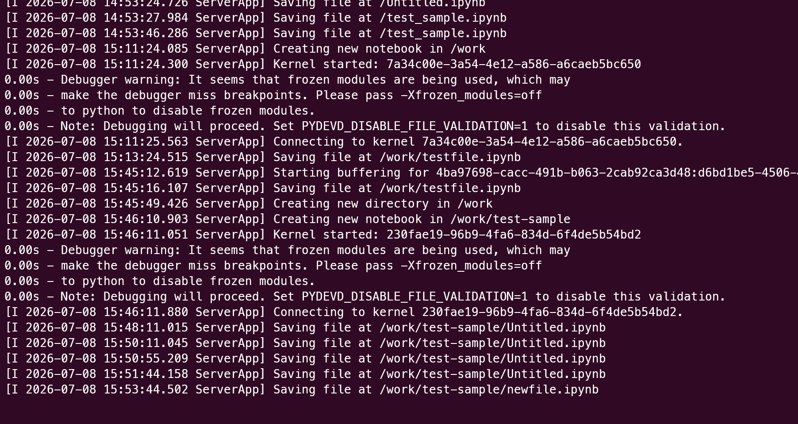

# [[Docker]]の `start` と `exec` の違い

[[Docker]]を使っていると、[[コンテナ]]を操作する際によく `docker start` と `docker exec` で混乱することがあります。
この2つのコマンドは**「[[コンテナ]]の状態」**と**「何をするか」**が全く異なります。混乱をなくすために、わかりやすい例えを交えて丁寧に解説します。

## 結論：一言で言うと？

*   **`docker start`**: 止まっている[[コンテナ]]の**「電源を入れる」**コマンド
*   **`docker exec`**: すでに動いている[[コンテナ]]の中で**「追加の作業（コマンド）を実行する」**コマンド

---

## 1. `docker start` （電源を入れる）

`docker start` は、**「停止している（Stopped）」[[コンテナ]]を「起動（Running）」させる**ためのコマンドです。

### パソコンや車に例えると…
*   **パソコン**: シャットダウンされているパソコンの電源ボタンを押して起動させること。
*   **車**: 駐車場に停まっている車のエンジンをかけること。

### 特徴
*   **対象**: 「停止している[[コンテナ]]」に対して使います。
*   **動作**: [[コンテナ]]が作られた時に設定された**「メインのプログラム（プロセス）」**を動かします。
    *   例：Webサーバー（Nginxなど）の[[コンテナ]]なら、`start` するとNginxが起動します。

**コマンド例:**
```[[bash]]
# my-container という名前の止まっている[[コンテナ]]を起動する
docker start my-container
```

---

## 2. `docker exec` （中に入って作業する）

`docker exec` は、**「すでに動いている（Running）」[[コンテナ]]の中で、新しく別のコマンドを実行する**ためのコマンドです。

### パソコンや車に例えると…
*   **パソコン**: すでに起動しているパソコンで、新しく「ターミナルを開く」や「メモ帳を開く」こと。
*   **車**: エンジンがかかって走っている車の中で、「カーナビを操作する」や「窓を開ける」こと。

### 特徴
*   **対象**: 「すでに動いている[[コンテナ]]」に対して使います。（止まっている[[コンテナ]]には使えません！）
*   **動作**: [[コンテナ]]のメインプログラムとは**別の新しいプログラム（プロセス）**を実行します。最もよく使われるのは、動いている[[コンテナ]]の中に「[[シェル]]（[[bash]]など）」で入って、内部を調査したりファイルを書き換えたりする用途です。

**コマンド例:**
```[[bash]]
# my-container という動いている[[コンテナ]]の中で、[[bash]]（ターミナル）を開く
docker exec -it my-container /bin/[[bash]]
```

---

## 比較まとめ表

| 項目 | `docker start` | `docker exec` |
| :--- | :--- | :--- |
| **主な目的** | [[コンテナ]]を起動する（電源ON） | 動いている[[コンテナ]]内で別のコマンドを実行する |
| **[[コンテナ]]の前提状態** | **停止している** (Exited/Stopped) | **動いている** (Up/Running) |
| **実行されるもの** | [[コンテナ]]作成時に決められたメインのプロセス | コマンドで指定した任意のプロセス（`[[bash]]` など） |
| **日常の例え** | PCの電源を入れる / 車のエンジンをかける | 起動中のPCでターミナルを開く / 走行中の車でラジオをつける |

### よくある間違いと解決法
*   **間違い**: [[コンテナ]]の中に入って作業したいのに `docker start -it my-container [[bash]]` と打ってしまう。
    *   **正解**: 中に入りたい（追加でコマンドを打ちたい）なら、すでに[[コンテナ]]を起動した上で `docker exec -it my-container [[bash]]` を使います。
*   **間違い**: 止まっている[[コンテナ]]に対して `docker exec` を実行してエラーになる。
    *   **正解**: まず `docker start` で[[コンテナ]]を起こしてから、`docker exec` を使います。

これでもう `start`（電源オン）と `exec`（追加実行）で迷うことはなくなるはずです！

---

## 3. 実践での疑問：「コマンドが打てない！」画面について

いただいた画像のように、サーバー[[コンテナ]]を起動した際、ターミナルにサーバーの動作ログ（`[I 2026-07-08 ... ServerApp]`など）が流れ続け、いつもの入力待ち状態が返ってこないことがあります。

「この画面に `docker exec` コマンドを打ちたくても打てない！」というのは**全くその通り**で、正常な状態です。

### なぜ打てないのか？
このターミナルが現在「[[コンテナ]]のメインプログラム（この場合はJupyter Server等）を動かし、そのログを画面に表示し続ける処理（フォアグラウンド）」で手一杯になっているからです。

### どうやって `exec` を打つのか？
**解決策：別のターミナル（タブ）を開く**
今ログが流れている画面は**そのまま放置**して、WSLの**新しいウィンドウまたは新しいタブ**をもう一つ開いてください。
そして、新しく開いたまっさらなターミナル画面から `docker exec -it [コンテナ名] [[bash]]` を実行すれば、動いている[[コンテナ]]の中に横から入ることができます。

※ちなみに、サーバー起動時にターミナルを占有させず裏側で動かしたい（バックグラウンド実行したい）場合は、`docker run` の際に `-d` (detach) オプションをつけることで、起動後すぐにいつもの入力画面が返ってくるようになります。

---

## 4. よくある疑問：[[コンテナ]]の指定方法と実行場所

### Q1. `docker start` には[[コンテナ]]IDが必要？それとも名前でいいの？
**A. どちらでもOKです！**
[[Docker]]は各[[コンテナ]]に対して「固有のID（例：`a1b2c3d4...`）」と「名前（例：`my-server`）」の両方を割り当てています。`docker start`（や `docker exec`）を使う時は、自分が分かりやすい方を使えば問題ありません。人間にとっては名前の方が覚えやすいので、名前を使うのが一般的です。
※さらに言うと、IDを指定する場合は `a1b2` のように最初の数文字だけでも、他と被らなければ認識してくれます。

### Q2. 全然違うディレクトリで `docker start` を実行したらどうなるの？
**A. 「謎の認識してくれる力」で全く問題なく動きます！**
ターミナルの「今いる場所（カレントディレクトリ）」がどこであろうと、`docker start` は成功します。
なぜなら、`docker` コマンドは手元のフォルダを見ているのではなく、パソコンの裏側で動いている **「[[Docker]]デーモン（[[Docker]]の管理サービス）」** に「この[[コンテナ]]を動かして！」とお願い（通信）をしているからです。[[Docker]]デーモンがパソコン内のすべての[[コンテナ]]を中央管理しているため、どこからお願いしても正確に認識して起動してくれます。
