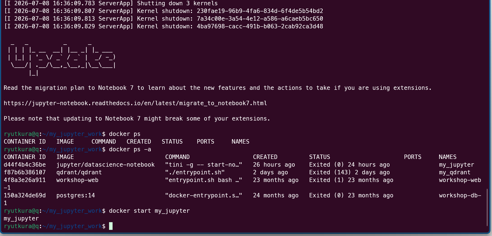

# [[Docker]]のrunとstartにおけるログ表示の違い

[[クリップボード]]の画像にある `[I 2026-07-08 ...]` という文字列は、Jupyter Notebookが出力する**Info（情報）ログ**です。

`docker run` を実行した時と、`docker start` を実行した時で画面の表示が違うのは、**[[Docker]][[コンテナ]]がフォアグラウンド（前面）で動くか、バックグラウンド（背面）で動くかというデフォルトの動作の違い**によるものです。

## どういう時にこのログが現れるのか？

1. **`docker run` の場合（デフォルトはフォアグラウンド）**
   `docker run` コマンドは、`-d` (detach: バックグラウンド実行) オプションをつけない限り、**フォアグラウンド**で[[コンテナ]]を起動します。
   この状態だと、[[コンテナ]]の中のプロセス（今回はJupyter Notebook）が出力するログが、そのまま今使っているターミナル画面にリアルタイムで出力されます。そのため、Iなんちゃら（Infoログ）がたくさん表示されていました。

2. **`docker start` の場合（デフォルトはバックグラウンド）**
   一度停止した[[コンテナ]]を `docker start` で再開させる場合、デフォルトでは**バックグラウンド**で起動します。
   [[コンテナ]]自体（およびJupyter）は裏でしっかり起動して動いていますが、画面にはログが出力されず、すぐに通常のコマンド入力状態（プロンプト）に戻ります。Webサイト上で[[Python]]が動いているのは、まさに裏で正常にJupyterが起動している証拠です。

## バックグラウンドの[[コンテナ]]のログを見たい場合

`docker start` で起動した後や、`docker run -d` で起動した[[コンテナ]]のログ（Iなんちゃらの画面）を確認したい場合は、以下のコマンドを使います。

```[[bash]]
# my_jupyter は画像にある[[コンテナ]]名
docker logs my_jupyter
```

リアルタイムで流れ続けるログを見たい場合は `-f` (follow) オプションをつけます。
```[[bash]]
docker logs -f my_jupyter
```
（表示を終了して元の画面に戻るには `Ctrl + C` を押します）

## よくある疑問と誤解

### `docker logs -f` 中の `Ctrl + C` で[[コンテナ]]は止まらないの？
**止まりません。** 
ここで `Ctrl + C` を押して終了するのは「ログを表示しているコマンド（`docker logs`）」だけです。裏で動いている[[コンテナ]]自体（Jupyter Notebook）はそのまま動き続けます。安全に元の画面に戻れるので安心してください。

### なぜ `docker start` の時は `-p` （ポート指定）が要らないの？
設定が**「イメージ」ではなく「[[コンテナ]]」に保存されているから**です。

* **`docker run`** は「イメージから新しく**[[コンテナ]]を作成**して起動する」コマンドです。この時 `-p` で指定したポート番号などの設定は、新しく作られた「[[コンテナ]]」に記録されます。
* **`docker start`** は「すでに作成済みの**[[コンテナ]]を再起動**する」コマンドです。[[コンテナ]]は自分が前回どのように設定されて作られたか（ポート番号など）を記憶しているため、起動の指示を出すだけで前回と同じ状態で立ち上がります。

つまり、一度 `run` で設定を作り込んでしまえば、次からは単に `start` するだけで同じ環境が立ち上がるのが[[Docker]]の便利なところです。
