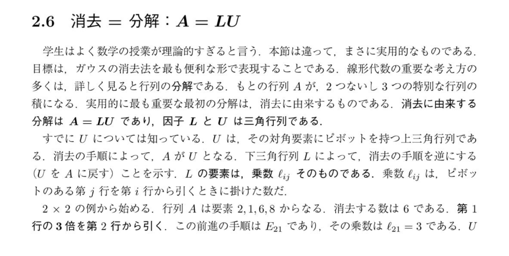
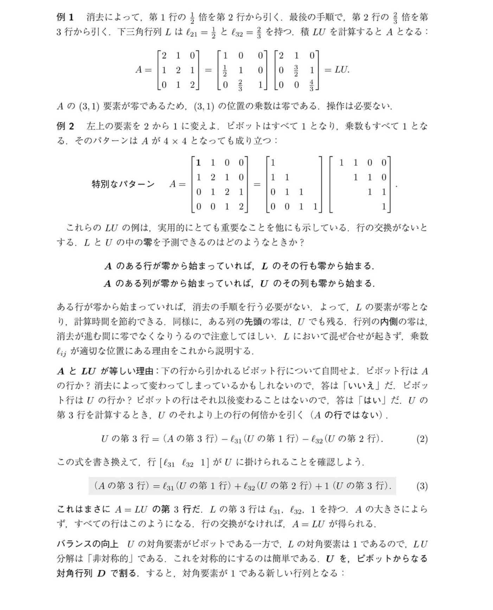

# LU分解について

画像は線形代数における「LU分解 ($A = LU$)」について説明しています。

## $l$ (小文字のエル) とは何か？

画像で登場する $l$（具体的には $\ell_{ij}$ などの添え字つきの形）は、**「乗数 (multiplier)」** を表しています。

ガウスの消去法（前進消去）を行う際、ある行から別の行を引いて特定の要素を0にします。このとき、「第 $i$ 行から、第 $j$ 行（ピボットがある行）の **何倍** を引くか」という、その「**何倍**」にあたる数が乗数 $\ell_{ij}$ です。

例えば画像にある $2 \times 2$ の例を見てみましょう：
- 行列 $A = \begin{pmatrix} 2 & 1 \\ 6 & 8 \end{pmatrix}$
- 第2行第1列の要素「6」を消去したい。
- 第1行（ピボットは2）の「**3倍**」を第2行から引けば、$6 - 2 \times 3 = 0$ となり消去できます。
- このとき掛けた数「3」が、乗数 $\ell_{21}$ になります。（$\ell_{21} = 3$）

## $L$ と $U$ の意味

- **$U$ (Upper triangular matrix: 上三角行列)**
  消去法を最後まで進めた結果、左下に0が並んだ階段状の行列です。対角要素にはピボットが並びます。
- **$L$ (Lower triangular matrix: 下三角行列)**
  上で説明した乗数 $l$（$\ell_{ij}$）を、そのまま対応する位置（$i$ 行 $j$ 列）に並べ、対角要素をすべて $1$ にした行列です。
  この行列は、「消去の手順を逆にする（$U$ を元の $A$ に戻す）」という役割を持ちます。

つまり、消去法の過程で計算した「乗数 $l$」を記録しておくだけで、元の行列 $A$ を $L$ と $U$ という2つの三角行列の積（$A = LU$）にきれいに分解できる、というのがこの節の重要なメッセージです。

---

## LU分解が成り立つ理由（$A = LU$ となる理由）

追加の画像では、「なぜ乗数 $l$ を集めた行列 $L$ と、消去後の行列 $U$ を掛けると、元の行列 $A$ に戻るのか？」という、LU分解の核心部分を説明しています。

### 1. 3×3行列の例とゼロの予測
まず、例1や例2を通して以下の法則を示しています。
* $A$ のある行が最初から0で始まっていれば、消去する手間が省けるため、$L$ の同じ行も0で始まります。
* 同様に $A$ のある列が0で始まっていれば、$U$ でもそのまま残ります。
これにより、計算量を予測したり節約したりできることがわかります。

### 2. なぜ $A = LU$ なのか？
これが最も重要なポイントです。
ガウスの消去法を振り返ってみると、例えば「第3行から、第1行の $\ell_{31}$ 倍と、第2行の $\ell_{32}$ 倍を引く」ことで、$U$ の第3行を作ります。

数式で書くとこうなります（画像内の式(2)）：
> $U$の第3行 = ($A$の第3行) $-$ $\ell_{31}$($U$の第1行) $-$ $\ell_{32}$($U$の第2行)

これを「$A$の第3行 = ...」という形に移行して書き直すと（画像内の式(3)）：
> ($A$の第3行) = $\ell_{31}$($U$の第1行) $+$ $\ell_{32}$($U$の第2行) $+$ $1 \times$ ($U$の第3行)

この式はまさに、**行列の掛け算を行単位で行っている**ことを表しています。
行列 $L$ の第3行は $(\ell_{31}, \ell_{32}, 1)$ なので、これに $U$ を掛けると、ピタリと元の $A$ の第3行に戻るのです。

### つまりどういうことか？
**「消去法の操作そのものが、実を行列の掛け算として逆算できる形になっている」** ということです。
乗数 $l$ を記録した $L$ は、単なる数字のメモではなく、「完成した $U$ をどう組み合わせれば元の $A$ に復元できるか」という **レシピ（組み立て手順）** になっています。だからこそ $A=LU$ が必ず成り立ちます。

---

## 【深掘り解説】具体例で見る「レシピ」としての $L$

ここまで「$L$ はレシピである」「逆算しているだけ」と言葉で説明してきましたが、まだぼんやりしているかもしれません。画像にある「例1」の $3 \times 3$ 行列を実際に計算しながら、この「レシピ」がどう働くのかを完全に紐解いてみましょう。

### STEP 1: ガウスの消去法（$A$ から $U$ を作る）
元の行列 $A$ は以下の通りです。
$$ A = \begin{pmatrix} 2 & 1 & 0 \\ 1 & 2 & 1 \\ 0 & 1 & 2 \end{pmatrix} $$

**① 1列目の消去**
* 1行目のピボットは `2` です。
* 2行目1列目の `1` を消すために、1行目の **$1/2$ 倍** を2行目から引きます。
  * 👉 ここで乗数 $l_{21} = 1/2$ が確定します。
  * 2行目は $(1, 2, 1) - 1/2 \times (2, 1, 0) = (0, 3/2, 1)$ となります。
* 3行目1列目は最初から `0` なので何もしません。
  * 👉 ここで乗数 $l_{31} = 0$ が確定します。

この時点での行列：
$$ \begin{pmatrix} 2 & 1 & 0 \\ 0 & 3/2 & 1 \\ 0 & 1 & 2 \end{pmatrix} $$

**② 2列目の消去**
* 2行目の新しいピボットは `3/2` です。
* 3行目2列目の `1` を消すために、どうすればいいでしょうか？ `1` は `3/2` の **$2/3$ 倍** です。なので、2行目の **$2/3$ 倍** を3行目から引きます。
  * 👉 ここで乗数 $l_{32} = 2/3$ が確定します。
  * 3行目は $(0, 1, 2) - 2/3 \times (0, 3/2, 1) = (0, 0, 4/3)$ となります。

これで、左下がすべて0になった上三角行列 **$U$** が完成しました。
$$ U = \begin{pmatrix} 2 & 1 & 0 \\ 0 & 3/2 & 1 \\ 0 & 0 & 4/3 \end{pmatrix} $$

### STEP 2: レシピ $L$ を組み立てる
消去の途中で「何倍したか」という乗数 $l$ を、そのまま対応する位置に当てはめ、対角線には $1$ を並べたのが $L$ です。
$$ L = \begin{pmatrix} 1 & 0 & 0 \\ l_{21} & 1 & 0 \\ l_{31} & l_{32} & 1 \end{pmatrix} = \begin{pmatrix} 1 & 0 & 0 \\ 1/2 & 1 & 0 \\ 0 & 2/3 & 1 \end{pmatrix} $$

### STEP 3: レシピを使って $U$ から $A$ を復元する（魔法の種明かし）
ここからが本番です。「なぜ $A = LU$ なのか？」を行列の掛け算のルールを使って確認します。

行列の掛け算において、「右側の行列（$U$）に左側から行列（$L$）を掛ける」ということは、**「$U$ の各行を、$L$ の行の数字の割合でブレンド（足し合わせ）する」** という意味を持っています。

例として、**元の行列 $A$ の3行目 $(0, 1, 2)$ がどうやって復元されるか** を見てみましょう。
掛け算のルールに従うと、$A$ の3行目は、レシピである **$L$ の3行目 $(0, 2/3, 1)$** の指示に従って、$U$ の各行をブレンドして作られます。

> **復元される $A$ の3行目**
> = $0 \times$ ($U$の1行目) ＋ $2/3 \times$ ($U$の2行目) ＋ $1 \times$ ($U$の3行目)
> = $0 \times (2, 1, 0)$
>   $+$ $2/3 \times (0, 3/2, 1)$
>   $+$ $1 \times (0, 0, 4/3)$
> = $(0, 0, 0) + (0, 1, 2/3) + (0, 0, 4/3)$
> = **$(0, 1, 2)$**

見事に、元の $A$ の3行目 $(0, 1, 2)$ が復元されました！

### 結論：LU分解の真の姿
「3行目から2行目の $2/3$ 倍を引いた」という操作の **逆** は、「3行目に2行目の $2/3$ 倍を足す」ことです。
行列 $L$ は、この「引いた分を足し戻す」という復元作業を、行列の掛け算という1つのパッケージに美しくまとめたものなのです。これが、線形代数におけるLU分解の最も実用的で美しい本質です。

---

## 【さらに深掘り】なぜ乗数を「そのままポンと置くだけ」で $L$ が完成するのか？

「$L$ を掛ければ元に戻る」というのは分かりましたが、**「消去の途中で出てきたバラバラの乗数 $l$ を、ただ行列の同じ位置にポンと置くだけで、都合よく完璧なレシピ $L$ が完成するのはなぜ？」** という疑問が湧くのは非常に鋭い視点です。
実はここにも、消去法ならではの「奇跡的な都合の良さ」が隠されています。

### もし「消去する作業（$A \to U$）」を行列で表したら？
ガウスの消去法で行う「〇行目から〇行目の $l$ 倍を引く」という作業は、**消去行列（$E$）** というものを左から掛けることで表現できます。
例えば、STEP1で行った操作は以下のようになります。
1. $E_{21}$ を掛ける（2行目1列目を消すため、2行目から1行目の $l_{21}$ 倍を引く）
2. $E_{32}$ を掛ける（3行目2列目を消すため、3行目から2行目の $l_{32}$ 倍を引く）

つまり、$U$ は次のように作られます：
$$ U = E_{32} \times E_{21} \times A $$

### 「元に戻す作業（$U \to A$）」はどうなる？
上の式を「$A = $」の形に直すには、それぞれの消去行列の**逆行列（$E^{-1}$）** を、掛けた順番と逆にして右辺に持っていきます（靴下を脱いでから靴を脱ぐように、逆の順番で外していきます）。
$$ A = (E_{21}^{-1} \times E_{32}^{-1}) \times U $$

この $(E_{21}^{-1} \times E_{32}^{-1})$ の部分が、まさにレシピ **$L$** の正体です。
* **$E_{21}^{-1}$ とは？**：「引いたものを**足し戻す**」行列です。元の $E_{21}$ が $-l_{21}$ を持っていたのに対し、逆行列は $+l_{21}$ を持ちます。

### 行列の計算で見る「混ざる」と「混ざらない」の違い

言葉だけでは「都合よく解決した」という感覚が拭えないと思いますので、実際に $E$ と $E^{-1}$ の行列の掛け算を見てみましょう。

さきほどの例の乗数は $l_{21} = 1/2$ と $l_{32} = 2/3$ でした。
それぞれの消去行列 $E$ と、その逆行列 $E^{-1}$ は次のようになります。

**【消去行列 $E$（引く作業）】**
* $E_{21}$ は「2行目から1行目の $1/2$ 倍を引く」行列：
  $$ E_{21} = \begin{pmatrix} 1 & 0 & 0 \\ -1/2 & 1 & 0 \\ 0 & 0 & 1 \end{pmatrix} $$
* $E_{32}$ は「3行目から2行目の $2/3$ 倍を引く」行列：
  $$ E_{32} = \begin{pmatrix} 1 & 0 & 0 \\ 0 & 1 & 0 \\ 0 & -2/3 & 1 \end{pmatrix} $$

**【逆行列 $E^{-1}$（足し戻す作業）】**
マイナスがプラスに変わるだけです。
  $$ E_{21}^{-1} = \begin{pmatrix} 1 & 0 & 0 \\ 1/2 & 1 & 0 \\ 0 & 0 & 1 \end{pmatrix}, \quad E_{32}^{-1} = \begin{pmatrix} 1 & 0 & 0 \\ 0 & 1 & 0 \\ 0 & 2/3 & 1 \end{pmatrix} $$

#### 失敗例：もし $E$ をそのまままとめようとしたら？
消去の作業を1つの行列にまとめようとして、$E_{32} \times E_{21}$ を計算してみます。
$$ E_{32}E_{21} = \begin{pmatrix} 1 & 0 & 0 \\ 0 & 1 & 0 \\ 0 & -2/3 & 1 \end{pmatrix} \begin{pmatrix} 1 & 0 & 0 \\ -1/2 & 1 & 0 \\ 0 & 0 & 1 \end{pmatrix} = \begin{pmatrix} 1 & 0 & 0 \\ -1/2 & 1 & 0 \\ 1/3 & -2/3 & 1 \end{pmatrix} $$
左下の要素（3行1列目）を見てください。**元の乗数にはなかった「$1/3$」という数字が勝手に発生してしまいました！** （$-2/3 \times -1/2$ が計算されて混ざってしまったのです）。
これでは、「乗数をポンと置く」なんて簡単な方法は使えません。これが普通の行列の掛け算の厄介なところです。

#### 成功例：$L$ を作るために $E^{-1}$ を掛けたら？
では、元の行列 $A$ を復元するためのレシピ $L$、つまり $E_{21}^{-1} \times E_{32}^{-1}$ を計算してみます。
（※消去の逆順なので、復元は $21 \to 32$ の順番に並びます）
$$ L = E_{21}^{-1}E_{32}^{-1} = \begin{pmatrix} 1 & 0 & 0 \\ 1/2 & 1 & 0 \\ 0 & 0 & 1 \end{pmatrix} \begin{pmatrix} 1 & 0 & 0 \\ 0 & 1 & 0 \\ 0 & 2/3 & 1 \end{pmatrix} = \begin{pmatrix} 1 & 0 & 0 \\ 1/2 & 1 & 0 \\ 0 & 2/3 & 1 \end{pmatrix} $$

**なんと、計算しても数字が全く混ざりません！** $1/2$ と $2/3$ が、ただ元の位置にストンと落ちただけのような結果になりました。

### なぜ混ざらなかったのか？
理由は、「左側の行列の列」と「右側の行列の行」の噛み合わせです。
$E_{21}^{-1}$ は1列目に数字がありますが、掛け合わせる $E_{32}^{-1}$ は1行目が「1, 0, 0」です。このため、掛け算をしてもお互いの数字が一切ぶつからず（掛け合わされず）、それぞれが独立して生き残るのです。

この**「逆行列を逆順で掛けると、数字が干渉せずにスッポリと収まる」**という奇跡的な性質があるため、私たちはわざわざ行列の掛け算をしなくても、「乗数 $l$ を $L$ の所定の位置にポンと置くだけ」で正しい行列 $L$ を作ることができるのです。

---

## 【総括】なぜわざわざ $A$ を $L$ と $U$ に分解するのか？（メリットと数学的意味）

「$A = LU$ になる仕組みは分かったけど、そもそも最初から $A$ のままでいいじゃないか。なぜわざわざ2つの行列に分解するのか？」
これは線形代数を学ぶ全員が抱く、非常に本質的な疑問です。ただの $3 \times 3$ 行列なら分解するメリットは薄く見えますが、実はここに**「計算機の効率」**と**「構造の整理整頓」**という2つの絶大なメリットがあります。

### メリット1：連立方程式 $Ax = b$ を何度も解くときの「圧倒的な計算の節約」
現実の工学（建築の強度計算、流体のシミュレーション、CGなど）では、「同じシステム（行列 $A$）」に対して「違う入力（ベクトル $b$）」を与えたときの答え $x$ を、何百回、何千回と計算する場面が頻出します。

* **$A$ のままガウスの消去法を毎回やると…**
  $A$ が $1000 \times 1000$ の巨大な行列だった場合、消去法には約 $3.3$ 億回の計算が必要です。入力 $b$ が100パターンあれば、毎回1から消去法をやり直すハメになり、**330億回**の計算が必要になります。
* **一度 $A = LU$ に分解しておくと…**
  方程式 $Ax = b$ は $LUx = b$ になります。
  1. まず $Ly = b$ を解いて $y$ を出す。
  2. 次に $Ux = y$ を解いて $x$ を出す。
  $L$ も $U$ もすでに「左下だけ」「右上だけ」に数字がある美しい三角行列です。三角行列の方程式は「代入するだけ」で上（あるいは下）からスルスル解けるため、たった約 $100$ 万回の計算で済みます。
  分解するのに最初だけ $3.3$ 億回かかりますが、その後の100パターンの $b$ については毎回 $100$ 万回で済むため、合計は **$3.3$ 億 ＋ $1$ 億 ＝ $4.3$ 億回** となり、計算時間が劇的に短縮されます。

つまり、**「一番重い『消去の作業』を一度だけやって、$L$ と $U$ というセーブデータとして保存しておく」**のがLU分解の実用的な最大の理由です。

### メリット2：数学的意味「複雑な構造を2つの基本構造に分離した」
数学的に行列 $A$ は「空間を歪める複雑な変換（システム）」を表しています。
$A$ をそのまま見ても、どう歪んでいるのか直感的には分かりません。しかし、$A = LU$ と分解することで、この複雑なシステムが「2つのシンプルなステップ」に分離されます。

* **$L$（下三角行列）**：上から下への依存関係。「過去（上の行）が未来（下の行）に影響を与える」という順方向のプロセス。
* **$U$（上三角行列）**：下から上への依存関係。「未来（下の行）の結果から過去（上の行）を逆算する」という逆方向のプロセス。

絡み合ってゴチャゴチャになった複雑な糸（$A$）を、「上から順に解ける素直な糸（$L$）」と「下から順に解ける素直な糸（$U$）」という、2つの本質的な構造に整理整頓した。これが $A = LU$ の数学的な真の解釈です。
