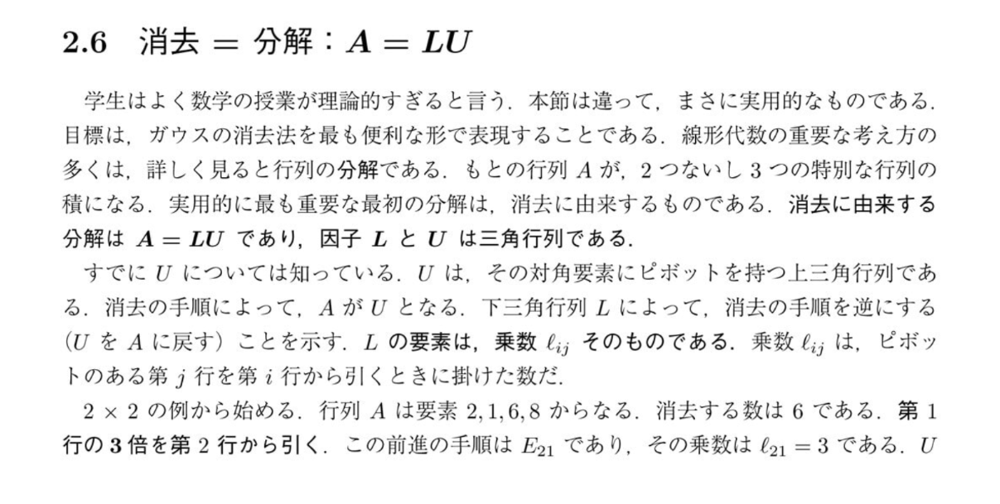
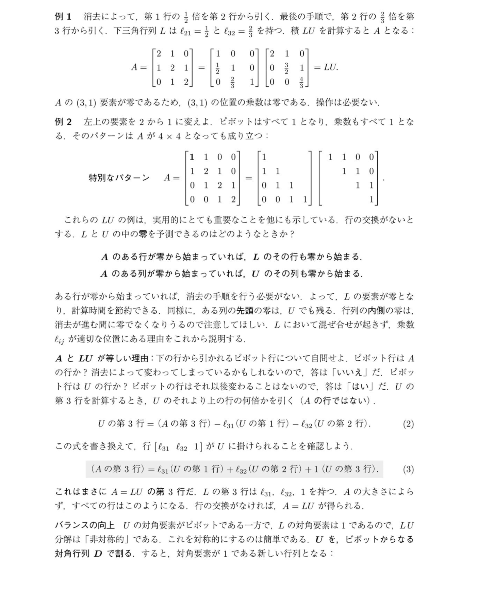
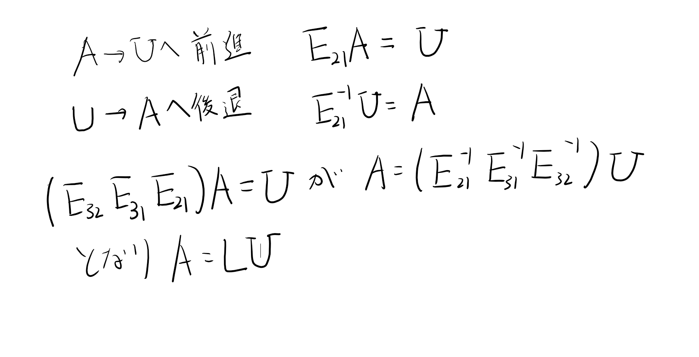
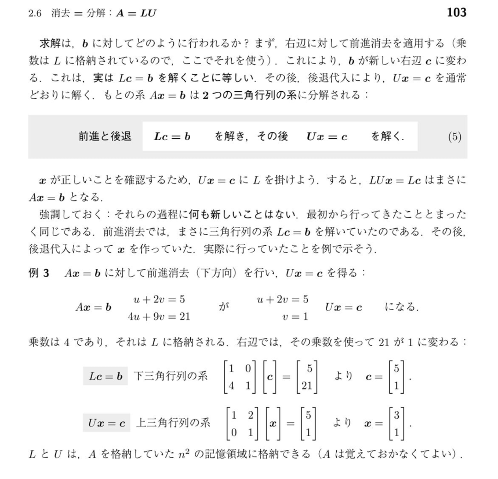

# LU分解について

> **表記メモ（この記事内で統一）**：「行」＝横方向、「列」＝縦方向。$a_{ij}$ の $i$ が「何行目」、$j$ が「何列目」を表します。「○行○列目」のように書いたときは必ずこの意味です（詳しい凡例は本文後半の【今後の凡例】節も参照）。

画像は[[線形代数]]における「[[LU分解]] ($A = LU$)」について説明しています。

## $l$ (小文字のエル) とは何か？

画像で登場する $l$（具体的には $\ell_{ij}$ などの添え字つきの形）は、**「乗数 (multiplier)」** を表しています。

[[ガウスの消去法]]（前進消去）を行う際、ある行から別の行を引いて特定の要素を0にします。このとき、「第 $i$ 行から、第 $j$ 行（ピボットがある行）の **何倍** を引くか」という、その「**何倍**」にあたる数が乗数 $\ell_{ij}$ です。

例えば画像にある $2 \times 2$ の例を見てみましょう：
- [[行列]] $A = \begin{pmatrix} 2 & 1 \\ 6 & 8 \end{pmatrix}$
- 第2行第1列の要素「6」を消去したい。
- 第1行（ピボットは2）の「**3倍**」を第2行から引けば、$6 - 2 \times 3 = 0$ となり消去できます。
- このとき掛けた数「3」が、乗数 $\ell_{21}$ になります。（$\ell_{21} = 3$）

## $L$ と $U$ の意味

- **$U$ (Upper triangular matrix: 上三角[[行列]])**
  消去法を最後まで進めた結果、左下に0が並んだ階段状の[[行列]]です。対角要素にはピボットが並びます。
- **$L$ (Lower triangular matrix: 下三角[[行列]])**
  上で説明した乗数 $l$（$\ell_{ij}$）を、そのまま対応する位置（$i$ 行 $j$ 列）に並べ、対角要素をすべて $1$ にした[[行列]]です。
  この[[行列]]は、「消去の手順を逆にする（$U$ を元の $A$ に戻す）」という役割を持ちます。

つまり、消去法の過程で計算した「乗数 $l$」を記録しておくだけで、元の[[行列]] $A$ を $L$ と $U$ という2つの三角[[行列]]の積（$A = LU$）にきれいに分解できる、というのがこの節の重要なメッセージです。

---

## LU分解が成り立つ理由（$A = LU$ となる理由）

追加の画像では、「なぜ乗数 $l$ を集めた[[行列]] $L$ と、消去後の[[行列]] $U$ を掛けると、元の[[行列]] $A$ に戻るのか？」という、LU分解の核心部分を説明しています。

### 1. 3×3行列の例とゼロの予測
まず、例1や例2を通して以下の法則を示しています。
* $A$ のある行が最初から0で始まっていれば、消去する手間が省けるため、$L$ の同じ行も0で始まります。
* 同様に $A$ のある列が0で始まっていれば、$U$ でもそのまま残ります。
これにより、計算量を予測したり節約したりできることがわかります。

### 2. なぜ $A = LU$ なのか？
これが最も重要なポイントです。
ガウスの消去法を振り返ってみると、例えば「第3行から、第1行の $\ell_{31}$ 倍と、第2行の $\ell_{32}$ 倍を引く」ことで、$U$ の第3行を作ります。

数式で書くとこうなります（画像内の式(2)）：
> $U$の第3行 = ($A$の第3行) $-$ $\ell_{31}$($U$の第1行) $-$ $\ell_{32}$($U$の第2行)

これを「$A$の第3行 = ...」という形に移行して書き直すと（画像内の式(3)）：
> ($A$の第3行) = $\ell_{31}$($U$の第1行) $+$ $\ell_{32}$($U$の第2行) $+$ $1 \times$ ($U$の第3行)

この式はまさに、**[[行列]]の掛け算を行単位で行っている**ことを表しています。
[[行列]] $L$ の第3行は $(\ell_{31}, \ell_{32}, 1)$ なので、これに $U$ を掛けると、ピタリと元の $A$ の第3行に戻るのです。

### つまりどういうことか？
**「消去法の操作そのものが、実を[[行列]]の掛け算として逆算できる形になっている」** ということです。
乗数 $l$ を記録した $L$ は、単なる数字のメモではなく、「完成した $U$ をどう組み合わせれば元の $A$ に復元できるか」という **レシピ（組み立て手順）** になっています。だからこそ $A=LU$ が必ず成り立ちます。

---

## 【深掘り解説】具体例で見る「レシピ」としての $L$

ここまで「$L$ はレシピである」「逆算しているだけ」と言葉で説明してきましたが、まだぼんやりしているかもしれません。画像にある「例1」の $3 \times 3$ [[行列]]を実際に計算しながら、この「レシピ」がどう働くのかを完全に紐解いてみましょう。

### STEP 1: ガウスの消去法（$A$ から $U$ を作る）
元の[[行列]] $A$ は以下の通りです。
$$ A = \begin{pmatrix} 2 & 1 & 0 \\ 1 & 2 & 1 \\ 0 & 1 & 2 \end{pmatrix} $$

**① 1列目の消去**
* 1行目のピボットは `2` です。
* 2行目1列目の `1` を消すために、1行目の **$1/2$ 倍** を2行目から引きます。
  * 👉 ここで乗数 $l_{21} = 1/2$ が確定します。
  * 2行目は $(1, 2, 1) - 1/2 \times (2, 1, 0) = (0, 3/2, 1)$ となります。
* 3行目1列目は最初から `0` なので何もしません。
  * 👉 ここで乗数 $l_{31} = 0$ が確定します。

この時点での[[行列]]：
$$ \begin{pmatrix} 2 & 1 & 0 \\ 0 & 3/2 & 1 \\ 0 & 1 & 2 \end{pmatrix} $$

**② 2列目の消去**
* 2行目の新しいピボットは `3/2` です。
* 3行目2列目の `1` を消すために、どうすればいいでしょうか？ `1` は `3/2` の **$2/3$ 倍** です。なので、2行目の **$2/3$ 倍** を3行目から引きます。
  * 👉 ここで乗数 $l_{32} = 2/3$ が確定します。
  * 3行目は $(0, 1, 2) - 2/3 \times (0, 3/2, 1) = (0, 0, 4/3)$ となります。

これで、左下がすべて0になった上三角[[行列]] **$U$** が完成しました。
$$ U = \begin{pmatrix} 2 & 1 & 0 \\ 0 & 3/2 & 1 \\ 0 & 0 & 4/3 \end{pmatrix} $$

### STEP 2: レシピ $L$ を組み立てる
消去の途中で「何倍したか」という乗数 $l$ を、そのまま対応する位置に当てはめ、対角線には $1$ を並べたのが $L$ です。
$$ L = \begin{pmatrix} 1 & 0 & 0 \\ l_{21} & 1 & 0 \\ l_{31} & l_{32} & 1 \end{pmatrix} = \begin{pmatrix} 1 & 0 & 0 \\ 1/2 & 1 & 0 \\ 0 & 2/3 & 1 \end{pmatrix} $$

### STEP 3: レシピを使って $U$ から $A$ を復元する（魔法の種明かし）
ここからが本番です。「なぜ $A = LU$ なのか？」を[[行列]]の掛け算のルールを使って確認します。

[[行列]]の掛け算において、「右側の[[行列]]（$U$）に左側から[[行列]]（$L$）を掛ける」ということは、**「$U$ の各行を、$L$ の行の数字の割合でブレンド（足し合わせ）する」** という意味を持っています。

例として、**元の[[行列]] $A$ の3行目 $(0, 1, 2)$ がどうやって復元されるか** を見てみましょう。
掛け算のルールに従うと、$A$ の3行目は、レシピである **$L$ の3行目 $(0, 2/3, 1)$** の指示に従って、$U$ の各行をブレンドして作られます。

> **復元される $A$ の3行目**
> = $0 \times$ ($U$の1行目) ＋ $2/3 \times$ ($U$の2行目) ＋ $1 \times$ ($U$の3行目)
> = $0 \times (2, 1, 0)$
>   $+$ $2/3 \times (0, 3/2, 1)$
>   $+$ $1 \times (0, 0, 4/3)$
> = $(0, 0, 0) + (0, 1, 2/3) + (0, 0, 4/3)$
> = **$(0, 1, 2)$**

見事に、元の $A$ の3行目 $(0, 1, 2)$ が復元されました！

### 結論：LU分解の真の姿
「3行目から2行目の $2/3$ 倍を引いた」という操作の **逆** は、「3行目に2行目の $2/3$ 倍を足す」ことです。
[[行列]] $L$ は、この「引いた分を足し戻す」という復元作業を、[[行列]]の掛け算という1つのパッケージに美しくまとめたものなのです。これが、[[線形代数]]におけるLU分解の最も実用的で美しい本質です。

---

## 【さらに深掘り】なぜ乗数を「そのままポンと置くだけ」で $L$ が完成するのか？

「$L$ を掛ければ元に戻る」というのは分かりましたが、**「消去の途中で出てきたバラバラの乗数 $l$ を、ただ[[行列]]の同じ位置にポンと置くだけで、都合よく完璧なレシピ $L$ が完成するのはなぜ？」** という疑問が湧くのは非常に鋭い視点です。
実はここにも、消去法ならではの「奇跡的な都合の良さ」が隠されています。

### もし「消去する作業（$A \to U$）」を行列で表したら？
ガウスの消去法で行う「〇行目から〇行目の $l$ 倍を引く」という作業は、**消去[[行列]]（$E$）** というものを左から掛けることで表現できます。
例えば、STEP1で行った操作は以下のようになります。
1. $E_{21}$ を掛ける（2行目1列目を消すため、2行目から1行目の $l_{21}$ 倍を引く）
2. $E_{32}$ を掛ける（3行目2列目を消すため、3行目から2行目の $l_{32}$ 倍を引く）

つまり、$U$ は次のように作られます：
$$ U = E_{32} \times E_{21} \times A $$

### 「元に戻す作業（$U \to A$）」はどうなる？
上の式を「$A = $」の形に直すには、それぞれの消去[[行列]]の**逆[[行列]]（$E^{-1}$）** を、掛けた順番と逆にして右辺に持っていきます（靴下を脱いでから靴を脱ぐように、逆の順番で外していきます）。
$$ A = (E_{21}^{-1} \times E_{32}^{-1}) \times U $$

この $(E_{21}^{-1} \times E_{32}^{-1})$ の部分が、まさにレシピ **$L$** の正体です。
* **$E_{21}^{-1}$ とは？**：「引いたものを**足し戻す**」[[行列]]です。元の $E_{21}$ が $-l_{21}$ を持っていたのに対し、逆[[行列]]は $+l_{21}$ を持ちます。

### 行列の計算で見る「混ざる」と「混ざらない」の違い

言葉だけでは「都合よく解決した」という感覚が拭えないと思いますので、実際に $E$ と $E^{-1}$ の[[行列]]の掛け算を見てみましょう。

さきほどの例の乗数は $l_{21} = 1/2$ と $l_{32} = 2/3$ でした。
それぞれの消去[[行列]] $E$ と、その逆[[行列]] $E^{-1}$ は次のようになります。

**【消去[[行列]] $E$（引く作業）】**
* $E_{21}$ は「2行目から1行目の $1/2$ 倍を引く」[[行列]]：
  $$ E_{21} = \begin{pmatrix} 1 & 0 & 0 \\ -1/2 & 1 & 0 \\ 0 & 0 & 1 \end{pmatrix} $$
* $E_{32}$ は「3行目から2行目の $2/3$ 倍を引く」[[行列]]：
  $$ E_{32} = \begin{pmatrix} 1 & 0 & 0 \\ 0 & 1 & 0 \\ 0 & -2/3 & 1 \end{pmatrix} $$

**【逆[[行列]] $E^{-1}$（足し戻す作業）】**
マイナスがプラスに変わるだけです。
  $$ E_{21}^{-1} = \begin{pmatrix} 1 & 0 & 0 \\ 1/2 & 1 & 0 \\ 0 & 0 & 1 \end{pmatrix}, \quad E_{32}^{-1} = \begin{pmatrix} 1 & 0 & 0 \\ 0 & 1 & 0 \\ 0 & 2/3 & 1 \end{pmatrix} $$

#### 失敗例：もし $E$ をそのまままとめようとしたら？
消去の作業を1つの[[行列]]にまとめようとして、$E_{32} \times E_{21}$ を計算してみます。
$$ E_{32}E_{21} = \begin{pmatrix} 1 & 0 & 0 \\ 0 & 1 & 0 \\ 0 & -2/3 & 1 \end{pmatrix} \begin{pmatrix} 1 & 0 & 0 \\ -1/2 & 1 & 0 \\ 0 & 0 & 1 \end{pmatrix} = \begin{pmatrix} 1 & 0 & 0 \\ -1/2 & 1 & 0 \\ 1/3 & -2/3 & 1 \end{pmatrix} $$
左下の要素（3行1列目）を見てください。**元の乗数にはなかった「$1/3$」という数字が勝手に発生してしまいました！** （$-2/3 \times -1/2$ が計算されて混ざってしまったのです）。
これでは、「乗数をポンと置く」なんて簡単な方法は使えません。これが普通の[[行列]]の掛け算の厄介なところです。

#### 成功例：$L$ を作るために $E^{-1}$ を掛けたら？
では、元の[[行列]] $A$ を復元するためのレシピ $L$、つまり $E_{21}^{-1} \times E_{32}^{-1}$ を計算してみます。
（※消去の逆順なので、復元は $21 \to 32$ の順番に並びます）
$$ L = E_{21}^{-1}E_{32}^{-1} = \begin{pmatrix} 1 & 0 & 0 \\ 1/2 & 1 & 0 \\ 0 & 0 & 1 \end{pmatrix} \begin{pmatrix} 1 & 0 & 0 \\ 0 & 1 & 0 \\ 0 & 2/3 & 1 \end{pmatrix} = \begin{pmatrix} 1 & 0 & 0 \\ 1/2 & 1 & 0 \\ 0 & 2/3 & 1 \end{pmatrix} $$

**なんと、計算しても数字が全く混ざりません！** $1/2$ と $2/3$ が、ただ元の位置にストンと落ちただけのような結果になりました。

### なぜ混ざらなかったのか？
理由は、「左側の[[行列]]の列」と「右側の[[行列]]の行」の噛み合わせです。
$E_{21}^{-1}$ は1列目に数字がありますが、掛け合わせる $E_{32}^{-1}$ は1行目が「1, 0, 0」です。このため、掛け算をしてもお互いの数字が一切ぶつからず（掛け合わされず）、それぞれが独立して生き残るのです。

この**「逆[[行列]]を逆順で掛けると、数字が干渉せずにスッポリと収まる」**という奇跡的な性質があるため、私たちはわざわざ[[行列]]の掛け算をしなくても、「乗数 $l$ を $L$ の所定の位置にポンと置くだけ」で正しい[[行列]] $L$ を作ることができるのです。

---

## 【総括】なぜわざわざ $A$ を $L$ と $U$ に分解するのか？（メリットと数学的意味）

「$A = LU$ になる仕組みは分かったけど、そもそも最初から $A$ のままでいいじゃないか。なぜわざわざ2つの[[行列]]に分解するのか？」
これは[[線形代数]]を学ぶ全員が抱く、非常に本質的な疑問です。ただの $3 \times 3$ [[行列]]なら分解するメリットは薄く見えますが、実はここに**「計算機の効率」**と**「構造の整理整頓」**という2つの絶大なメリットがあります。

### メリット1：連立方程式 $Ax = b$ を何度も解くときの「圧倒的な計算の節約」
現実の工学（建築の強度計算、流体のシミュレーション、CGなど）では、「同じシステム（[[行列]] $A$）」に対して「違う入力（[[ベクトル]] $b$）」を与えたときの答え $x$ を、何百回、何千回と計算する場面が頻出します。

* **$A$ のままガウスの消去法を毎回やると…**
  $A$ が $1000 \times 1000$ の巨大な[[行列]]だった場合、消去法には約 $3.3$ 億回の計算が必要です。入力 $b$ が100パターンあれば、毎回1から消去法をやり直すハメになり、**330億回**の計算が必要になります。
* **一度 $A = LU$ に分解しておくと…**
  方程式 $Ax = b$ は $LUx = b$ になります。
  1. まず $Ly = b$ を解いて $y$ を出す。
  2. 次に $Ux = y$ を解いて $x$ を出す。
  $L$ も $U$ もすでに「左下だけ」「右上だけ」に数字がある美しい三角[[行列]]です。三角[[行列]]の方程式は「代入するだけ」で上（あるいは下）からスルスル解けるため、たった約 $100$ 万回の計算で済みます。
  分解するのに最初だけ $3.3$ 億回かかりますが、その後の100パターンの $b$ については毎回 $100$ 万回で済むため、合計は **$3.3$ 億 ＋ $1$ 億 ＝ $4.3$ 億回** となり、計算時間が劇的に短縮されます。

つまり、**「一番重い『消去の作業』を一度だけやって、$L$ と $U$ というセーブデータとして保存しておく」**のがLU分解の実用的な最大の理由です。

### メリット2：数学的意味「複雑な構造を2つの基本構造に分離した」
数学的に[[行列]] $A$ は「空間を歪める複雑な変換（システム）」を表しています。
$A$ をそのまま見ても、どう歪んでいるのか直感的には分かりません。しかし、$A = LU$ と分解することで、この複雑なシステムが「2つのシンプルなステップ」に分離されます。

* **$L$（下三角[[行列]]）**：上から下への依存関係。「過去（上の行）が未来（下の行）に影響を与える」という順方向のプロセス。
* **$U$（上三角[[行列]]）**：下から上への依存関係。「未来（下の行）の結果から過去（上の行）を逆算する」という逆方向のプロセス。

絡み合ってゴチャゴチャになった複雑な糸（$A$）を、「上から順に解ける素直な糸（$L$）」と「下から順に解ける素直な糸（$U$）」という、2つの本質的な構造に整理整頓した。これが $A = LU$ の数学的な真の解釈です。

---

## 【疑問】$(E_{32}E_{31}E_{21})A = U$ が、なぜ $A = (E_{21}^{-1}E_{31}^{-1}E_{32}^{-1})U$ になるのか？

手書きメモにある式変形は、次の3つの疑問に分解できます。順に潰していきます。

1. そもそも $E^{-1}$ とは何者で、なぜ必ず存在するのか
2. 反対側へ移すとき、なぜ **順番がひっくり返る** のか
3. 出てきた $E_{21}^{-1}E_{31}^{-1}E_{32}^{-1}$ が、なぜ **そのまま $L$** なのか

### 1. $E^{-1}$ は「引いた分を足し戻す行列」

$E_{21}$ は「2行目から1行目の $l_{21}$ 倍を **引く**」という操作でした。
この操作を取り消したければ、「2行目に1行目の $l_{21}$ 倍を **足す**」だけです。引いたものを足し戻せば元に戻る、という当たり前の話です。

$$ E_{21} = \begin{bmatrix} 1 & 0 & 0 \ -l_{21} & 1 & 0 \ 0 & 0 & 1 \end{bmatrix}, \qquad E_{21}^{-1} = \begin{bmatrix} 1 & 0 & 0 \ +l_{21} & 1 & 0 \ 0 & 0 & 1 \end{bmatrix} $$

**マイナスがプラスに変わるだけ**です。実際に掛ければ $E_{21}^{-1}E_{21} = I$ になります。

「逆行列を持つか？（＝存在するか）」を心配する必要もありません。$E$ は対角成分がすべて $1$ の三角[[行列]]なので、行列式が必ず $1$（$\neq 0$）です。消去[[行列]]の逆行列は**常に存在し、しかも符号を変えるだけで求まる**という、非常に扱いやすい相手です。

> ここが画像の1〜2行目、「$E_{21}A = U$（前進）」と「$E_{21}^{-1}U = A$（後退）」の意味です。
> $E_{21}A = U$ の両辺に左から $E_{21}^{-1}$ を掛けると
> $\underbrace{E_{21}^{-1}E_{21}}_{=I}A = E_{21}^{-1}U$ すなわち $A = E_{21}^{-1}U$ になります。

### 2. なぜ順番がひっくり返るのか（1枚ずつ剥がすから）

3×3 の場合、消去は「$E_{21}$ を掛け、次に $E_{31}$ を掛け、最後に $E_{32}$ を掛ける」という順で進みます。式に書くと、**最後に掛けたものが一番左**に来ます。

$$ E_{32}\,E_{31}\,E_{21}\,A = U $$

ここで大事なのは、**$A$ にいちばん近いのは $E_{21}$（最初の操作）で、いちばん外側が $E_{32}$（最後の操作）** だということです。玉ねぎのように外側から順に着せられている状態です。

だから剥がすときも、**外側から**しか剥がせません。左から順に逆行列を掛けていきます。

* 両辺に左から $E_{32}^{-1}$：　$E_{31}E_{21}A = E_{32}^{-1}U$
* さらに左から $E_{31}^{-1}$：　$E_{21}A = E_{31}^{-1}E_{32}^{-1}U$
* さらに左から $E_{21}^{-1}$：　$A = E_{21}^{-1}E_{31}^{-1}E_{32}^{-1}U$

右辺を見てください。剥がした $E_{32}^{-1}$ が **右端** に、最後に剥がした $E_{21}^{-1}$ が **左端** に積み上がりました。これが「順番がひっくり返る」の正体です。何か特別な公式を覚える必要はなく、**1枚ずつ左から剥がしていったら自然にそうなる**だけです。

一般に $(XY)^{-1} = Y^{-1}X^{-1}$ が成り立つのも同じ理屈で、よく **靴下と靴** に喩えられます。履くときは「靴下 → 靴」ですが、脱ぐときは「靴 → 靴下」です。最後に着けたものから外すしかありません。

### 3. なぜ $E_{21}^{-1}E_{31}^{-1}E_{32}^{-1}$ が $L$ そのものになるのか

ここが一番の山場です。実際に掛けてみます（乗数を $l_{21}, l_{31}, l_{32}$ とします）。

$$
\underbrace{\begin{bmatrix} 1 & 0 & 0 \ l_{21} & 1 & 0 \ 0 & 0 & 1 \end{bmatrix}}_{E_{21}^{-1}}
\underbrace{\begin{bmatrix} 1 & 0 & 0 \ 0 & 1 & 0 \ l_{31} & 0 & 1 \end{bmatrix}}_{E_{31}^{-1}}
\underbrace{\begin{bmatrix} 1 & 0 & 0 \ 0 & 1 & 0 \ 0 & l_{32} & 1 \end{bmatrix}}_{E_{32}^{-1}}
=
\begin{bmatrix} 1 & 0 & 0 \ l_{21} & 1 & 0 \ l_{31} & l_{32} & 1 \end{bmatrix} = L
$$

**3つの乗数が、掛け算をしたはずなのに一切混ざらず、それぞれの定位置にストンと落ちただけ**になります。これが「乗数をポンと置くだけで $L$ が作れる」という話の正体です。

#### 混ざらない理由

$E_{21}^{-1}$ は「**1行目**を使って**2行目**を書き換える」行列、$E_{32}^{-1}$ は「**2行目**を使って**3行目**を書き換える」行列です。

行列の積で余計な項（混ざり）が生まれるのは、**左の行列が「使う」行を、右の行列が既に書き換えてしまっている**ときだけです。ところがこの並び順では、

* $E_{21}^{-1}$ が使う「1行目」を、右にいる $E_{31}^{-1}, E_{32}^{-1}$ は**書き換えていない**（両者が書き換えるのは3行目）
* $E_{31}^{-1}$ が使う「1行目」も、右にいる $E_{32}^{-1}$ は**書き換えていない**

というふうに、**誰も他人の材料に手を出していない**のです。だから干渉が起きず、独立に足し合わされるだけで済みます。

#### 順番を間違えるとどうなるか（対照実験）

試しに、順番をひっくり返さずに $E_{32}^{-1}E_{21}^{-1}$ を計算してみます。

$$
\begin{bmatrix} 1 & 0 & 0 \ 0 & 1 & 0 \ 0 & l_{32} & 1 \end{bmatrix}
\begin{bmatrix} 1 & 0 & 0 \ l_{21} & 1 & 0 \ 0 & 0 & 1 \end{bmatrix}
=
\begin{bmatrix} 1 & 0 & 0 \ l_{21} & 1 & 0 \ l_{32}l_{21} & l_{32} & 1 \end{bmatrix}
$$

$(3,1)$ 成分に、**元の乗数にはなかった $l_{32}l_{21}$ が湧いてしまいました。** こちらでは $E_{32}^{-1}$ が使う「2行目」を、右の $E_{21}^{-1}$ が先に書き換えてしまっているため、混ざりが発生しています。

つまり **「順番がひっくり返る」ことと「乗数がそのまま並ぶ」ことはセット**です。逆順で並べたからこそ $L$ がきれいな形になる、という因果関係になっています。

### まとめ

$$ \underbrace{(E_{32}E_{31}E_{21})A = U}_{\text{前進：}A\text{を崩して}U\text{にする}} \quad\Longleftrightarrow\quad \underbrace{A = (E_{21}^{-1}E_{31}^{-1}E_{32}^{-1})U}_{\text{後退：}U\text{から}A\text{を組み立て直す}} $$

* 左の式は「$A$ をどう壊したか」の記録、右の式は「$U$ からどう戻すか」のレシピ。同じ1つの事実を、向きを変えて眺めているだけです。
* 外側から1枚ずつ剥がすので、逆行列は**逆順**に並ぶ。
* その逆順のおかげで乗数が混ざらず、$(E_{21}^{-1}E_{31}^{-1}E_{32}^{-1})$ は乗数を定位置に置いただけの下三角[[行列]]になる。
* だからこれを $L$ と名付けてよく、**$A = LU$** が完成する。

---

## 【新しい疑問】$LDU$ 分解の $D$ は何をしている行列か

$A = LU$ の $U$ は「上三角[[行列]]」ではありますが、対角成分（ピボット）は $1$ とは限りません。ここから**ピボットの大きさだけを $U$ から抜き出して、別の対角[[行列]] $D$ にまとめる**ことができます。

$$ A = LU = L\,\underbrace{D\,\bar U}_{=\,U} $$

* $D$：ピボットを対角に並べただけの[[行列]]。$D = \mathrm{diag}(d_1, d_2, \dots, d_n)$
* $\bar U$：$U$ の各行をそのピボットで割って、**対角成分をすべて $1$ に揃え直した**[[行列]]

つまり $D$ は「**$U$ から大きさの情報だけを吸い出して、$U$ 側には『比率』だけを残す**」という役割です。$D$ 自身は掛け算をしているわけではなく、$U = D\bar U$ という**掛け算の結果として定義される**[[行列]]です。

### 具体例（前回の[[行列]]で確認）

以前の例で使った

$$ A = \begin{bmatrix} 2 & 1 & 0 \\ 1 & 2 & 1 \\ 0 & 1 & 2 \end{bmatrix}, \qquad L = \begin{bmatrix} 1 & 0 & 0 \\ 1/2 & 1 & 0 \\ 0 & 2/3 & 1 \end{bmatrix}, \qquad U = \begin{bmatrix} 2 & 1 & 0 \\ 0 & 3/2 & 1 \\ 0 & 0 & 4/3 \end{bmatrix} $$

を使います。ピボットは $2,\ 3/2,\ 4/3$ でした。これを対角に並べたのが $D$ です。

$$ D = \begin{bmatrix} 2 & 0 & 0 \\ 0 & 3/2 & 0 \\ 0 & 0 & 4/3 \end{bmatrix} $$

$\bar U$ を作るには、$U$ の各行を対応するピボットで割ります（$\bar U = D^{-1}U$）。

* 1行目 $(2,1,0)$ を $2$ で割る　→　$(1,\ 1/2,\ 0)$
* 2行目 $(0,3/2,1)$ を $3/2$ で割る　→　$(0,\ 1,\ 2/3)$
* 3行目 $(0,0,4/3)$ を $4/3$ で割る　→　$(0,\ 0,\ 1)$

$$ \bar U = \begin{bmatrix} 1 & 1/2 & 0 \\ 0 & 1 & 2/3 \\ 0 & 0 & 1 \end{bmatrix} $$

ここでよく見てください。**$\bar U$ は $L$ を転置（行と列を入れ替え）したものと完全に一致します。**

$$ \bar U = L^{\mathsf T} = \begin{bmatrix} 1 & 1/2 & 0 \\ 0 & 1 & 2/3 \\ 0 & 0 & 1 \end{bmatrix} \checkmark $$

これは偶然ではありません。**元の $A$ が対称[[行列]]（$A = A^{\mathsf T}$、右上と左下が鏡写し）だから**起きています。対称[[行列]]では常に $A = LDL^{\mathsf T}$ という形になり、$L$ さえ計算すれば $\bar U$（$=L^{\mathsf T}$）は自動的に決まる、つまり**計算量が半分で済みます**。これが $LDU$（対称の場合は $LDL^{\mathsf T}$）分解を使う最大のメリットです。

### 対角成分しかないのに「演算できるのか」

**できます。むしろ行列の掛け算の中で一番単純な部類です。**

前回の解説で使った「左から掛ける＝行のブレンド」を思い出してください。

$$ (DA)\text{ の第 } i \text{ 行} = \sum_k d_{ik} \times (A\text{ の第 } k \text{ 行}) $$

$D$ の第 $i$ 行は $(0,\dots,0,\,d_i,\,0,\dots,0)$、つまり $i$ 番目だけに数字があるレシピです。よって

$$ (DA)\text{ の第 } i \text{ 行} = d_i \times (A\text{ の第 } i \text{ 行}) \qquad \text{（他の行は混ざらない）} $$

**「左から $D$ を掛ける」＝「各行をそれぞれの $d_i$ 倍する」というだけの操作**です。同様に「右から $D$ を掛ける」＝「各列をそれぞれの $d_i$ 倍する」になります。

$$ \begin{bmatrix} 2 & 0 \\ 0 & 5 \end{bmatrix} \begin{bmatrix} 1 & 2 \\ 3 & 4 \end{bmatrix} = \begin{bmatrix} 2\times1 & 2\times2 \\ 5\times3 & 5\times4 \end{bmatrix} = \begin{bmatrix} 2 & 4 \\ 15 & 20 \end{bmatrix} $$

行同士の足し引きが一切発生しない（$0$ を掛けた項は消えるだけ）ので、**対角[[行列]]の掛け算は「掃除」ではなく「拡大縮小」**というイメージが近いです。$E$（消去[[行列]]）が「行を混ぜる」係だったのに対し、$D$ は「行の大きさを揃える／伸縮する」係、と役割分担で覚えると整理しやすくなります。

---

## 【添付画像の疑問】$Lc=b$ → $Ux=c$ の2段階に分けて解くのはなぜか

画像は「Strang『線形代数とその応用』2.6節 消去＝分解：$A=LU$」の一部で、**$Ax=b$ を実際に解くときの手順**を説明しています。ここでの $c$ は「補助的な未知[[ベクトル]]」で、目新しい記号ではありません。

### なぜ $c$ という変数が挟まるのか

$A = LU$ なので、解きたい方程式 $Ax=b$ は

$$ Ax = b \quad\Longrightarrow\quad LUx = b $$

と書き直せます。ここで「$U$ を[[ベクトル]] $x$ に掛けた結果」に、**$c$ という名前を仮に付けます**。

$$ c := Ux $$

そうすると $LUx=b$ は $Lc=b$ に化けます。つまり $c$ は魔法の変数ではなく、**「$Ux$ という、まだ計算していない中間結果に付けた仮の名前」**にすぎません。

### 2段階に分ける理由（＝三角[[行列]]は一瞬で解けるから）

$Lc=b$ も $Ux=c$ も、それ単体では**方程式**です。しかし $L$ は下三角、$U$ は上三角なので、ふつうの連立方程式のような掃き出し計算が要りません。

* **$Lc=b$（前進代入 / forward substitution）**
  $L$ は下三角なので、1行目には $c_1$ しか登場しません。$c_1$ が求まれば、2行目には $c_1$ と $c_2$ しか登場しないので $c_2$ も即決まります。**上から下へ、代入するだけ**で解けます。だから「前進」。

* **$Ux=c$（後退代入 / back substitution）**
  $U$ は上三角なので、**最後の行**には最後の未知数しか登場しません（例では $v$ だけ）。そこから決まった値を1つ上の行に代入していきます。**下から上へ、代入するだけ**なので「後退」。

つまり2段階に分ける理由は、**「掃き出し計算が必要な連立方程式」を、「代入するだけで解ける2つの簡単な問題」に分解するため**です。これは前回説明した「$LU$ 分解で同じ $A$ に対する複数回の求解が速くなる」というメリットの、まさに実行フェーズにあたります。

### 検算：なぜこれで元の方程式が解けたと言えるのか（画像中段の説明）

画像は「$x$ が正しいことを確認するため、$Ux=c$ に $L$ を掛けよう」と述べています。実際にやってみると：

$$ L(Ux) = Lc $$

左辺は結合則から $LUx$、右辺は $Lc=b$ だったので $b$。つまり

$$ LUx = b \quad\Longrightarrow\quad Ax = b \qquad (\because A=LU) $$

**ぐるっと1周して、最初に解きたかった $Ax=b$ に戻ってきます。** これが「$x$ が正しい」ことの証明です。

### 画像の「何も新しいことはない」の意味

画像はこう強調しています。

> それらの過程に何も新しいことはない。最初から行ってきたこととまったく同じである。

これは文字通りの意味です。**前進消去（$A$ を $U$ に崩す作業）は、実は「$Lc=b$ を解く作業」を裏で同時にやっていた**、ということです。つまり $L$ を作る作業（乗数を記録する）と、$c$ を求める作業（右辺 $b$ に同じ乗数を適用する）は、手作業でガウスの消去法をやっているときには**1つの操作として同時に進んでいた**のです。$LU$ 分解は、それを「$A$ を崩す部分（$L,U$ を作る）」と「$b$ を崩す部分（$c$ を作る）」に**後から仕分けて名前を付け直した**だけ、というのが画像の言いたいことです。

### 例3を実際に手を動かして追う

画像の例3は次の連立方程式です。

$$ \begin{cases} u + 2v = 5 \\ 4u + 9v = 21 \end{cases} \qquad\Longleftrightarrow\qquad A = \begin{bmatrix} 1 & 2 \\ 4 & 9 \end{bmatrix},\quad b = \begin{bmatrix} 5 \\ 21 \end{bmatrix} $$

**① 前進消去で $U$ と $L$ を作る**

1行目のピボットは $1$。2行目の先頭 $4$ を消すための乗数は $l_{21} = 4/1 = 4$。

$$ \text{2行目} - 4\times\text{1行目}: \quad (4,9) - 4(1,2) = (0,1) $$

$$ U = \begin{bmatrix} 1 & 2 \\ 0 & 1 \end{bmatrix}, \qquad L = \begin{bmatrix} 1 & 0 \\ 4 & 1 \end{bmatrix} $$

**② 前進代入：$Lc=b$ を解いて $c$ を求める**

$$ \begin{bmatrix} 1 & 0 \\ 4 & 1 \end{bmatrix} \begin{bmatrix} c_1 \\ c_2 \end{bmatrix} = \begin{bmatrix} 5 \\ 21 \end{bmatrix} $$

1行目：$c_1 = 5$。
2行目：$4c_1 + c_2 = 21 \;\Rightarrow\; c_2 = 21 - 4\times5 = 1$。

$$ c = \begin{bmatrix} 5 \\ 1 \end{bmatrix} $$

ここで求めた $c_2=1$ が、①の消去で右辺 $b$ にも同じ「$4$ 倍を引く」操作をした結果（$21 - 4\times5 = 1$）と**完全に同じ計算**であることに注目してください。これが「前進消去と前進代入は同じ作業」という意味です。

**③ 後退代入：$Ux=c$ を解いて $x$ を求める**

$$ \begin{bmatrix} 1 & 2 \\ 0 & 1 \end{bmatrix} \begin{bmatrix} u \\ v \end{bmatrix} = \begin{bmatrix} 5 \\ 1 \end{bmatrix} $$

下の行から：$v = 1$。
上の行に代入：$u + 2(1) = 5 \;\Rightarrow\; u = 3$。

$$ x = \begin{bmatrix} u \\ v \end{bmatrix} = \begin{bmatrix} 3 \\ 1 \end{bmatrix} $$

画像の答え $\boldsymbol{x} = (3, 1)$ とぴったり一致しました。

### まとめ

| 記号 | 正体 | 解き方 |
| --- | --- | --- |
| $c$ | $Ux$ に付けた仮の名前（新しい未知[[ベクトル]]ではなく中継地点） | — |
| $Lc=b$ | 前進消去で $b$ に施すべき操作をそのまま方程式にしたもの | 前進代入（上から下へ代入するだけ） |
| $Ux=c$ | 消去し終わった後、通常通り答えを求める段階 | 後退代入（下から上へ代入するだけ） |

$c$ という文字に身構える必要はなく、**「$Ax=b$ を一気に解く代わりに、$L$ の分と $U$ の分に工程を分割しただけ」**、それだけの話です。

---

## 【実例】$4\times4$ で「セーブ」が効くタイミングを追う

前回の話をまとめると、「$LU$ 分解は $b$ が1個だけなら得しない。同じ $A$ に複数の $b$ で解くときに初めて得をする」でした。
言葉だけだとピンと来ないとのことなので、$4\times4$ を実際に最後まで手で追い、**「何回目の $b$ から得をし始めるか」**を数字で確認します。

### 準備：$4\times4$ の $A$ を消去して $L, U$ を作る

$$ A = \begin{bmatrix} 1 & 2 & 1 & 0 \\ 2 & 5 & 5 & 1 \\ 1 & 5 & 11 & 5 \\ 0 & 2 & 10 & 11 \end{bmatrix} $$

**1列目の消去（ピボット $1$）**
* $l_{21} = 2/1=2$：2行目 $-2\times$1行目 $=(2,5,5,1)-(2,4,2,0)=(0,1,3,1)$
* $l_{31} = 1/1=1$：3行目 $-1\times$1行目 $=(1,5,11,5)-(1,2,1,0)=(0,3,10,5)$
* $l_{41} = 0/1=0$：4行目はそのまま $(0,2,10,11)$

**2列目の消去（ピボット $1$）**
* $l_{32} = 3/1=3$：3行目 $-3\times$2行目 $=(0,3,10,5)-(0,3,9,3)=(0,0,1,2)$
* $l_{42} = 2/1=2$：4行目 $-2\times$2行目 $=(0,2,10,11)-(0,2,6,2)=(0,0,4,9)$

**3列目の消去（ピボット $1$）**
* $l_{43} = 4/1=4$：4行目 $-4\times$3行目 $=(0,0,4,9)-(0,0,4,8)=(0,0,0,1)$

これで消去が完了し、

$$ U = \begin{bmatrix} 1&2&1&0\\0&1&3&1\\0&0&1&2\\0&0&0&1 \end{bmatrix}, \qquad L = \begin{bmatrix} 1&0&0&0\\2&1&0&0\\1&3&1&0\\0&2&4&1 \end{bmatrix} $$

**ここまでの「行操作」の回数を数えておきます。$1$列目で $3$回、$2$列目で $2$回、$3$列目で $1$回、合計 $3+2+1=6$回。** この「$6$回の行操作」が、$A$ の構造だけから決まる**一番重い部分**で、以後この数字が主役になります。

### $b$ その1：$b_1 = (4,13,22,23)$ を解く

**前進代入（$Lc=b_1$）**

$$ c_1=4,\quad c_2=13-2(4)=5,\quad c_3=22-1(4)-3(5)=3,\quad c_4=23-2(5)-4(3)=1 $$

**後退代入（$Ux=c$）**

$$ x_4=1,\quad x_3=3-2(1)=1,\quad x_2=5-3(1)-1(1)=1,\quad x_1=4-2(1)-1(1)-0(1)=1 $$

$$ x = (1,1,1,1) $$

（検算：$A$ の各行の成分を全部足すと $4,13,22,23$ になるので、$x=(1,1,1,1)$ で合っています。）

### $b$ その2：$b_2 = (1,2,1,0)$ を解く

**ここが本題です。$A$ の消去（さっきの6回の行操作）は、もう二度とやりません。** $L$ と $U$ はすでに手元にあるので、いきなり代入から始めます。

$$ c_1=1,\ c_2=2-2(1)=0,\ c_3=1-1(1)-3(0)=0,\ c_4=0-2(0)-4(0)=0 $$
$$ x_4=0,\ x_3=0-2(0)=0,\ x_2=0-3(0)-0=0,\ x_1=1-2(0)-0-0=1 $$
$$ x=(1,0,0,0) $$

（検算：$b_2=(1,2,1,0)$ は $A$ の1列目そのものなので、$x=(1,0,0,0)$ で正しいです。）

### $b$ その3：$b_3=(0,1,5,11)$ を解く

こちらも消去はやり直さず、代入だけです。

$$ c_1=0,\ c_2=1-2(0)=1,\ c_3=5-0-3(1)=2,\ c_4=11-2(1)-4(2)=1 $$
$$ x_4=1,\ x_3=2-2(1)=0,\ x_2=1-3(0)-1=0,\ x_1=0-2(0)-0-0=0 $$
$$ x=(0,0,0,1) $$

（検算：$b_3=(0,1,5,11)$ は $A$ の4列目そのものなので、$x=(0,0,0,1)$ で正しいです。）

### 「セーブ」がどのタイミングで効いたか、回数で確認する

「行操作」（$A$ 側の6回、重い）と「代入」（$b$ 側、軽い）を分けて数えます。1回の代入ステップは「掛け算1〜2回＋引き算」程度なので、行操作よりずっと軽い作業だと思ってください。

| | $b_1$ を解く | $b_2$ を解く | $b_3$ を解く | 合計 |
| --- | --- | --- | --- | --- |
| **毎回ゼロから拡大行列を掃き出す場合** （$[A\mid b]$ を1から消去） | 行操作 6回 ＋ 代入相当 | 行操作 6回 ＋ 代入相当 | 行操作 6回 ＋ 代入相当 | 行操作 **18回** |
| **先に $A=LU$ を作っておく場合** （今回やった方法） | 行操作 6回（ここで $L,U$ を確定） | 行操作 **0回**（代入だけ） | 行操作 **0回**（代入だけ） | 行操作 **6回** |

**$b_1$ を解いている間は、両者にまったく差がありません。** ここが前回話した「1個目だけなら得しない」の意味です。
**差が生まれるのは $b_2$ に進んだ瞬間からです。** 毎回ゼロからやる方法は2セット目・3セット目でも同じ6回の行操作を律儀に繰り返しますが（$A$ は変わっていないので本来は無駄な繰り返し）、$LU$ を保存しておく方法は「もう知っている」ので代入だけで済みます。

$n=4$、$b$ が3個という小さな例でも、重い行操作の回数が $18$回 → $6$回に減っています。これが $n=1000$、$b$ が100個という規模になると、前回のノートで見た「$330$億回 → $4.3$億回」という桁違いの差に育っていきます。**やっていることの構造は、この $4\times4$ の例とまったく同じ**で、ただ $n$ と $b$ の個数が大きくなっただけです。

### まとめ

* **セーブが発生するタイミングは「2個目の $b$ が現れた瞬間」。** $L,U$ という「消去し終わった記録」を1個目の $b$ を解いている間にすでに手に入れているので、2個目以降はその記録を読み出すだけで済む。
* 1個目の $b$ を解くのに必要な手間（行操作6回＋代入）は、$LU$ を使ってもゼロから消去してもまったく同じ。ここで「得した」感覚がないのは正しい。
* 得をするのは、**「同じ $A$」を使い回すシチュエーションに限られる。** 逆に言えば、$A$ が毎回変わる（$b$ だけでなく係数も変わる）なら $LU$ 分解のメリットは消える。

---

## 【今後の凡例】行と列、どっちが縦でどっちが横か

このノートではこれ以降、次の対応で統一します。**縦に並んだ成分が「列」、横に並んだ成分が「行」**です。

$$ \begin{bmatrix} \boxed{a_{11}\ \ a_{12}\ \ a_{13}} \\ a_{21}\ \ a_{22}\ \ a_{23} \\ a_{31}\ \ a_{32}\ \ a_{33} \end{bmatrix} \begin{matrix}\leftarrow\ \text{これが「1行目」（横）}\end{matrix} $$

$$ \begin{bmatrix} \boxed{a_{11}} & a_{12} & a_{13} \\ \boxed{a_{21}} & a_{22} & a_{23} \\ \boxed{a_{31}} & a_{32} & a_{33} \end{bmatrix} \begin{matrix}\uparrow \\ \text{これが「1列目」（縦）}\end{matrix} $$

| 呼び方 | 向き | 添字 $a_{ij}$ での位置 |
| --- | --- | --- |
| 行（row） | 横（→） | $i$（1文字目）が「何行目か」 |
| 列（column） | 縦（↓） | $j$（2文字目）が「何列目か」 |

**覚え方**：漢字の「行」は横書きの文章が「行」と呼ばれることから連想すると横、「列」は縦に並んで並ぶ「行列（人の列）」から連想すると縦、と覚えると定着しやすいです。
以降、「○行目」「○列目」と書くときは必ずこの意味で使います。

---

## 【訂正と深掘り】「逆行列」の話、そして「除算がいらない」は言い過ぎでした

### 1. 「逆行列を求める演算と同じ」という理解について

**その理解はかなり正確です。** 毎回 $[A \mid b]$ をゼロから掃き出す方法は、名前こそ「逆行列を求める」とは言っていませんが、**やっている計算量の中身は「$A^{-1}$ を求めるのに必要な情報を、$b$ が来るたびに一から作り直している」のとほぼ同じ**です。実際、$A^{-1}$ の列は「$Ax=e_i$（$e_i$ は標準[[ベクトル]]）を解く」ことで1列ずつ求まるので、「毎回違う右辺を解く」という作業は、本質的に逆[[行列]]の1列を求める作業の繰り返しと同じ構造をしています。$b$ が増えるほど、この「毎回ゼロから」の無駄が線形に積み上がっていく、というのもその通りです。

**おまけ：では逆に、先に $A^{-1}$ を1回だけ計算して使い回せばいいのでは？**
これも自然な発想ですが、実は **$LU$ 分解の方がさらに有利**です。理由は2つあります。

* **$A^{-1}$ を求める手間そのものが、$LU$ 分解より重い**（だいたい3倍）。$LU$ 分解は「1回の消去」で済みますが、逆[[行列]]は「$n$ 本の $Ax=e_i$」を解く手間に相当し、ガウス・ジョルダン法で計算すると余分な作業が発生します。
* $x = A^{-1}b$ を計算するのは、$n\times n$ の密な[[行列]]と[[ベクトル]]の掛け算なので $n^2$ 回の掛け算が必要です。一方、$Lc=b \to Ux=c$ の前進・後退代入は、$L,U$ が三角（半分が $0$）なので、**だいたい半分の手間（$n^2/2$ 程度）**で済みます。

つまり「$A^{-1}$ を先に求めて使い回す」でも「毎回ゼロから解く」よりは得をしますが、**$LU$ 分解はそれよりもさらに軽い**、というのが数値計算の教科書で「$Ax=b$ を解くために明示的に逆[[行列]]を計算してはいけない」とよく言われる理由です。

### 2. 「除算がいらない」は半分だけ正しい訂正

前回の $4\times4$ の例では確かに一度も割り算が出てきませんでした。しかし、これは**たまたま例として選んだ数字が親切だっただけ**で、一般には成り立ちません。**正しくは「前進代入（$L$ を使う方）だけは絶対に割り算がいらない。後退代入（$U$ を使う方）は基本的に割り算が必要」**です。訂正してお詫びします。

#### なぜ前進代入には絶対に割り算がいらないのか

$L$ の対角成分は**ガウスの消去法の仕組み上、必ず $1$ になります**（自分の行を「$1$ 倍」して、それより上の行を何倍か引くだけなので、自分自身の係数は常に $1$）。だから前進代入の1行目は必ず「$1 \times c_1 = b_1$」の形で、割り算をするまでもなく $c_1=b_1$ が読み取れます。以降の行も同様に、常に新しい未知数の係数が $1$ なので、**割り算は原理上一度も発生しません。**

#### なぜ後退代入は割り算が必要なことが多いのか

$U$ の対角成分は**ピボットそのもの**であり、$1$ になる保証はどこにもありません。前回の $4\times4$ の例でたまたまピボットが全部 $1,1,1,1$ だったので割り算が隠れていましたが、一般には $2$ や $3/2$ のようなピボットが並びます。

### 実例で確認：割り算が本当に必要になるケース

以前使った対称[[行列]]の例で確認します。

$$ A = \begin{bmatrix} 2 & 1 & 0 \\ 1 & 2 & 1 \\ 0 & 1 & 2 \end{bmatrix}, \qquad L = \begin{bmatrix} 1 & 0 & 0 \\ 1/2 & 1 & 0 \\ 0 & 2/3 & 1 \end{bmatrix}, \qquad U = \begin{bmatrix} 2 & 1 & 0 \\ 0 & 3/2 & 1 \\ 0 & 0 & 4/3 \end{bmatrix} $$

$b=(2,3,3)$ で $Ax=b$ を解いてみます。

**前進代入 $Lc=b$（割り算なし）**

$$ c_1 = 2 \qquad(\text{1行目：}1\times c_1 = 2) $$
$$ \tfrac12 c_1 + c_2 = 3 \;\Rightarrow\; c_2 = 3 - \tfrac12(2) = 2 \qquad(\text{2行目：係数1の}c_2\text{について解くだけ}) $$
$$ \tfrac23 c_2 + c_3 = 3 \;\Rightarrow\; c_3 = 3 - \tfrac23(2) = 3 - \tfrac43 = \tfrac53 \qquad(\text{3行目も同様}) $$

一度も割り算をしていません（掛け算と引き算だけ）。

**後退代入 $Ux=c$（ここで割り算が登場）**

$U$ の3行目は $\tfrac43 x_3 = c_3$ という形で、**$x_3$ の係数が $\tfrac43$（$1$ ではない）**ので、今度こそ本当に割り算が必要です。

$$ \tfrac43 x_3 = \tfrac53 \;\Rightarrow\; x_3 = \tfrac53 \div \tfrac43 = \tfrac54 $$
$$ \tfrac32 x_2 + x_3 = c_2=2 \;\Rightarrow\; \tfrac32 x_2 = 2-\tfrac54=\tfrac34 \;\Rightarrow\; x_2 = \tfrac34\div\tfrac32=\tfrac12 $$
$$ 2x_1 + x_2 = c_1=2 \;\Rightarrow\; 2x_1 = 2-\tfrac12=\tfrac32 \;\Rightarrow\; x_1=\tfrac32\div2=\tfrac34 $$

$$ x = \left(\tfrac34,\ \tfrac12,\ \tfrac54\right) $$

（検算：$A x = \begin{bmatrix}2(3/4)+1(1/2)\\1(3/4)+2(1/2)+1(5/4)\\1(1/2)+2(5/4)\end{bmatrix}=\begin{bmatrix}2\\3\\3\end{bmatrix}=b$ ✓）

このとおり、**後退代入では3回とも割り算をしています**。「除算がいらない」のは前進代入だけの特権で、$L$ の対角が常に $1$ になるという特別な作りのおかげです。

---

## 【徹底解説】4×4 の消去を、基本変形行列 $E$ をひとつずつ掛けて追う

「単なるピボットの手順に見える」という指摘はもっともです。前回は「行 $-$ 何倍 $\times$ 行」という**手続き**しか見せていなかったので、これでは[[行列]]$E$ を使っている実感が湧きません。今回は毎ステップ、**実際に $E$ を作って、それを左から掛ける**という形で全部やり直します。使う道具は [[基本変形行列]] の記事の「第0節：左から掛ける＝行のブレンド」です。

対象は同じ[[行列]]です。

$$ A = \begin{bmatrix} 1 & 2 & 1 & 0 \\ 2 & 5 & 5 & 1 \\ 1 & 5 & 11 & 5 \\ 0 & 2 & 10 & 11 \end{bmatrix} $$

### STEP 1：$E_{21}$ を掛けて $(2,1)$ 成分を消す

**目的**：2行目・1列目の成分「$2$」を $0$ にしたい。1行目（ピボット $1$）を使う。乗数 $l_{21} = 2/1 = 2$。

$$ E_{21} = \begin{bmatrix} 1&0&0&0\\ -2&1&0&0\\ 0&0&1&0\\ 0&0&0&1 \end{bmatrix} $$

「左から掛ける＝各行が、その行の数字をレシピとして $A$ の行をブレンドしたもの」というルールを、4行すべてに適用します。

* $E_{21}$ の1行目 $(1,0,0,0)$ → 新1行目 $= 1\times(A\text{の1行目})$ ＝そのまま
  $$ (1,2,1,0) $$
* $E_{21}$ の2行目 $(-2,1,0,0)$ → 新2行目 $= -2\times(A\text{の1行目}) + 1\times(A\text{の2行目})$
  $$ -2(1,2,1,0) + (2,5,5,1) = (-2,-4,-2,0)+(2,5,5,1) = (0,1,3,1) $$
* $E_{21}$ の3行目 $(0,0,1,0)$ → 新3行目 $=$ そのまま　$(1,5,11,5)$
* $E_{21}$ の4行目 $(0,0,0,1)$ → 新4行目 $=$ そのまま　$(0,2,10,11)$

$$ M_1 = E_{21}A = \begin{bmatrix} 1&2&1&0\\ 0&1&3&1\\ 1&5&11&5\\ 0&2&10&11 \end{bmatrix} $$

### STEP 2：$E_{31}$ を掛けて $(3,1)$ 成分を消す

**目的**：3行目・1列目の「$1$」を消す。使うのは $M_1$ の1行目（ピボット $1$）。乗数 $l_{31}=1/1=1$。

$$ E_{31} = \begin{bmatrix} 1&0&0&0\\ 0&1&0&0\\ -1&0&1&0\\ 0&0&0&1 \end{bmatrix} $$

* 3行目のレシピ $(-1,0,1,0)$ → $-1\times(M_1\text{の1行目}) + 1\times(M_1\text{の3行目})$
  $$ -1(1,2,1,0) + (1,5,11,5) = (-1,-2,-1,0)+(1,5,11,5) = (0,3,10,5) $$
* 他の行は $E_{31}$ の対応する行が単位行列のままなので不変。

$$ M_2 = E_{31}M_1 = \begin{bmatrix} 1&2&1&0\\ 0&1&3&1\\ 0&3&10&5\\ 0&2&10&11 \end{bmatrix} $$

### STEP 3：$E_{41}$ を掛けて $(4,1)$ 成分を消す（実は何もしない回）

**目的**：4行目・1列目の成分を見ると、すでに $0$ です。乗数 $l_{41} = 0/1 = 0$。

$$ E_{41} = \begin{bmatrix} 1&0&0&0\\ 0&1&0&0\\ 0&0&1&0\\ 0&0&0&1 \end{bmatrix} = I $$

「$-l$ を置く」と言っても $l=0$ なので、**$E_{41}$ は単位[[行列]]そのもの**になります。単位[[行列]]を掛けても何も変わりません。

$$ M_3 = E_{41}M_2 = M_2 = \begin{bmatrix} 1&2&1&0\\ 0&1&3&1\\ 0&3&10&5\\ 0&2&10&11 \end{bmatrix} $$

（これは以前の note にあった「$A$ のある列が $0$ で始まっていれば $L$ の同じ位置も $0$ になる」の実例です。$E$ の言葉で言うと「その位置の $E$ は最初から単位行列」ということです。）

### STEP 4：$E_{32}$ を掛けて $(3,2)$ 成分を消す

**目的**：3行目・2列目の「$3$」を消す。使うのは $M_3$ の**新しくなった**2行目（ピボット $1$）。乗数 $l_{32}=3/1=3$。

$$ E_{32} = \begin{bmatrix} 1&0&0&0\\ 0&1&0&0\\ 0&-3&1&0\\ 0&0&0&1 \end{bmatrix} $$

* 3行目のレシピ $(0,-3,1,0)$ → $-3\times(M_3\text{の2行目}) + 1\times(M_3\text{の3行目})$
  $$ -3(0,1,3,1) + (0,3,10,5) = (0,-3,-9,-3)+(0,3,10,5) = (0,0,1,2) $$

$$ M_4 = E_{32}M_3 = \begin{bmatrix} 1&2&1&0\\ 0&1&3&1\\ 0&0&1&2\\ 0&2&10&11 \end{bmatrix} $$

### STEP 5：$E_{42}$ を掛けて $(4,2)$ 成分を消す

**目的**：4行目・2列目の「$2$」を消す。使うのは $M_4$ の2行目。乗数 $l_{42}=2/1=2$。

$$ E_{42} = \begin{bmatrix} 1&0&0&0\\ 0&1&0&0\\ 0&0&1&0\\ 0&-2&0&1 \end{bmatrix} $$

* 4行目のレシピ $(0,-2,0,1)$ → $-2\times(M_4\text{の2行目}) + 1\times(M_4\text{の4行目})$
  $$ -2(0,1,3,1) + (0,2,10,11) = (0,-2,-6,-2)+(0,2,10,11) = (0,0,4,9) $$

$$ M_5 = E_{42}M_4 = \begin{bmatrix} 1&2&1&0\\ 0&1&3&1\\ 0&0&1&2\\ 0&0&4&9 \end{bmatrix} $$

### STEP 6：$E_{43}$ を掛けて $(4,3)$ 成分を消す

**目的**：4行目・3列目の「$4$」を消す。使うのは $M_5$ の3行目。乗数 $l_{43}=4/1=4$。

$$ E_{43} = \begin{bmatrix} 1&0&0&0\\ 0&1&0&0\\ 0&0&1&0\\ 0&0&-4&1 \end{bmatrix} $$

* 4行目のレシピ $(0,0,-4,1)$ → $-4\times(M_5\text{の3行目}) + 1\times(M_5\text{の4行目})$
  $$ -4(0,0,1,2) + (0,0,4,9) = (0,0,-4,-8)+(0,0,4,9) = (0,0,0,1) $$

$$ U = E_{43}M_5 = \begin{bmatrix} 1&2&1&0\\ 0&1&3&1\\ 0&0&1&2\\ 0&0&0&1 \end{bmatrix} $$

**6個の $E$ を全部つなげると**：

$$ E_{43}\,E_{42}\,E_{32}\,E_{41}\,E_{31}\,E_{21}\,A = U $$

（$E_{41}=I$ なので実質5個の実効的な操作ですが、形式上は6個の消去ステップとして数えます。）

### 逆側：$E^{-1}$ を集めて $L$ を組み立て、本当に混ざらないか検算する

$$ A = \underbrace{E_{21}^{-1}\,E_{31}^{-1}\,E_{41}^{-1}\,E_{32}^{-1}\,E_{42}^{-1}\,E_{43}^{-1}}_{=\,L}\,U $$

（順番は「消去した順（$21\to31\to41\to32\to42\to43$）そのまま」で、以前の3×3の例と同じパターンです。）

各 $E^{-1}$ は符号を反転するだけです。

$$ E_{21}^{-1}=\begin{bmatrix}1&0&0&0\\2&1&0&0\\0&0&1&0\\0&0&0&1\end{bmatrix},\ E_{31}^{-1}=\begin{bmatrix}1&0&0&0\\0&1&0&0\\1&0&1&0\\0&0&0&1\end{bmatrix},\ E_{41}^{-1}=I $$
$$ E_{32}^{-1}=\begin{bmatrix}1&0&0&0\\0&1&0&0\\0&3&1&0\\0&0&0&1\end{bmatrix},\ E_{42}^{-1}=\begin{bmatrix}1&0&0&0\\0&1&0&0\\0&0&1&0\\0&2&0&1\end{bmatrix},\ E_{43}^{-1}=\begin{bmatrix}1&0&0&0\\0&1&0&0\\0&0&1&0\\0&0&4&1\end{bmatrix} $$

**「本当に混ざらないのか」を、実際に6個掛け合わせて確認します。** 左から順に、途中結果を $P_1,P_2,\dots$ とします。

**$P_1 = E_{21}^{-1}$**

$$ P_1=\begin{bmatrix}1&0&0&0\\2&1&0&0\\0&0&1&0\\0&0&0&1\end{bmatrix} $$

**$P_2 = P_1 \cdot E_{31}^{-1}$**

* $P_1$ の1行目 $(1,0,0,0)$ → 新1行目 $=E_{31}^{-1}$の1行目 $=(1,0,0,0)$
* $P_1$ の2行目 $(2,1,0,0)$ → 新2行目 $=2\times(E_{31}^{-1}\text{の1行目})+1\times(E_{31}^{-1}\text{の2行目}) = 2(1,0,0,0)+(0,1,0,0)=(2,1,0,0)$
* $P_1$ の3行目 $(0,0,1,0)$ → 新3行目 $=E_{31}^{-1}$の3行目 $=(1,0,1,0)$
* $P_1$ の4行目 $(0,0,0,1)$ → 新4行目 $=(0,0,0,1)$

$$ P_2=\begin{bmatrix}1&0&0&0\\2&1&0&0\\1&0&1&0\\0&0&0&1\end{bmatrix} $$

**この時点で $l_{21}=2$ と $l_{31}=1$ が、すでに混ざらず定位置に落ちています。**

**$P_3 = P_2 \cdot E_{41}^{-1} = P_2 \cdot I = P_2$**（変化なし）

**$P_4 = P_3 \cdot E_{32}^{-1}$**

* 1行目 $(1,0,0,0)$ → $(1,0,0,0)$
* 2行目 $(2,1,0,0)$ → $2(1,0,0,0)+(0,1,0,0)=(2,1,0,0)$
* 3行目 $(1,0,1,0)$ → $1\times(1,0,0,0)+0\times(0,1,0,0)+1\times(0,3,1,0) = (1,0,0,0)+(0,3,1,0)=(1,3,1,0)$
* 4行目 $(0,0,0,1)$ → $(0,0,0,1)$

$$ P_4=\begin{bmatrix}1&0&0&0\\2&1&0&0\\1&3&1&0\\0&0&0&1\end{bmatrix} $$

**$l_{32}=3$ も混ざらず $(3,2)$ に落ちました。**

**$P_5 = P_4 \cdot E_{42}^{-1}$**

* 1行目 $(1,0,0,0)$ → $(1,0,0,0)$
* 2行目 $(2,1,0,0)$ → $2(1,0,0,0)+(0,1,0,0)=(2,1,0,0)$
* 3行目 $(1,3,1,0)$ → $1(1,0,0,0)+3(0,1,0,0)+1(0,0,1,0) = (1,3,1,0)$
* 4行目 $(0,0,0,1)$ → $0(1,0,0,0)+0(0,1,0,0)+1(0,0,1,0)+1(0,2,0,1) = (0,2,0,1)$

$$ P_5=\begin{bmatrix}1&0&0&0\\2&1&0&0\\1&3&1&0\\0&2&0&1\end{bmatrix} $$

**$l_{42}=2$ も無事 $(4,2)$ に落下。**

**$P_6 = P_5 \cdot E_{43}^{-1} = L$**

* 1行目 $(1,0,0,0)$ → $(1,0,0,0)$
* 2行目 $(2,1,0,0)$ → $(2,1,0,0)$
* 3行目 $(1,3,1,0)$ → $1(1,0,0,0)+3(0,1,0,0)+1(0,0,1,0)=(1,3,1,0)$
* 4行目 $(0,2,0,1)$ → $0(1,0,0,0)+2(0,1,0,0)+0(0,0,1,0)+1(0,0,4,1) = (0,2,0,0)+(0,0,4,1)=(0,2,4,1)$

$$ L = \begin{bmatrix} 1&0&0&0\\ 2&1&0&0\\ 1&3&1&0\\ 0&2&4&1 \end{bmatrix} $$

**6個の $E^{-1}$ を全部掛け合わせても、最初から知っていた乗数 $2,1,3,2,4$ がそのまま定位置に落ちただけ**で、余計な数字は一つも湧きませんでした。前回の3×3の例で確認した「混ざらない理由」（左の行列が使う材料行を、右の行列がまだ書き換えていない）が、$4\times4$・6段階でもそのまま成立しています。

### まとめ：単なる「ピボット手順」ではない理由

見た目上、「行 $-$ 何倍 $\times$ 行」という操作は[[ガウス・ジョルダンの消去法]]で単位[[行列]]を作るときの手続きと同じに見えます。しかし今回明示的に示したように、その1歩1歩は**実際に定義された $E_{ij}$ という具体的な[[行列]]を左から掛けている**のであり、

* $A$ 側では $E_{43}E_{42}E_{32}E_{41}E_{31}E_{21}A=U$ という**1本の掛け算の式**にまとめられる
* $U$ 側からは、その逆[[行列]]を掛け直すだけで、**混ざらずに** $L$ という具体的な[[行列]]が得られる

という**代数的な裏付け**を持っています。手作業としては「引き算を繰り返しているだけ」に見えても、その正体は「$6$個の特定の[[行列]]を、特定の順序で掛け合わせている」という、[[行列]]の掛け算の理論そのものです。
