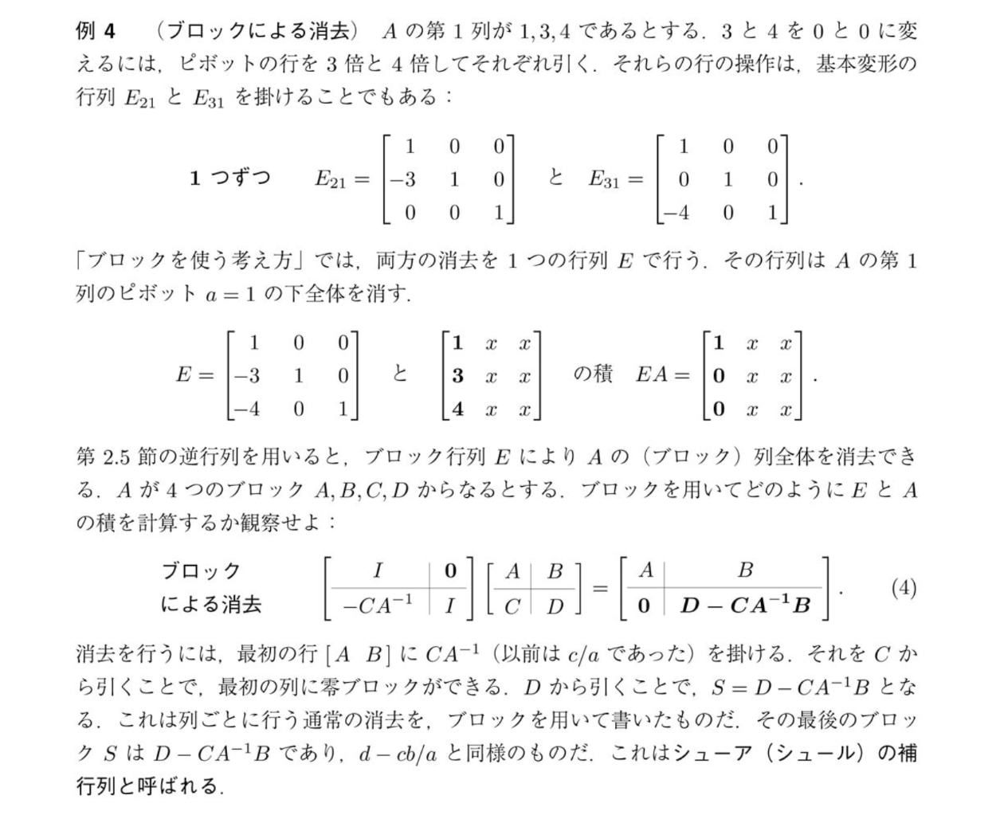

# ブロック行列による消去と式(4)の導出

画像にある式(4)は、これまで学んだ「ただの数字（スカラー）」に対する消去の操作を、「ブロック（行列のまとまり）」にそのまま拡張したものです。

## 1. 単位行列についての誤解を解く
まず、「単位行列作れなくないですか？」という疑問についてお答えします。
おそらく、「消去される側（右側）の行列の一部を $I$（単位行列）に変えようとしている」と捉えてしまっていませんか？

実は、式(4)の左側の行列（消去行列 $E$）に最初から用意されているのが $I$ です。
* 左側の行列は、**単位行列をベースにして作られた「消去行列 $E$」**です。
* 右側の行列が、**消去されるターゲットである元の行列**です。

これまで $2\times 2$ の行列で $E_{21} = \begin{bmatrix} 1 & 0 \\ -l & 1 \end{bmatrix}$ と書いていたものの「$1$」が、ブロック行列の世界では「$I$」にスケールアップしただけなのです。元の行列 $A, B, C, D$ を単位行列に無理やり変形しようとしているわけではありません。

## 2. 消去行列はどのようにして式(4)になるのか？
普通の数字の消去と完全に同じステップで考えます。

**【普通の数字の消去】**
$$ \begin{bmatrix} a & b \\ c & d \end{bmatrix} $$
* $a$ を使って $c$ を消したい。
* 乗数 $l = \frac{c}{a} = c \cdot a^{-1}$
* 消去行列 $E = \begin{bmatrix} 1 & 0 \\ -c a^{-1} & 1 \end{bmatrix}$

**【ブロックの消去（今回の式4）】**
$$ \begin{bmatrix} A & B \\ C & D \end{bmatrix} $$
* ブロック $A$ を使って ブロック $C$ を消したい。
* 乗数に当たるものは？ $\rightarrow$ $C$ を $A$ で割る（行列では $A^{-1}$ を右から掛ける）ので **$C A^{-1}$** になります。
* 消去行列 $E$ は、単位行列の形 $\begin{bmatrix} I & 0 \\ 0 & I \end{bmatrix}$ の左下に、マイナスをつけた乗数を配置して作ります。
  $$ E = \begin{bmatrix} I & 0 \\ -C A^{-1} & I \end{bmatrix} $$

## 3. 実際に掛け算してみる
作られた消去行列 $E$ を元の行列に左から掛けてみます（これが式(4)の左辺です）。

$$ \begin{bmatrix} I & 0 \\ -C A^{-1} & I \end{bmatrix} \begin{bmatrix} A & B \\ C & D \end{bmatrix} $$

ブロックを行列の要素とみなして、普通の行列の掛け算のルールに従って計算します：
* **1行目の計算**：
  * 左上：$I \cdot A + 0 \cdot C = A$
  * 右上：$I \cdot B + 0 \cdot D = B$
* **2行目の計算**：
  * 左下：$(-C A^{-1}) \cdot A + I \cdot C = -C + C = \mathbf{0}$ （見事に消去されました！）
  * 右下：$(-C A^{-1}) \cdot B + I \cdot D = \mathbf{D - C A^{-1} B}$ （これがシューアの補行列です）

これをまとめると、式(4)の右辺と完全に一致します。
$$ \begin{bmatrix} A & B \\ \mathbf{0} & \mathbf{D - C A^{-1} B} \end{bmatrix} $$

**結論：**
式(4)の左側の行列は「ターゲットを操作して作った単位行列」ではなく、**「下のブロックを $0$ にするために用意された、単位行列ベースの消去用ツール」**です。計算の仕組み自体は、数字の消去（$c/a$）と全く同じ形をしていることが分かります。

## 4. なぜ消去行列の右側は 0 と 1（または I）なのか？
「$b$ や $d$ が消えて $1$ になった」と見えてしまったのなら、それは**「操作する側の行列（消去行列 $E$）」**と**「操作される側の行列（ターゲットの行列）」**が混ざって見えてしまっているからです。

消去行列 $E = \begin{bmatrix} 1 & 0 \\ -ca^{-1} & 1 \end{bmatrix}$ の中には、ターゲットの右側の要素である $b$ や $d$ は**一切含まれません**。

この右側の $\begin{bmatrix} 0 \\ 1 \end{bmatrix}$ が意味しているのは、操作の**指示書**です。行列を左から掛けるとき、この部分は以下のような指示を出しています。
* 上の $0$：「新しい1行目を作るときは、元の2行目は **$0$ 倍**（つまり混ぜない）にしてね」
* 下の $1$：「新しい2行目を作るときは、元の2行目をベースとして **$1$ 倍**（そのままの形）で残してね（そこから1行目の $ca^{-1}$ 倍を引くから）」

もしこの右下が $1$ でなかったら、元の $d$ の値まで勝手に何倍かされて壊れてしまいます。「元の $d$ をそのままのスケールで保った上で引き算を行う」ために、消去行列のベースは必ず対角成分が $1$（ブロックなら $I$）の単位行列になっているのです。
