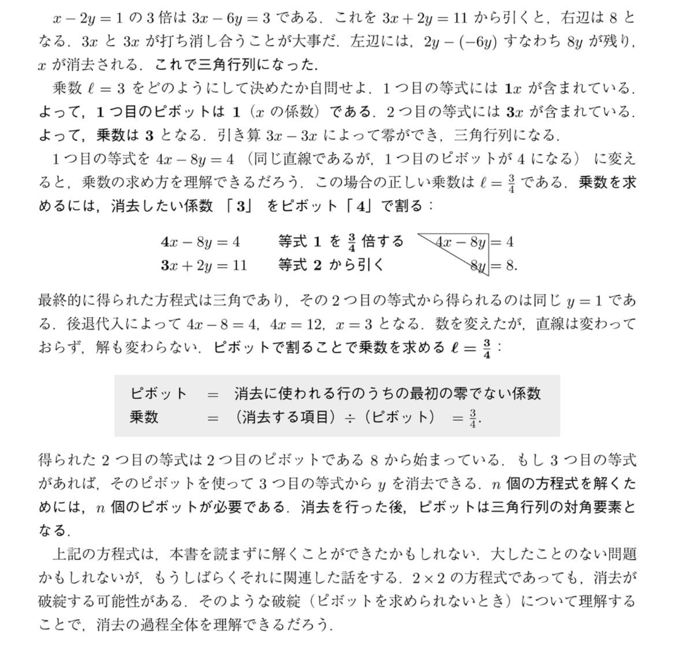

# ガウスの消去法における「ピボット」と「乗数」の本質

連立方程式を解く（行列を三角化する）過程である「ガウスの消去法」において、ただの手順として暗記しがちな「ピボット」と「乗数」の本質的な役割について解説します。

## 1. ピボット（Pivot）の本質：消去の「軸」
**ピボットとは、他の行の変数を消去するための「基準となる値（軸）」です。**

* **定義**: 消去に使われる行のうち、最初の「零でない」係数。
* **役割**: ピボットが存在するからこそ、その下の行にある変数を消去できます。もしピボットが `0` の場合、その変数を使って下の行を消すことができないため、行の交換が必要になります（消去の破綻の一歩手前）。
* **結果としての意味**: 消去（前進消去）がすべて終わった後、このピボットたちは最終的に「三角行列の対角要素」として並びます。

## 2. 乗数（Multiplier）の本質：ターゲットを消すための「倍率」
**乗数とは、下の行の変数をピッタリ 0 にして消滅させるために、基準行（ピボットがある行）に掛けるべき「倍率」です。**

* **計算式**: `乗数 = (消去したい項目) ÷ (ピボット)`
* **なぜこの計算式になるのか？**: 
  例えば、ピボットが `4` で、消去したい相手の係数が `3` だとします。
  ピボットの行を何倍すれば `3` になるでしょうか？
  答えは `3 ÷ 4 = 3/4` 倍です。
  基準行を `3/4` 倍して引くことで、`3 - 4 * (3/4) = 0` となり、見事に変数が消去されます。

## まとめ：ただの割り算ではなく「倍率合わせ」
学部生の時に「とりあえず割って引く」と作業的に解いていた操作の正体は、**「基準となる式の係数（ピボット）を、消したい係数にピッタリ合わせるための倍率（乗数）を求めている」**という非常に論理的なステップです。

この2つを理解することで、n次元の方程式において「n個のピボットが必要である」ことや、「なぜピボットが0だと困るのか」が直感的に分かるようになります。
