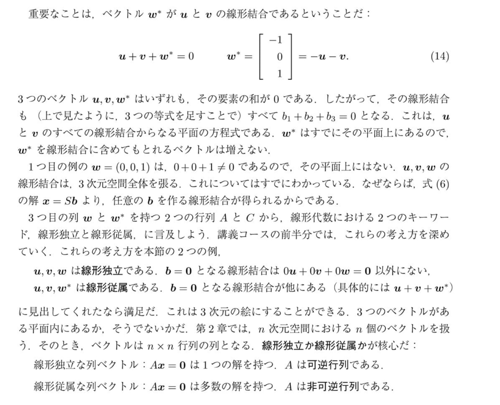

# [[ベクトル]] $w^*$ の導出と移項の意味

画像内の式 (14) について、「なぜ単なる移項で $[-1, 0, 1]$ という[[ベクトル]]が出てくるのか？」という疑問にお答えします。

## 1. 前提：[[ベクトル]] $u$ と $v$ の中身を思い出す
この画像の前のページ（巡回する差分[[行列]]）で、[[ベクトル]] $u$ と $v$ は以下のように定義されていました。

* $u = \begin{bmatrix} 1 \\ -1 \\ 0 \end{bmatrix}$
* $v = \begin{bmatrix} 0 \\ 1 \\ -1 \end{bmatrix}$

この「具体的な数字」が隠れていることが、移項しただけに見えるのに新しい数字が出てきてしまう最大の理由です。

## 2. 移項して実際に計算してみる
画像にある式 (14) は以下のようになっています。
$$u + v + w^* = 0$$

これを $w^*$ について解くために、$u$ と $v$ を右辺に**移項**します。
$$w^* = -u - v$$

一見するとただ記号を動かしただけですが、**右辺は「[[ベクトル]] $u$ と $v$ を足して、マイナスをかける」という計算の指示**になっています。実際に中身の数字を入れて計算してみましょう。

$$w^* = - \begin{bmatrix} 1 \\ -1 \\ 0 \end{bmatrix} - \begin{bmatrix} 0 \\ 1 \\ -1 \end{bmatrix}$$

上・真ん中・下の要素ごとに足し引き（引き算）を行います。

* **1番上の要素**：$-1 - 0 = -1$
* **真ん中の要素**：$-(-1) - 1 = 1 - 1 = 0$
* **一番下の要素**：$-0 - (-1) = 0 + 1 = 1$

これを縦に並べると、
$$w^* = \begin{bmatrix} -1 \\ 0 \\ 1 \end{bmatrix}$$
となります。

### 結論
「単なる移項」に見えるのは文字式（$w^* = -u -v$）で書かれているからであり、**その裏では前ページで定義された具体的な[[ベクトル]] $u$ と $v$ の引き算が実行されている**ため、結果として $[-1, 0, 1]$ という新しい[[ベクトル]]の要素が現れる、という仕組みでした。

（※ちなみに、このように「ある[[ベクトル]]が他の[[ベクトル]]の足し算・引き算で作れてしまう」関係のことを、テキストの下部にあるように**「線形従属（せんけいじゅうぞく）」**と呼びます。新しい[[ベクトル]] $w^*$ に見えて、実は $u$ と $v$ の影に過ぎない、ということです。）
