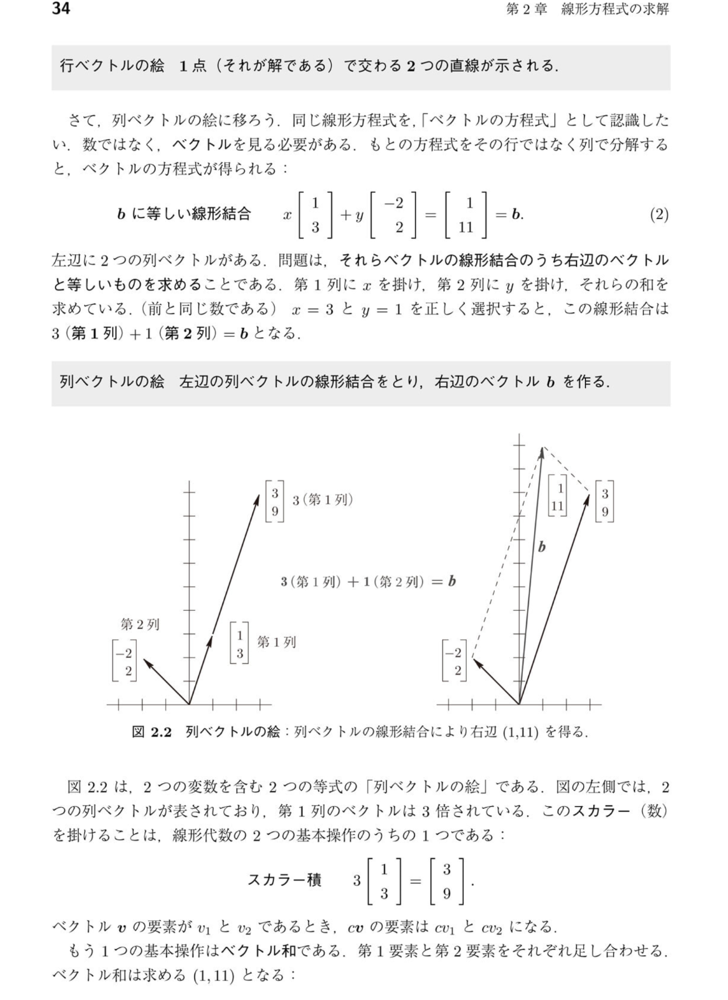

# 「行の絵」と「列の絵」が同じ解に行き着く理由

[[線形代数]]を学ぶ上で、ほとんどの人が最初に「不思議だなぁ」と引っかかるのがこの部分です。
「直線の交点（行の絵）」を探していたはずなのに、いつの間にか「矢印の足し算（列の絵）」の話になっていて、全く違う図形を描いているのになぜか同じ答え $x=3, y=1$ が出てきます。

この謎を、初歩的な数式の仕組みから丁寧に紐解いてみましょう。

## 1. 大元にある「2つの連立方程式」
すべての出発点は、中学校で習うような以下の連立方程式です。

1. $1x - 2y = 1$  （上の式）
2. $3x + 2y = 11$ （下の式）

この2つの式を、**「横（行）で見るか」「縦（列）で見るか」の違いが、図形の違いを生んでいます。**

---

## 2. 横に見る ＝「行の絵（Row Picture）」
方程式を1行ずつ、**独立した別々のルール**として見ます。

* ルール1： $1x - 2y = 1$ を満たす $(x, y)$ のペアを探せ。
  → これを図にすると、1つの**直線**になります。
* ルール2： $3x + 2y = 11$ を満たす $(x, y)$ のペアを探せ。
  → これを図にすると、もう1つの**直線**になります。

私たちが知りたいのは「ルール1もルール2も両方満たす $(x, y)$」なので、図形的には**2つの直線が交わる点**を探すことになります。これが「行の絵」の考え方です。

---

## 3. 縦に見る ＝「列の絵（Column Picture）」
今度は、同じ連立方程式を $x$ のグループ、$y$ のグループ、答えのグループとして**縦にスパッと切って**まとめます。

$x \begin{bmatrix} 1 \\ 3 \end{bmatrix} + y \begin{bmatrix} -2 \\ 2 \end{bmatrix} = \begin{bmatrix} 1 \\ 11 \end{bmatrix}$

ここでは直線を引くことは忘れてください。代わりに**「空間を移動するための矢印（[[ベクトル]]）」**が登場します。
* 1つ目の矢印：右に1、上に3進む $\begin{bmatrix} 1 \\ 3 \end{bmatrix}$
* 2つ目の矢印：左に2、上に2進む $\begin{bmatrix} -2 \\ 2 \end{bmatrix}$

問題は、**「1つ目の矢印を $x$ 回、2つ目の矢印を $y$ 回使って、目的地 $\begin{bmatrix} 1 \\ 11 \end{bmatrix}$ にピッタリ到着するにはどうすればいいか？」**というルート探しのゲームに変わります。これが「列の絵」です。

---

## 4. なぜ全く違う図形なのに答えが同じになるのか？
「直線の交点」と「矢印のルート探し」、図形としては全く別物ですよね。
しかし、**裏で行っている計算は「完全に同じ」**だからです。

「列の絵」で作った矢印の式を、もう一度よく見てください。
$x \begin{bmatrix} 1 \\ 3 \end{bmatrix} + y \begin{bmatrix} -2 \\ 2 \end{bmatrix} = \begin{bmatrix} 1 \\ 11 \end{bmatrix}$

この矢印の足し算を、「上の階（1行目）」と「下の階（2行目）」に分けて計算してみましょう。

* **上の階だけの計算**： $x \cdot 1 + y \cdot (-2) = 1$
* **下の階だけの計算**： $x \cdot 3 + y \cdot 2 = 11$

お気づきでしょうか？
「列の矢印の上の階だけ」を取り出すと、**完全に行の絵のルール1（上の式）に戻る**のです。下の階もルール2（下の式）と全く同じです。

### 結論
* **行の絵**：「上の式を満たす点」と「下の式を満たす点」を別々に描いてから、両方満たす場所を探すアプローチ。
* **列の絵**：「上の式と下の式を同時に」計算していくアプローチ。

見ている切り口（横でスライスするか、縦でスライスするか）が違うため、頭の中に描かれる図形は「交差する線」と「伸び縮みする矢印」という風に思いっ切り変わります。

しかし、**「$1x - 2y = 1$ になり、かつ $3x + 2y = 11$ になるような $x, y$ を探している」という数学的な事実は1ミリも変わっていません**。だからこそ、どんなに図形が違って見えても、全く同じ $x=3, y=1$ という答えにピタリと帰着するのです。
