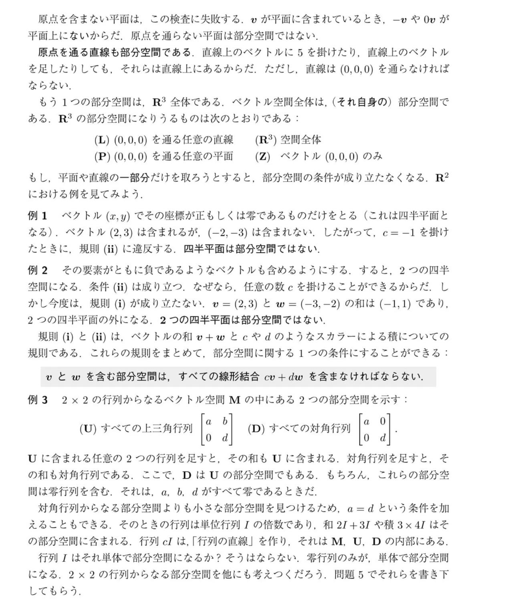

# 部分空間の条件 $v+w$ は「誰と誰」を足す規則なのか

## 疑問

> $v$ が部分空間であっても、足す相手の $w$ が部分空間でなかったら、$v$ も部分空間ではないのか？
> $v$ しか部分空間を持たないベクトルがあったら詰みでは？

## 結論：まず「部分空間」の指すものがズレている

**部分空間はベクトルの性質ではなく、ベクトルを集めた「集合」の性質です。** $v$ や $w$ は部分空間ではなく、部分空間の**中身（メンバー）**です。

| 登場するもの | 正体 |
| --- | --- |
| $v,\ w$ | ベクトル（メンバー1人ずつ） |
| $S$ | ベクトルの集まり（部屋）。これが部分空間かどうかを調べる |

「$v$ が部分空間である」という言い方は成立しません。調べる対象は、常に**集まり $S$ 全体**です。

## 規則 (i)・(ii) の正しい読み方

集まり $S$ が部分空間であるための条件は次の2つです。

- **(i)**：$S$ の**中にいる**どのベクトル $v,\ w$ を選んでも、$v+w$ が $S$ の**中に留まる**
- **(ii)**：$S$ の中のどのベクトル $v$ と、どんな数 $c$ を選んでも、$cv$ が $S$ の**中に留まる**

ポイントは **「$v$ も $w$ も $S$ のメンバーの中から選ぶ」** という点です。$S$ の外にいるベクトルは、そもそも検査の対象外です。だから「$w$ が部分空間でない」という状況は発生せず、あるのは「$w$ が $S$ のメンバーかどうか」だけです。

## 具体例で確かめる

### 合格する例：$x$ 軸（原点を通る直線）

$$ S=\{(t,0)\mid t\text{ は任意の実数}\} $$

- (i)：$(a,0)+(b,0)=(a+b,0)$ → $S$ の中に留まる
- (ii)：$c\,(a,0)=(ca,0)$ → $S$ の中に留まる

**合格**。$S$ は部分空間です。

### 「外のベクトルを足すと外に出る」は不合格の理由にならない

$v=(1,0)$（$S$ のメンバー）と、$w=(0,1)$（$S$ の**外**）を足すと $(1,1)$ で、確かに $S$ の外に出ます。しかし $w$ は $S$ のメンバーではないので、**この足し算は検査の対象外**です。$S$ が部分空間かどうかには影響しません。

### 不合格になる例：教科書の例2（2つの四半平面）

ここでは $v=(2,3)$ も $w=(-3,-2)$ も**集まり $S$（第1象限と第3象限）のメンバー**です。なのに $v+w=(-1,1)$ は $S$ の外に出ます。**メンバーどうしを足して外に出た**ので不合格です。

### 不合格になる例：教科書の例1（第1象限のみ）

$v=(2,3)$ は $S$ のメンバーですが、$c=-1$ を掛けた $(-2,-3)$ は外に出ます。(ii) に違反です。

## 「$v$ しかない集まり」は詰みか

$S=\{v\}$（メンバーが $v$ だけ）で考えます。

- $v\ne0$ の場合：(ii) で $2v$ を作ると $\{v\}$ の外に出る。また $0\cdot v=0$ も外。**不合格**
- $v=0$ の場合：$0+0=0$、$c\cdot0=0$ で、どちらも $\{0\}$ の中に留まる。**合格**。これが教科書の (Z)（零ベクトルのみ）

つまり「$v$ しか持たない集まり」が部分空間になるのは $v=0$ のときだけです。

ただし、**詰みではありません**。$v$ が $0$ でなくても、$v$ を材料にして部分空間を作れます。

$$ S=\{cv\mid c\text{ は任意の実数}\} $$

$v$ のあらゆる定数倍を集めた集まりです。

- (i)：$cv+dv=(c+d)v$ → 中に留まる
- (ii)：$d(cv)=(dc)v$ → 中に留まる

これは**原点と $v$ を通る直線**で、$v$ を含む最小の部分空間です。

## 教科書の枠内の文の意味

> $v$ と $w$ を含む部分空間は、すべての線形結合 $cv+dw$ を含まなければならない。

これは「$v$ と $w$ を**メンバーにしたいなら**、$cv+dw$ の形のものは全部一緒に入れる必要がある」という意味です。

- $v,w$ が同じ向きでない：$cv+dw$ 全体は原点を通る**平面**
- $v,w$ が同じ向き：$cv+dw$ 全体は原点を通る**直線**

材料になるベクトルを何個渡されても、それらを含む部分空間は**必ず作れます**（全部の線形結合を集めればよい）。

## 教科書の例3（行列の部分空間）も同じ読み方

$2\times2$ の行列の集まり $M$ の中で、上三角行列の集まり $U$、対角行列の集まり $D$ を調べています。

- $U$ のメンバー2つ（例：$\begin{bmatrix}1&2\\0&3\end{bmatrix}$ と $\begin{bmatrix}4&5\\0&6\end{bmatrix}$）を足すと $\begin{bmatrix}5&7\\0&9\end{bmatrix}$ で、左下が $0$ のまま → $U$ の中に留まる
- $D$ のメンバー2つを足しても、対角以外は $0$ のまま → $D$ の中に留まる
- $D$ のメンバーは全員 $U$ のメンバーでもあるので、$D$ は $U$ の部分空間

ここでは行列1つ1つが「ベクトル」の役を果たしています。

## まとめ

- 部分空間はベクトルの集まり。$v$ や $w$ 自身が部分空間になることはない
- 検査は「集まりの**メンバーどうし**を足す・定数倍する」。外のベクトルは対象外
- メンバーどうしの和や定数倍が**外に出たら不合格**、**中に留まり続けたら合格**
- 零ベクトルだけの集まり $\{0\}$ は部分空間。$v\ne0$ 単独の集まり $\{v\}$ は不合格だが、$v$ の定数倍を全部集めれば直線になり、部分空間になる
