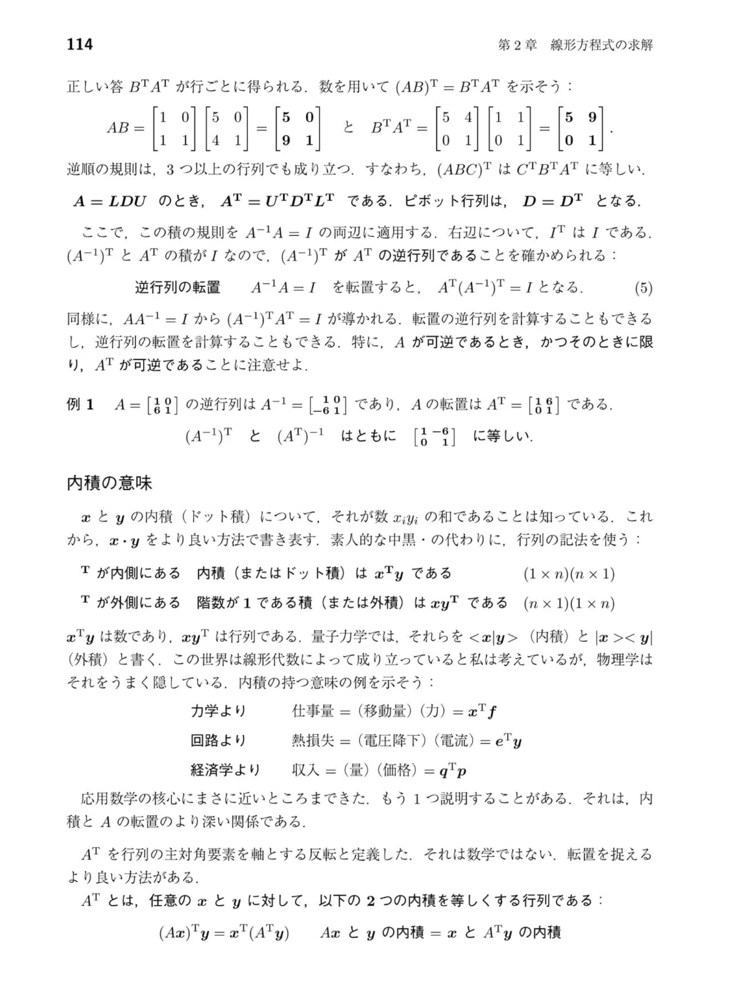
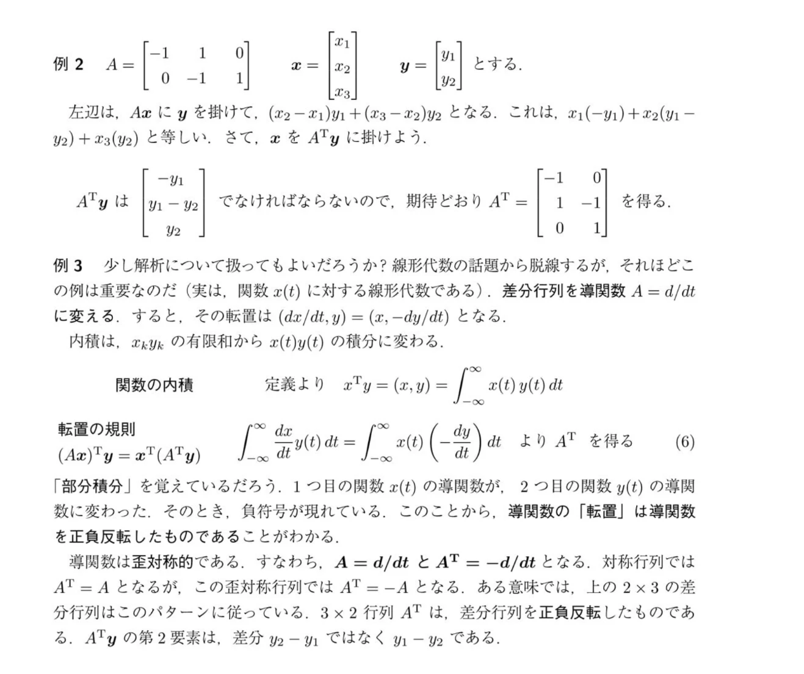

# 転置行列 $A^{\mathsf T}$・ピボット行列 $D$・内積 $x^{\mathsf T}y$ を整理する

> **表記メモ（この記事内で統一）**：「行」＝横方向、「列」＝縦方向。$a_{ij}$ の $i$ が「何行目」、$j$ が「何列目」を表します。また、[[ベクトル]]は特に断らない限り**縦に並べた1本の列**（$n\times1$）として扱います。

教科書114ページで詰まった2点を順に解きほぐします。

1. 「ピボット行列 $D$」とは何か、なぜ $D=D^{\mathsf T}$ なのか
2. 高校で習った内積が、なぜ $x^{\mathsf T}y$ という形で出てくるのか

---

## 1. ピボット行列 $D$ とは何のことか

**新しい概念ではありません。** 前に [[LU分解]] のノートで出てきた $LDU$ 分解の $D$ そのものです。

$$ A = L\,D\,U,\qquad D=\begin{bmatrix} d_1 & 0 & 0\\ 0 & d_2 & 0\\ 0 & 0 & d_3 \end{bmatrix}\quad(d_1,d_2,d_3=\text{ピボット}) $$

- 消去で出てきた**ピボットを、対角線上に並べただけ**の[[行列]]です。だから「ピボット行列」と呼んでいます。
- このとき $L$ も $U$ も対角成分は全部 $1$ です（ピボットの大きさは $D$ に吸い出してあるため）。

### なぜ $D = D^{\mathsf T}$ なのか

転置とは「行と列を入れ替える」操作です（$(i,j)$ 成分と $(j,i)$ 成分を交換する）。$D$ は対角成分以外が全部 $0$ なので、入れ替えても**動かせる数字が一つもありません**。だから $D^{\mathsf T}=D$ です。

### $A=LDU$ から $A^{\mathsf T}=U^{\mathsf T}D^{\mathsf T}L^{\mathsf T}$ になる理由

教科書の太字の2行は、この一本の流れです。

$$ A^{\mathsf T}=(LDU)^{\mathsf T}=U^{\mathsf T}\,D^{\mathsf T}\,L^{\mathsf T}=U^{\mathsf T}\,D\,L^{\mathsf T} $$

- 積の転置は**順番がひっくり返る**（次節で説明）ので $L,D,U$ の並びが逆になる
- $D^{\mathsf T}=D$ なのでそのまま $D$
- $U$ は上三角なので、転置した $U^{\mathsf T}$ は**下三角**になる。$L^{\mathsf T}$ は逆に**上三角**になる

つまり $A^{\mathsf T}=(\text{下三角})(\text{対角})(\text{上三角})$ という、**また $LDU$ の形**になっています。「$A^{\mathsf T}$ の $LDU$ 分解は、$A$ の分解を転置して並べ替えれば手に入る」というのが、この2行の言いたいことです。

---

## 2. $(AB)^{\mathsf T}=B^{\mathsf T}A^{\mathsf T}$（順番が逆になる）

教科書の例を実際に計算します。

$$ AB=\begin{bmatrix}1&0\\1&1\end{bmatrix}\begin{bmatrix}5&0\\4&1\end{bmatrix}=\begin{bmatrix}5&0\\9&1\end{bmatrix} $$

これを転置（行と列を入れ替え）すると

$$ (AB)^{\mathsf T}=\begin{bmatrix}5&9\\0&1\end{bmatrix} $$

一方、$B^{\mathsf T}A^{\mathsf T}$ は

$$ B^{\mathsf T}A^{\mathsf T}=\begin{bmatrix}5&4\\0&1\end{bmatrix}\begin{bmatrix}1&1\\0&1\end{bmatrix}=\begin{bmatrix}5&9\\0&1\end{bmatrix} $$

一致します。ちなみに $A^{\mathsf T}B^{\mathsf T}$ の順で掛けると $\begin{bmatrix}1&1\\0&1\end{bmatrix}\begin{bmatrix}5&4\\0&1\end{bmatrix}=\begin{bmatrix}5&5\\0&1\end{bmatrix}$ となり合いません。

### 「逆順」になる理由（サイズで確認する）

$A$ が $m\times n$、$B$ が $n\times p$ とします。

| 式 | サイズ | 計算できるか |
| --- | --- | --- |
| $AB$ | $(m\times n)(n\times p)=m\times p$ | ○ |
| $(AB)^{\mathsf T}$ | $p\times m$ | — |
| $B^{\mathsf T}A^{\mathsf T}$ | $(p\times n)(n\times m)=p\times m$ | ○（サイズが一致） |
| $A^{\mathsf T}B^{\mathsf T}$ | $(n\times m)(p\times n)$ | ×（$m\ne p$ なら掛け算自体が不可能） |

逆順でないとそもそも掛け算が成立しません。逆行列の $(XY)^{-1}=Y^{-1}X^{-1}$（靴下と靴）と同じ形です。

### 逆行列の転置：$(A^{-1})^{\mathsf T}=(A^{\mathsf T})^{-1}$

$A^{-1}A=I$ の両辺を転置します。左辺は逆順ルールで、右辺は $I^{\mathsf T}=I$（単位行列は転置しても同じ）です。

$$ A^{\mathsf T}\,(A^{-1})^{\mathsf T}=I $$

「$A^{\mathsf T}$ に掛けたら $I$ になる」のは $A^{\mathsf T}$ の逆行列の定義そのものなので、$(A^{-1})^{\mathsf T}$ が $A^{\mathsf T}$ の逆行列だと分かります。例1で確かめると、

$$ A=\begin{bmatrix}1&0\\6&1\end{bmatrix},\quad (A^{-1})^{\mathsf T}=\begin{bmatrix}1&-6\\0&1\end{bmatrix},\quad (A^{\mathsf T})^{-1}=\begin{bmatrix}1&6\\0&1\end{bmatrix}^{-1}=\begin{bmatrix}1&-6\\0&1\end{bmatrix} $$

（$A^{-1}=\begin{bmatrix}1&0\\-6&1\end{bmatrix}$ を転置すると $\begin{bmatrix}1&-6\\0&1\end{bmatrix}$ になり、確かに一致します。）

---

## 3. 内積がなぜ $x^{\mathsf T}y$ になるのか

### 高校の内積と同じものです

高校で習った $x\cdot y=x_1y_1+x_2y_2+\cdots+x_ny_n$ は、**一切変わっていません**。同じ数字を、[[行列]]の掛け算の書き方で書き直しただけです。書き直す理由は、そうすると内積を**行列の計算ルール（結合法則・転置の逆順ルールなど）の中に取り込める**からです。

### 「行 × 列 ＝ 数字1個」

[[ベクトル]] $x$ は縦に並べた $n\times1$ の列です。転置した $x^{\mathsf T}$ は横に並べた $1\times n$ の行になります。

$$ x=\begin{bmatrix}1\\2\\3\end{bmatrix},\ y=\begin{bmatrix}4\\5\\6\end{bmatrix}\ \Rightarrow\ x^{\mathsf T}y=\begin{bmatrix}1&2&3\end{bmatrix}\begin{bmatrix}4\\5\\6\end{bmatrix}=1\cdot4+2\cdot5+3\cdot6=32 $$

サイズで見ると $(1\times n)(n\times1)=1\times1$、つまり**数字が1個**です。「横一列 × 縦一列」なので、各成分がぴったり対になって掛かり、全部足されます。これが内積の正体です。

### 「$\mathsf T$ が内側／外側」の違い

教科書の2つの積を並べます。

| 名前 | 式 | サイズ | 結果 |
| --- | --- | --- | --- |
| 内積（ドット積） | $x^{\mathsf T}y$ | $(1\times n)(n\times1)$ | **数字1個** |
| 外積（階数1の積） | $xy^{\mathsf T}$ | $(n\times1)(1\times n)$ | **$n\times n$ の行列** |

$x=\begin{bmatrix}1\\2\end{bmatrix},\ y=\begin{bmatrix}3\\4\end{bmatrix}$ で外積を計算すると

$$ xy^{\mathsf T}=\begin{bmatrix}1\\2\end{bmatrix}\begin{bmatrix}3&4\end{bmatrix}=\begin{bmatrix}1\cdot3&1\cdot4\\2\cdot3&2\cdot4\end{bmatrix}=\begin{bmatrix}3&4\\6&8\end{bmatrix} $$

2行目は1行目の $2$ 倍で、全部の行が同じ向きなので階数（ランク）が $1$ です。覚え方は次の通りです。

- **$\mathsf T$ が内側**（$x^{\mathsf T}y$）：中の $n$ どうしがぶつかって消え、$1\times1$ が残る → 数字
- **$\mathsf T$ が外側**（$xy^{\mathsf T}$）：中の $1$ どうしがぶつかって消え、外側の $n\times n$ が残る → 行列

### 教科書の3つの例は全部「掛けて足す」

| 分野 | 式 | 中身 |
| --- | --- | --- |
| 力学 | 仕事量 $=x^{\mathsf T}f$ | 移動量 $\times$ 力 を成分ごとに掛けて足す |
| 回路 | 熱損失 $=e^{\mathsf T}y$ | 電圧降下 $\times$ 電流 を成分ごとに掛けて足す |
| 経済 | 収入 $=q^{\mathsf T}p$ | 量 $\times$ 価格 を成分ごとに掛けて足す |

「対応するもの同士を掛けて、全部足す」という状況は世の中に山ほどあり、それが全部 $x^{\mathsf T}y$ で書けます。

---

## 4. 本題：$A^{\mathsf T}$ の本当の定義

ページ末尾の一番大事な部分です。

> $A^{\mathsf T}$ とは、任意の $x$ と $y$ に対して $(Ax)^{\mathsf T}y=x^{\mathsf T}(A^{\mathsf T}y)$ を成り立たせる行列である。

「対角線で折り返す」という説明は手順であって、**転置の意味**ではない、というのが著者の主張です。意味は「$A$ を $x$ 側に掛ける代わりに、$A^{\mathsf T}$ を $y$ 側に掛けても内積が変わらない」ことです。

### 逆順ルールからそのまま出る

$$ (Ax)^{\mathsf T}y=x^{\mathsf T}A^{\mathsf T}y=x^{\mathsf T}(A^{\mathsf T}y) $$

最初の等号が $(AB)^{\mathsf T}=B^{\mathsf T}A^{\mathsf T}$（$B$ が $x$ の場合）です。新しい証明は要りません。

### 数字で確かめる

教科書の例1の $A=\begin{bmatrix}1&0\\6&1\end{bmatrix}$、$x=\begin{bmatrix}1\\2\end{bmatrix}$、$y=\begin{bmatrix}3\\1\end{bmatrix}$ を使います。

**左辺 $(Ax)\cdot y$**：

$$ Ax=\begin{bmatrix}1\cdot1+0\cdot2\\6\cdot1+1\cdot2\end{bmatrix}=\begin{bmatrix}1\\8\end{bmatrix},\qquad (Ax)\cdot y=1\cdot3+8\cdot1=11 $$

**右辺 $x\cdot(A^{\mathsf T}y)$**：

$$ A^{\mathsf T}=\begin{bmatrix}1&6\\0&1\end{bmatrix},\quad A^{\mathsf T}y=\begin{bmatrix}1\cdot3+6\cdot1\\0\cdot3+1\cdot1\end{bmatrix}=\begin{bmatrix}9\\1\end{bmatrix},\qquad x\cdot(A^{\mathsf T}y)=1\cdot9+2\cdot1=11 $$

どちらも $11$ で一致しました。$A$ を $x$ 側に付けても、$A^{\mathsf T}$ を $y$ 側に付けても、内積の値は同じです。

### まとめ

- $D$（ピボット行列）は対角にピボットを並べただけなので、転置しても変わらない（$D=D^{\mathsf T}$）
- 積の転置は順番が逆になる。サイズを見れば逆順でないと計算自体が成立しない
- 内積 $x\cdot y$ は $x^{\mathsf T}y$（行 × 列 ＝ 数字1個）。高校の内積と同じ値
- $A^{\mathsf T}$ の意味は「内積の中で $A$ を反対側に移すときの相棒」

---

## 【追加の疑問1】内積と外積は「行×列」か「列×行」かの違いか

**その理解で合っています。** 順番を入れ替えただけで、結果の種類がまったく変わります。

| 名前 | 式 | 並び（横＝行、縦＝列） | サイズ | 結果 |
| --- | --- | --- | --- | --- |
| 内積 | $x^{\mathsf T}y$ | 行 × 列 | $(1\times n)(n\times1)$ | 数字1個 |
| 外積（この教科書の呼び方） | $xy^{\mathsf T}$ | 列 × 行 | $(n\times1)(1\times n)$ | $n\times n$ の行列 |

なお、3次元の「外積（クロス積、$a\times b$）」は別物で、こちらは[[ベクトル]]を返します。この教科書の外積は「階数（ランク）が $1$ の積」のことなので、混同しないでください。

---

## 【追加の疑問2】$(Ax)^{\mathsf T}y=x^{\mathsf T}(A^{\mathsf T}y)$ のメリットは何か

「同じ値になるなら、計算しやすい方を選べばいい」という理解は**メリットの一つとして正しい**です。ただし、それは副次的な利点で、著者が言いたい主眼は「$A^{\mathsf T}$ を折り返しではなく**性質で定義する**」ことにあります。メリットを3つに分けます。

### メリット1：実際に計算量が減る（「使い回し」の効果）

$A$ が巨大な $n\times n$ で、**同じ $y$ に対して、たくさんの違う $x$ の内積 $(Ax)\cdot y$ を求めたい**とします。

- 左辺のまま：$x$ ごとに $Ax$（約 $n^2$ 回の掛け算）→ その後に内積
- 右辺に直す：$A^{\mathsf T}y$ を**1回だけ**計算（約 $n^2$ 回）して手元に置き、あとは $x$ ごとに内積だけ（約 $n$ 回）

前に見た「$LU$ で消去を1回だけやって使い回す」と同じ発想です。教科書の $A=\begin{bmatrix}1&0\\6&1\end{bmatrix}$、$y=\begin{bmatrix}3\\1\end{bmatrix}$ で確かめます。

まず $A^{\mathsf T}y=\begin{bmatrix}1&6\\0&1\end{bmatrix}\begin{bmatrix}3\\1\end{bmatrix}=\begin{bmatrix}9\\1\end{bmatrix}$ を**1回だけ**作ります。

| $x$ | 右辺：$x\cdot(A^{\mathsf T}y)$（内積だけ） | 左辺：$Ax$ を作ってから $(Ax)\cdot y$ |
| --- | --- | --- |
| $(1,2)$ | $9+2=11$ | $Ax=(1,8)$、$3+8=11$ |
| $(2,0)$ | $18+0=18$ | $Ax=(2,12)$、$6+12=18$ |
| $(0,1)$ | $0+1=1$ | $Ax=(0,1)$、$0+1=1$ |

右辺の方は、$x$ が増えても「$(9,1)$ との内積」だけで済みます。

### メリット2：$A^{\mathsf T}$ の「意味」が分かる（折り返しからは見えない）

「対角線で折り返す」は手順の説明にすぎず、**なぜそれが大事なのか**が見えません。内積を使った定義なら、意味がはっきりします。

> $A^{\mathsf T}$ ＝ 内積の中で $A$ を**反対側の[[ベクトル]]に移すときの相棒**

教科書が挙げた例で言うと、回路では電圧降下 $e$ が $e=Ax$（$x$ は各点の電位）で作られ、熱損失は $e^{\mathsf T}y=(Ax)^{\mathsf T}y$ でした。これを $x^{\mathsf T}(A^{\mathsf T}y)$ と書き直すと、「電位 $x$ と $A^{\mathsf T}y$ の内積」という別の見方になります。$A^{\mathsf T}$ が「$y$ 側の世界で $A$ の役割を引き継ぐ行列」として働いているわけです（後の章で詳しく扱われる話なので、ここでは「そういう役割がある」という予告として受け取れば十分です）。

### メリット3：定義から折り返しが「導ける」（順序が逆転する）

この性質を**定義**にしても、「折り返し」が結果として自動的に出てきます。$x=e_i$（$i$ 番目だけ $1$ で他が $0$ の[[ベクトル]]）、$y=e_j$ を入れます。

- 左辺 $(Ae_i)\cdot e_j$：$Ae_i$ は $A$ の**$i$ 列目**、その $j$ 番目の成分を取り出すので $a_{ji}$（$j$ 行 $i$ 列の成分）
- 右辺 $e_i\cdot(A^{\mathsf T}e_j)$：$A^{\mathsf T}e_j$ は $A^{\mathsf T}$ の**$j$ 列目**、その $i$ 番目の成分なので $(A^{\mathsf T})_{ij}$

両者が等しいので

$$ (A^{\mathsf T})_{ij}=a_{ji} $$

となり、「$(i,j)$ 成分と $(j,i)$ 成分の入れ替え」が確かに出てきます。教科書の $A$ で確認すると、$Ae_1=(1,6)$（1列目）、$e_2$ との内積は $6=a_{21}$。一方 $A^{\mathsf T}=\begin{bmatrix}1&6\\0&1\end{bmatrix}$ の $(1,2)$ 成分も $6$ で一致します。

つまり **「内積を保つ相棒」を定義にすると、「折り返し」は定理として導かれる**という関係です。逆（折り返しを定義にする）だと、なぜそれが大事なのかは分かりません。

### まとめ

- 計算しやすい方を選べる：**その通り。** 同じ $y$ で $x$ が大量にあるとき、$A^{\mathsf T}y$ を1回作って使い回せる
- ただし本題は、**$A^{\mathsf T}$ の意味づけ**（内積の中で $A$ を反対側に移す相棒）と、そこから折り返しが導ける、という点
- この見方は、「折り返す」という図が使えない場面（行列以外の対象）に $A^{\mathsf T}$ を拡張するときの出発点にもなる（先の話として、いまは覚えなくてよい）

---

## 【例2・例3】差分行列の転置が、なぜ部分積分になるのか

> この節でも「行＝横、列＝縦」です。$A$ は $2\times3$（2行3列）の行列、[[ベクトル]] $x$ は3成分、$y$ は2成分の縦の列です。

結論を先に書くと、**部分積分は「差分行列の転置」の連続版**です。摩訶不思議に見えるのは、例2（有限個の数）を飛ばして例3（関数）を見るからで、例2の計算をそのまま連続にしたものが部分積分になっています。順に追います。

### 例2：$A^{\mathsf T}$ を「$x$ の係数を集める」ことで求める

$$ A=\begin{bmatrix}-1&1&0\\0&-1&1\end{bmatrix},\qquad Ax=\begin{bmatrix}x_2-x_1\\x_3-x_2\end{bmatrix} $$

$A$ は「隣どうしの差を取る」行列です。左辺 $(Ax)\cdot y$ を計算します。

$$ (Ax)\cdot y=(x_2-x_1)y_1+(x_3-x_2)y_2 $$

これを**$x_1,x_2,x_3$ ごとに係数をまとめ直す**と

$$ =x_1(-y_1)+x_2(y_1-y_2)+x_3(y_2) $$

となります。これは「$x$ と何かの内積」の形なので、その「何か」が $A^{\mathsf T}y$ です。

$$ A^{\mathsf T}y=\begin{bmatrix}-y_1\\y_1-y_2\\y_2\end{bmatrix}\ \Longrightarrow\ A^{\mathsf T}=\begin{bmatrix}-1&0\\1&-1\\0&1\end{bmatrix} $$

（$A$ の行と列を入れ替えた形と一致します。前節で「定義から折り返しが導ける」と書いた通りです。）

数字で確認します。$x=(1,4,9)$、$y=(2,3)$ とします。

- 左辺：$Ax=(4-1,\ 9-4)=(3,5)$、$(Ax)\cdot y=3\cdot2+5\cdot3=21$
- 右辺：$A^{\mathsf T}y=(-2,\ 2-3,\ 3)=(-2,-1,3)$、$x\cdot(A^{\mathsf T}y)=-2-4+27=21$

一致します。

### 何が起きたのか：添字をずらして「差」を $y$ 側へ移した

$A$ は $x$ の**差** $x_{k+1}-x_k$ を取る操作でした。内積 $\sum_k(x_{k+1}-x_k)\,y_k$ を、$x$ を主役にして並べ直すために、$x_{k+1}$ の項だけ添字を $1$ つずらします。

$$ \sum_k x_{k+1}y_k-\sum_k x_ky_k=\sum_k x_k\,y_{k-1}-\sum_k x_ky_k=\sum_k x_k\,(y_{k-1}-y_k) $$

- 差を取る相手が $x$ から $y$ に移った（$x_{k+1}-x_k$ が $y_{k-1}-y_k$ になった）
- しかも向きが逆になり、**符号が反転した**（$x_{k+1}-x_k$ は「後 $-$ 前」、$y_{k-1}-y_k$ は「前 $-$ 後」）

符号が反転するのは、$x_{k+1}$ の係数だったものが、ずらすと1つ前の $y_{k-1}$ にくっつくためです。教科書の最後の一文「$A^{\mathsf T}y$ の第2要素は $y_2-y_1$ ではなく $y_1-y_2$」は、この符号反転のことです。

両端（$x_1$ と $x_3$）は、$y_0$ も $y_3$ も存在しない（$0$ 扱い）ので、$(A^{\mathsf T}y)_1=y_0-y_1=-y_1$、$(A^{\mathsf T}y)_3=y_2-y_3=y_2$ になっています。

### 例3：同じ操作を、和から積分に置き換えるだけ

例2の中身を、有限個の数から関数に置き換えます。

| | 例2（数の列） | 例3（関数） |
| --- | --- | --- |
| 内積 | $\sum_k x_ky_k$ | $\int x(t)y(t)\,dt$ |
| $A$ の役割 | 隣の差 $x_{k+1}-x_k$ | 微小な差 $\dfrac{dx}{dt}$ |
| 移す操作 | 添字を $1$ つずらす | 部分積分 |
| 結果 | $A^{\mathsf T}y\ \leftrightarrow\ y_{k-1}-y_k$（符号反転） | $A^{\mathsf T}y=-\dfrac{dy}{dt}$（符号反転） |

$A=d/dt$ のとき、$(Ax)\cdot y$ は

$$ \int_{-\infty}^{\infty}\frac{dx}{dt}\,y(t)\,dt $$

です。これを「$x$ と何かの内積」の形にしたいので、部分積分を使います。

$$ \int x'y\,dt=\Big[x\,y\Big]_{-\infty}^{\infty}-\int x\,y'\,dt=\int x(t)\Big(-\frac{dy}{dt}\Big)dt $$

境界項 $[xy]$ は、関数が両端で $0$ になる（この前提で内積を定義している）ので消えます。すると $x$ と $(-dy/dt)$ の内積になっており、

$$ A^{\mathsf T}=-\frac{d}{dt} $$

だと読み取れます。**「$x$ の係数を集め直して $A^{\mathsf T}y$ を読み取る」という例2とまったく同じ手順**です。

### 「なぜ符号が反転するのか」の直感

積の微分 $(xy)'=x'y+xy'$ を両端まで積分すると、$xy$ が両端で $0$ なので左辺は $0$ になります。

$$ 0=\int x'y\,dt+\int xy'\,dt\ \Longrightarrow\ \int x'y\,dt=-\int xy'\,dt $$

「$xy$ の変化の総量はゼロ」なので、$x$ が増えた分だけ $y$ 側が減る、という釣り合いです。例2の「添字をずらすと符号が反転する」も、有限個の版のこの釣り合いです（和の入れ替えでも、両端の項を除いて同じ打ち消しが起きています）。

### 歪対称（$A^{\mathsf T}=-A$）とは

- 対称行列：$A^{\mathsf T}=A$（例：$\begin{bmatrix}2&1\\1&2\end{bmatrix}$）
- 歪対称行列：$A^{\mathsf T}=-A$（例：$K=\begin{bmatrix}0&1\\-1&0\end{bmatrix}$、$K^{\mathsf T}=\begin{bmatrix}0&-1\\1&0\end{bmatrix}=-K$）

$d/dt$ は $A^{\mathsf T}=-d/dt=-A$ なので歪対称です。歪対称なものには、$x$ 自身との内積が $0$ になるという性質があります。$(Kx)\cdot x=x\cdot(K^{\mathsf T}x)=-x\cdot(Kx)$ より $(Kx)\cdot x=0$。関数の世界では $\int x\,x'\,dt=\big[x^2/2\big]=0$ に対応します。

教科書が「差分行列 $A$（$2\times3$）はこのパターンに従っている」と言うのは、$A$ が $d/dt$ の有限版であり、$A^{\mathsf T}$（$3\times2$）が符号反転した差になっているためです。ただし $A$ は正方行列ではないので、$A^{\mathsf T}=-A$ と等号で書くことはできず、「パターンに従っている」という言い方に留まります。

### まとめ

- 部分積分は、「差を $x$ から $y$ へ移す」操作の連続版で、符号が反転するのはその仕組み上のこと
- 例2で $A^{\mathsf T}y$ を求めたときの「$x$ の係数を集め直す」を、例3ではそのまま部分積分で行っている
- 「内積を保つ相棒」という転置の定義が使えるので、行列以外の対象（関数と微分）にも $A^{\mathsf T}$ を作れる。前節の「折り返し図が使えない場面に拡張できる」の実例が、この $A^{\mathsf T}=-d/dt$
