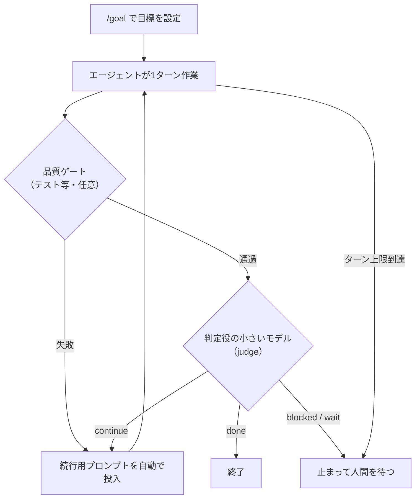

# ループエンジニアリングの知識は「ハーネスを使う側」でも使えるか

## 質問

[[textbooks/ループエンジニアリング/08章]] までの内容（Loop Engineering / Harness）は、
Hermes や Cline のような「ハーネスを作る側」の中身の話でしか通用しないのか。

既存のハーネスの上で `task.md`、goal コマンド、`guardrail.md` のようなファイルを使って
エージェントを自律的に動かす仕組みを作るとき、DDDの考え方や役割の分解、
それに基づくフォルダの切り分けは役に立つのか。

## 結論

**使える。しかも「使う側」の方が直接効く部分がある。** ただし効く章と効かない章がはっきり分かれる。

既存ハーネスを使うとき、自分が書かなくて済むのは Queue・Watcher・アトミック保存といった
**「エンジン部分」**（第6・7・9章）。
一方で、`task.md` や `guardrail.md` を書くという行為は、教科書の **Task・State・Checker・終了条件を
Markdownで設計すること**そのもの。つまり「ハーネスの設定層」を自分が設計している。

## 教科書の部品と、ハーネス利用時のファイルの対応

| 教科書の部品 | ハーネス利用時に相当するもの | 章 |
| --- | --- | --- |
| Task（仕事の実体化） | `task.md`、TODOリスト | [[textbooks/ループエンジニアリング/02章]] |
| State（記憶） | `progress.md`、memory-bank 系のファイル | [[textbooks/ループエンジニアリング/03章]] |
| PromptBuilder のテンプレート | `.clinerules` や system 指示のファイル | [[textbooks/ループエンジニアリング/04章]] |
| 終了条件（Checker が ok を返す） | goal の「完了の定義」 | [[textbooks/ループエンジニアリング/05章]] |
| 進捗（失敗理由を Task に積む） | 失敗理由を `task.md` / `progress.md` に書き戻させる運用 | 05章 |
| 打ち切り（`MAX_RETRY`） | ハーネスの最大ターン数、コスト上限、「N回失敗したら止めて報告」 | 05章 |
| Checker | **テスト・lint・型検査・hooks**（後述） | 05章 |
| 制御は誰が持つか | Cline などは Agent型（LLMが次の行動を選ぶ） | [[textbooks/ループエンジニアリング/12章]] |

第8章の「ループが成立する3条件（終了条件・進捗・打ち切り）」は、goal や guardrail を書くときの
**チェックリストとしてそのまま使える。** どれか1つでも欠けると、次のように壊れる。

* 終了条件が曖昧（「いい感じにして」）→ いつまでも終わらない、または勝手に終わる
* 進捗が無い（失敗理由がどこにも残らない）→ 同じ失敗を繰り返す「ガチャ」になる
* 打ち切りが無い → 直せない要求のまま永久に回り、コストが溶ける

## 一番大事な注意：`guardrail.md` は Checker ではない

教科書の Checker はコードで、**AIの出力を機械的に検査して差し戻す**もの。
それに対して `guardrail.md` に書いた文章は、Promptに混ざる**お願い**でしかない。
LLMは読み飛ばすこともあるし、長い対話の後半では効きが落ちる。

教科書の言葉で言えば、`guardrail.md` は PromptBuilder の側にあり、Checker の側には無い。
本当に守らせたいルールは、機械が判定できる形にして Checker 側へ移す。

| ルール | お願い（Prompt側） | 強制（Checker側） |
| --- | --- | --- |
| テストを壊すな | `guardrail.md` に書く | テストを実行し、落ちたら差し戻す |
| domain層から外部ライブラリを import するな | 同上 | import-linter や ArchUnit 等で依存方向を検査 |
| このフォルダは触るな | 同上 | ハーネスの権限設定、pre-commit hook |

`guardrail.md` の役割は「なぜそのルールがあるか」を伝えて**最初から違反しにくくする**こと
（第5章の「リトライしなくて済むようにする」）。検査そのものは別に用意する。
そして検査のエラーメッセージは、第5章の通り「AI向けの指示」として書くと、差し戻しが1回で済みやすい。

## DDD・役割分解・フォルダの切り分けはどこで効くか

効く場所は2つある。混同しないこと。

### (1) エージェントが編集する「作業対象のコード」の構造

ここでは DDD の**戦略的設計**（境界づけられたコンテキスト、ユビキタス言語）が特によく効く。
理由は、エージェントの一番の制約が**コンテキストウィンドウ（一度に読める量）**だから。

* **境界づけられたコンテキスト ＝ 1回の仕事で読めば足りる範囲。**
  境界がはっきりしていれば「このタスクはこのフォルダの中だけ見ればいい」と指示でき、
  関係ないファイルを読んで迷う・壊すことが減る。1タスク＝1コンテキストに収まるよう分けると、
  第2章でいう「Taskの粒度」が自然に決まる。
* **ユビキタス言語 ＝ 用語集ファイル。** `glossary.md` を置いておくと、
  エージェントが同じ概念に別名を付けて増殖させる（`User` と `Account` と `Member` が混在する）のを防げる。
* **層と依存方向のルール**（第8章の「依存は上から下へ一方向」）は、
  機械で検査できるので、上の表のとおり**本物の Checker にできる。**
  ルールが明確な設計ほどエージェントに守らせやすい、ということ。

逆に、Aggregate や Repository といった**戦術的パターン**を細かく持ち込むのは、
作業対象がそれを必要とする規模のときだけでよい。エージェントのためにやるものではない。

### (2) エージェントを制御する「指示ファイル群」の構造

こちらは DDD というより、第2・3章の**役割分解**の話。
分け方の基準は2つ。

1. **誰が書くか**（人間か、エージェントか）
2. **どのくらいの頻度で変わるか**

```text
.agent/
├── goal.md          # 人間が書く。目的と「完了の定義」。ほぼ変えない
├── guardrails.md    # 人間が書く。禁止事項とその理由。たまに変える
├── glossary.md      # 人間が書く。ユビキタス言語
├── tasks/           # Planner の出力。1タスク1ファイル。完了したら閉じる
│   └── 012_add-login.md
└── progress.md      # エージェントが書く。現在地・失敗理由・次の一手（State）
```

混ぜると壊れる典型例：

* `goal.md` に進捗を書かせる → エージェントが毎回 goal を書き換え、**目的そのものがずれていく**
* `task.md` に禁止事項を書く → タスクが閉じた瞬間にルールも消える
* 失敗理由をどこにも書かせない → 次の周回で同じ失敗をする（ガチャ化）

第2章の「Runnerだけが全体を知る」に相当するのは、ここでは **`goal.md` を持つ人間**。
エージェントには「いま何をするか」は任せても、「何を以て完了とするか」は書き換えさせない。
これが第12章の「制御は誰が持つか」を、Agent型ハーネスの上で部分的に取り戻す方法になる。

## 章ごとの「使う側」での有用度

| 章 | 使う側での有用度 | 理由 |
| --- | --- | --- |
| 1・2・3 | 高い | Task / State の分離は、指示ファイルの分け方そのもの |
| 4 | 中 | テンプレートを外に出す発想 ＝ ルールファイル。抽象LLMClientは不要 |
| 5 | **最重要** | 終了条件・進捗・打ち切り、Checker を「お願い」と区別する視点 |
| 6・7・9 | 低い | ハーネス側が持っている（ただしハーネス選びの目利きには効く） |
| 8 | 高い | 3条件のチェックリスト、層と依存方向 |
| 10 | 中 | テスト ＝ 本物の Checker を用意する話 |
| 11 | 中 | MCP の Tool と Knowledge の区別は、ハーネスに何を繋ぐかの判断に効く |
| 12 | 高い | 使っているハーネスが Workflow型か Agent型かを見分ける目 |

## まとめ

* ハーネスを使う側がやっていることは「ハーネスの設定層の設計」であり、教科書の Task・State・Checker・3条件がそのまま当てはまる
* `guardrail.md` はお願い（Prompt側）。守らせたいルールはテスト・lint・権限で Checker 側に置く
* DDD は、作業対象のコードに対しては「コンテキストウィンドウに収まる単位」を作る道具として効く
* 指示ファイルは「誰が書くか」「どの頻度で変わるか」で分ける。goal はエージェントに書き換えさせない

---

## 追記：そもそも `/goal` コマンドとは何か

（2026-09-30 追記。Hermes Agent の公式ドキュメントを元に整理）

### 一言でいうと

**「続けて」と言い続ける係と、「終わった？」と判定する係を自動化したもの。**

`/goal` がない時代は、人間が「続けて」「まだ終わってないよ」と何度も打ち込んでループを回していた。
`/goal` は「完了とは何か」を一度だけ書いておくと、ハーネスがそのループを代わりに回す。
Codex CLI、Claude Code、Hermes Agent（Nous Research）などが同名のコマンドを持っている。

### 仕組み（Hermes Agent の場合）



* 毎ターンの後、**別の軽量モデル（judge）**が「目標の文」と「直近の応答（末尾の約4KB）」だけを見て、
  `done` / `continue` / `blocked` / `wait` を返す
* `continue` なら、ハーネスが続行用のプロンプトをユーザー発言として自動投入する
* 既定の上限は **20ターン**（`goals.max_turns`）。使い切ると一時停止する
* テストなどの**品質ゲートを設定すると judge より先に走り**、落ちたら judge は呼ばれない
* judge 自体がエラーになった場合は `continue` 扱い（止まらない側に倒す）。最後の安全装置はターン上限
* 人間が途中で発言すると、そちらが優先される
* 目標はセッションに保存され、翌日 `/resume` しても残っている
* サブコマンド：`/goal pause`・`resume`・`clear`・`show`、`/goal draft`（完了条件の下書きを作らせる）、`/subgoal`（途中で受け入れ条件を足す）

### 教科書の部品との対応

| `/goal` の部品 | 教科書の部品 | 章 |
| --- | --- | --- |
| 目標の文（完了の定義） | 終了条件 | [[textbooks/ループエンジニアリング/05章]] |
| 続行用プロンプトの自動投入 | ループ本体 | 05章 |
| 品質ゲート（テスト等） | Checker（形式検査、決定的） | 05章 |
| judge モデル | LLM-as-a-Judge（教科書では範囲外とした品質評価側） | [[textbooks/ループエンジニアリング/08章]] |
| `max_turns` | 打ち切り（`MAX_RETRY`） | 05章 |
| セッションへの保存と `/resume` | State | [[textbooks/ループエンジニアリング/03章]] |

「ゲートが先、judge は後」という順番は、上で書いた「守らせたいことは Checker 側に置く」と同じ発想。
**決定的に判定できるものは機械で、できないものだけLLMに判定させる。**

### 使う側として気をつけること

* **judge は直近の応答しか見ていない。** 作業ログ全体を読んで判断しているわけではない。
  だから目標文に「最後にテスト結果を報告すること」のような**証明方法**を含めないと、
  judge が完了を確認できずに回り続けたり、逆に「できました」という自己申告だけで終わったりする
* ドキュメントが勧める目標の書き方は「**何ができたら完了か・どう証明するか・何を壊してはいけないか・どこまでが範囲か・いつ止めるか**」。
  これは第8章の3条件（終了条件・進捗・打ち切り）に、ガードレールと範囲を足したものになっている
* 定番の書式は「`/goal` 〔作業〕 until 〔測れる完了状態〕 without 〔守るべき制約〕」

### 参考

* [Persistent Goals — Hermes Agent 公式ドキュメント](https://hermes-agent.nousresearch.com/docs/user-guide/features/goals)
* [How Hermes, Codex, and Claude Code Use /goal](https://justdraft.substack.com/p/how-hermes-codex-and-claude-code-use-goal)

---

## 追記：task.md から `/goal` に乗り換えるべきか

（2026-10-01 追記）

**乗り換えではなく併用。** 両者は担当している部品が違う。

| | `task.md` | `/goal` |
| --- | --- | --- |
| 教科書の部品 | Task と State（何をやるか、どこまでやったか） | ループ本体と終了判定（いつまで回すか） |
| 置き場所 | ファイル。git で差分が見え、人間も読める | ハーネスのセッションDB |
| ツールをまたげるか | またげる（Hermes でも Claude Code でも読める） | そのハーネスの中だけ |
| 得意な期間 | 何日もかかる計画、複数タスク | 1つの目標を「終わるまで回す」 |
| 弱点 | 回す仕組みが無い。人間が「続けて」と言う必要がある | judge は直近の応答しか見ない。計画の全体像を持たない |

どちらを使っても「確実」にはならない。確実さを生むのは**品質ゲート（テストなど、機械で判定できる検査）**の方。
`/goal` の judge もLLMなので、自己申告の「できました」に騙されうる。

組み合わせ方の例：

```text
/goal .agent/tasks/ の未完了タスクを上から順に片付ける
  until 全タスクにチェックが付き、pytest と lint が通り、最後にその結果を報告している
  without goal.md と guardrails.md を編集しない、tests/ を削除しない
```

* 計画と進捗は `task.md` / `progress.md` に残す（State。ツールを替えても引き継げる）
* 回す役と止める役は `/goal` に任せる（ループと終了判定）
* 完了の証拠はテストとlintに出させる（Checker）

---

## 追記：巨大な手順書で制御する方式に再現性はあるか、フォルダ構造はどう組むか

（2026-10-01 追記）

### 状況

`task.md`・`guardrail.md`・`result.md`・`agent.md`・`手順書.md` で制御している。
「どこで何を編集するか」を手順書に大量に書いてあるので、`task.md` に短く書いても的確に動いている**ように見える**。

### 再現性は「今は出ているが、脆い」

手順書が大量に必要になっているのは、**フォルダ構造が語っていないことを文章で補っている**から。
この方式は次の4つの理由で、時間とともに崩れやすい。

1. **長い指示は薄まる。** 対話が長くなるほど、手順書の後半や細部は守られにくくなる
2. **手順書とコードがずれる。** コードを変えても手順書は自動では更新されず、ずれを検出する Checker も無い
3. **モデルやハーネスが変わると解釈が変わる。** 文章は、読むモデルによって効き方が違う
4. **「的確に動いている感じ」は測定ではない。** 再現性は、同じタスクを何度か回して比べないと分からない

再現性を確かめる最小の方法：代表的なタスクを3つ選び、それぞれを新しいセッションで3回ずつ実行し、
テストが通るか・差分が同じ場所に出るかを比べる。これが自分のハーネスのテストになる。

### 方針：知識を「文章 → 構造 → 検査」へ移す

| 手順書に書いてある内容 | 移す先 | 例 |
| --- | --- | --- |
| どこに何を置くか・どこを編集するか | **フォルダ構造**（見れば分かる状態にする） | 「注文の機能は `features/order/` だけ見ればいい」 |
| 守るべき形式・禁止事項 | **検査**（テスト、lint、依存方向チェック） | 「domain層から infra を import しない」を import 検査に |
| 手順・コマンド | **スクリプト** | 「確認は `scripts/check` を実行」の1行にまとめる |
| なぜそうするか・例外・判断基準 | **短い文章**。関係するフォルダの近くに置く | 各フォルダの `README.md` や、そのフォルダ用の指示ファイル |

最後の行が重要。巨大な手順書を1枚読ませるのではなく、**作業するフォルダに入った時だけ、そのフォルダ用の指示を読ませる**。
Claude Code はサブフォルダの `CLAUDE.md` を、そのフォルダのファイルに触れた時に読み込む。
（他のハーネスで同じ動作をするかは、それぞれのドキュメントで確認すること）

### 作業対象のコード：既定は「機能ごとに縦割り＋中を軽く層に分ける」

DDD をフルに入れる必要はない。エージェント向けの既定値としては、
**トップを機能（≒境界づけられたコンテキスト）で切り、その中を層で切る**のが扱いやすい。

```text
src/
├── features/
│   ├── order/
│   │   ├── README.md      # この機能の用語・ルール・触る時の注意（短く）
│   │   ├── domain/        # ルールとデータ。外部に依存しない
│   │   ├── application/   # ユースケース。domain を組み合わせる
│   │   ├── infra/         # DB・API など外部との接続
│   │   └── tests/
│   └── user/
│       └── ...（同じ形）
└── shared/                # 本当に共通なものだけ。膨らんだら黄信号
```

エージェントにとってこの形が良い理由：

* **1タスクが1フォルダで完結しやすい。** 読む範囲が狭いのでコンテキストに収まり、関係ない場所を壊しにくい
* **どの機能も同じ形なので、「どこで何を編集するか」を手順書に書かなくて済む。** 1つ覚えれば全部に当てはまる
* **依存方向（domain ← application ← infra）が機械で検査できる**（第8章の「依存は一方向」）

層を先に切る形（`controllers/`・`services/`・`models/` がトップにある形）は、1つの機能を直すのに
複数のフォルダをまたぐので、エージェントには不利。Aggregate などの戦術的パターンは、ドメインが複雑になってからでよい。

### 制御側のファイル：今のファイルの行き先

```text
.agent/
├── agent.md         # 役割と振る舞い（今のまま）
├── goal.md          # 完了の定義。人間だけが編集する
├── guardrails.md    # 検査に移せなかった禁止事項と「なぜ」だけ残す
├── tasks/           # 1タスク1ファイル。各ファイルに完了条件を書く
│   └── 012_add-coupon.md
└── progress.md      # 現在地・失敗理由・次の一手（旧 result.md。State）
scripts/
└── check            # テスト＋lint＋依存検査を1コマンドで。これが Checker
```

| 今のファイル | 行き先 |
| --- | --- |
| `task.md` | `tasks/` に1タスク1ファイルで分割。完了条件を必ず書く |
| `guardrail.md` | 検査にできるものは `scripts/check` へ。残りだけ残す |
| `result.md` | `progress.md`。**失敗理由も書かせる**（第5章の「進捗」） |
| `agent.md` | そのまま |
| `手順書.md` | 一番削る対象。上の表に従って構造・検査・スクリプト・各フォルダの README に分解する |

手順書が短くなっても同じ精度で動けば、それは**構造と検査が手順書の代わりを果たしている**ということ。
そこまで来れば、モデルやハーネスを替えても再現性が落ちにくい。

具体例として、論文実装プロジェクトに当てはめた構成を [[software_engineering/AIAgent/Paper_Implementation_Agent_Layout]] に書いた。
