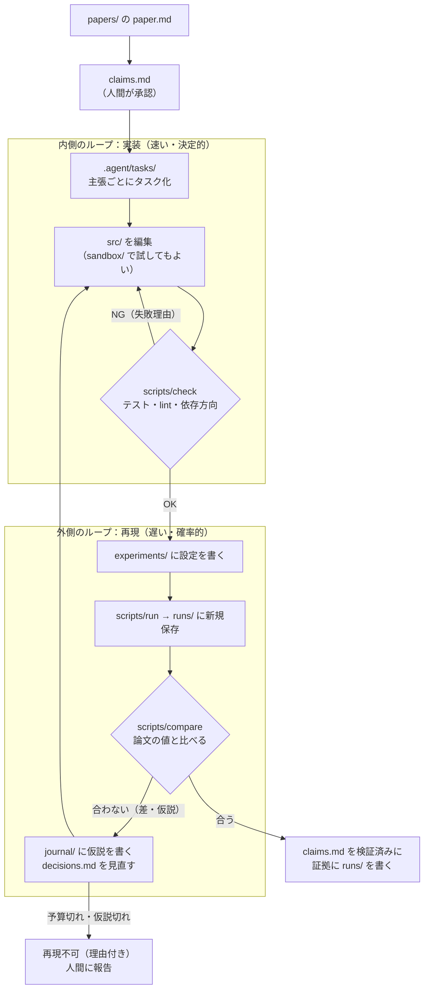
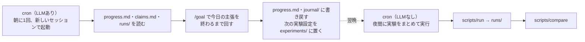

# 論文の理論を自律的に実装し続けるプロジェクトの構成例

前提と文脈は [[software_engineering/AIAgent/Harness_Knowledge_for_Agent_Users]] を参照。
ここでは、そこで整理した部品（Task・State・Checker・終了条件・打ち切り、`/goal`、機能ごとの縦割り）を、
**論文実装**という具体的な題材に当てはめた一例を示す。

前提：論文は PDF ではなく、人間が Markdown に書き直したものを入力にする（RAG の話を持ち込まないため）。
例として、進化計算の CMA-ES の論文を実装する場面を想定する。

## 論文実装に特有の難しさ

普通の開発と違う点が3つあり、構成はこの3つへの対策として決まる。

1. **「完成」の定義が論文の中に散らばっている。** 数式、アルゴリズムの疑似コード、実験の表。
   どれを満たせば「実装できた」と言えるのかを、最初に取り出しておかないとループが止まらない
2. **論文は書いていないことが多い。** 初期値、細かい順序、実験設定の一部。
   エージェントは黙って「それっぽい」選択をするので、**解釈の記録が無いと再現性がそこで消える**
3. **結果の数値を「合わせにいく」誘惑がある。** 許容誤差を緩める、テストを書き換える、結果ファイルを直す。
   人間でも起きる不正が、エージェントでは悪意なく起きる

## 部屋の割り当て

```text
paper-lab/
├── papers/                    # 📚 論文保管庫（読み取り専用）
│   └── cmaes/
│       ├── paper.md           #   Markdown に書き直した論文本体
│       └── claims.md          #   検証できる主張の一覧（人間が承認する）
│
├── .agent/                    # 🧭 司令室（ループの制御）
│   ├── agent.md               #   役割と振る舞い
│   ├── goal.md                #   完了の定義。人間だけが編集
│   ├── guardrails.md          #   禁止事項と理由
│   ├── tasks/                 #   1タスク1ファイル
│   └── progress.md            #   現在地・失敗理由・次の一手（State）
│
├── src/                       # 🛠 開発室
│   ├── cmaes/                 #   1論文 = 1フォルダ（境界づけられたコンテキスト）
│   │   ├── README.md          #   記号とコード名の対応表・この論文の注意点
│   │   ├── core/              #   数式をそのまま関数にした部分。外部に依存しない
│   │   └── algorithm/         #   core を組み合わせたアルゴリズム本体
│   └── shared/                #   2本以上の論文で使われて初めてここへ昇格
│
├── tests/                     # 🧪 テスト場
│   └── cmaes/
│       ├── claims/            #   claims.md の各主張に対応するテスト。人間がレビュー済み、エージェントは編集不可
│       └── unit/              #   エージェントが自由に足してよい細かいテスト
│
├── sandbox/                   # 🔧 デバッグ場（使い捨て。git 管理外）
│
├── experiments/               # 🏃 アルゴリズム実行場（設定だけを置く）
│   └── cmaes/
│       └── c3_sphere_10d.yaml #   どの主張を、どの設定で確かめるか
│
├── runs/                      # 📦 結果の格納庫（追記のみ。実行スクリプトだけが書く）
│   └── 2026-10-01T1432_c3_sphere_10d_a1b2c3/
│       ├── config.yaml        #   実行時の設定のコピー
│       ├── meta.json          #   git のコミット、乱数の種、実行時間、環境
│       ├── metrics.json       #   数値の結果
│       └── log.txt
│
├── journal/                   # 📓 記録室（人が読むための研究ノート）
│   ├── decisions.md           #   論文に書かれていない部分をどう解釈したか
│   └── 2026-10-01.md          #   その日の試行・仮説・結果の要約
│
└── scripts/
    ├── check                  #   テスト + lint + 依存方向の検査（Checker その1）
    ├── run                    #   experiments/ の設定を実行し、runs/ に新しいフォルダを作る
    └── compare                #   runs/ の結果と claims.md の目標値を比べる（Checker その2）
```

### 部屋ごとの「誰が書くか」と教科書の部品

| 部屋 | フォルダ | 書くのは誰か | 教科書の部品 |
| --- | --- | --- | --- |
| 論文保管庫 | `papers/` | 人間だけ | 入力（`docs/`、読み取り専用） |
| 主張の一覧 | `papers/*/claims.md` | エージェントが下書き、人間が承認 | 終了条件の元 |
| 司令室 | `.agent/` | goal と guardrails は人間、tasks と progress はエージェント | Task・State |
| 開発室 | `src/` | エージェント | Generator の成果物 |
| テスト場 | `tests/*/claims/` | 人間がレビューして固定 | Checker（形式） |
| 　 | `tests/*/unit/` | エージェント | Checker の補助 |
| デバッグ場 | `sandbox/` | エージェントが自由に | ― （何も残らない前提） |
| 実行場 | `experiments/` | エージェント（設定だけ） | Task の具体化 |
| 格納庫 | `runs/` | **`scripts/run` だけ** | Artifact（保存は検査の後ではなく、実行の記録として全部残す） |
| 記録室 | `journal/` | エージェントが追記 | ログ |

**書き込める人を部屋ごとに決めておくことが、この構成の一番の要点。**
特に `runs/` と `tests/*/claims/` をエージェントが書き換えられないようにすると、
「結果を合わせにいく」不正が構造的に起きなくなる。
お願い（`guardrails.md`）だけでなく、ハーネスの権限設定や pre-commit hook で実際に書き込みを拒否する。

## 一番重要なファイル：`claims.md`

論文から**検証できる主張**を取り出し、ID を振って並べたもの。
これがそのまま `/goal` の完了条件になり、テストと実験の対応表にもなる。

```markdown
| ID | 主張 | 出典 | 検証方法 | 許容誤差 | 状態 | 証拠 |
| --- | --- | --- | --- | --- | --- | --- |
| C1 | 共分散行列は更新後も対称かつ正定値 | 式(9)〜(11) | tests/cmaes/claims/test_c1.py | ― | 検証済み | ― |
| C2 | 目的関数に単調増加な変換をかけても、探索の軌跡が変わらない | 3章 | tests/cmaes/claims/test_c2.py | ― | 検証済み | ― |
| C3 | 10次元 Sphere 関数で、表2の評価回数程度で目標値に到達する | 表2 | experiments/cmaes/c3_sphere_10d.yaml | ±20% | 未検証 | ― |
| C4 | ... | ... | ... | ... | 再現不可 | runs/2026-10-01T1432_... |
```

主張には2種類ある。

* **性質の主張**（C1, C2）：小さな入力で必ず成り立つはずのこと。**単体テスト**にする。速く、決定的
* **数値の主張**（C3）：論文の表の値。**実験**にする。遅く、乱数でぶれるので許容誤差と試行回数を決めておく

許容誤差は人間が決め、エージェントには変更させない。

状態は「未検証 → 検証済み」だけでなく、**「再現不可（理由付き）」も正式な終わり方**として認める。
これを認めないと、エージェントは再現できない主張の前で打ち切りまで回り続けるか、数値を合わせにいく。

## もう一つ重要なファイル：`journal/decisions.md`

論文に書かれていない部分をエージェントが決めたら、必ずここに1件ずつ記録させる。

```markdown
## D3: ステップサイズの初期値
- 論文の記述: 「適切に選ぶ」とだけある（2.1節）
- 選んだもの: 探索範囲の幅の 0.3 倍
- 根拠: 著者の公開実装の既定値に合わせた
- 影響する主張: C3
- 未確定: 結果が合わない場合、最初に疑う候補
```

`guardrails.md` には「論文に無い選択を黙ってしないこと。必ず decisions.md に記録すること」と書く。
数値の主張が再現しない時、**最初に疑うべき場所の一覧**がこのファイルになる。

## 2重のループ

論文実装のループは、速さの違う2つの輪に分かれる。



* **内側のループ**は第5章そのもの。失敗理由がエージェントの次の入力になる
* **外側のループ**は高くつく（計算時間）ので、次の3つを守らせる
  * 1周で変えるのは1つだけ（複数同時に変えると、どれが効いたか分からない）
  * 変える前に仮説を `journal/` に書く（「ガチャ」にしないため）
  * 主張ごとに実行回数の上限を決めておく（第8章の「打ち切り」）

## `/goal` との組み合わせ

```text
/goal papers/cmaes/claims.md のすべての主張を「検証済み」か「再現不可（理由付き）」にする
  until scripts/check が通り、claims.md の各行の証拠欄が runs/ の実在するフォルダを指し、
        最後に claims.md の状態表をそのまま報告している
  without papers/・tests/cmaes/claims/・runs/ を編集しない、許容誤差を変更しない、
          論文に無い選択を journal/decisions.md に記録せずに行わない
```

* **品質ゲート**に `scripts/check` と `scripts/compare` を設定する。judge（LLM）より先に機械が判定する
* judge は直近の応答しか見ないので、「最後に状態表を報告する」を完了条件に入れておく
* ターン上限に達したら、`progress.md` と `claims.md` の状態表から再開できる。
  ループの状態をファイルに持っているので、翌日やハーネスを替えた後でも続きから始められる

## DDD の考え方がどこに効いているか

* **1論文 = 1フォルダ（境界づけられたコンテキスト）。** CMA-ES の作業中に別の論文のコードを読む必要がない。
  共通化は、2本目の論文で同じものが必要になってから `shared/` へ移す（最初から共通化しない）
* **記号とコード名の対応表 ＝ ユビキタス言語。** `src/cmaes/README.md` に置く

  | 論文の記号 | コード上の名前 | 意味 |
  | --- | --- | --- |
  | $\sigma$ | `step_size` | ステップサイズ |
  | $\lambda$ | `population_size` | 1世代で生成する個体数 |
  | $C$ | `cov` | 共分散行列 |

  これが無いと、エージェントは同じ記号に毎回違う名前を付ける。
  テストや `claims.md` からも同じ名前で参照できるので、主張と実装の対応が追いやすくなる
* **`core/` は外部に依存しない。** 数式をそのまま関数にした部分なので、乱数や入出力を持ち込まない。
  こうしておくと C1・C2 のような性質のテストが速く、決定的に書ける

## まとめ

* 部屋ごとに「誰が書けるか」を決め、特に結果（`runs/`）と主張のテスト（`tests/*/claims/`）はエージェントに書き換えさせない
* `claims.md` が完了の定義・テストと実験の対応表・進捗表を兼ねる。「再現不可（理由付き）」も正式な終わり方にする
* 論文に書かれていない選択は `decisions.md` に記録させる。再現しない時に最初に見る場所になる
* ループは「実装（速い）」と「再現（遅い）」の2重。外側は1周1変更・仮説を先に書く・回数上限を守る

---

## 追記：実行はエージェント任せか、bat で発火か、組み込み機能か

（2026-10-01 追記。Hermes Agent と Claude Code の公式ドキュメントで確認した範囲）

### 「実行」は2種類あり、分けて考える

| 何を実行するか | 中身 | 誰にやらせるか |
| --- | --- | --- |
| **実験の実行**（`scripts/run`・`scripts/compare`） | 決定的な処理。判断は要らない | **スクリプト**。エージェントは呼ぶだけ |
| **エージェントの起動**（次の実装・次の仮説） | 判断が要る | **ハーネスの機能**（`/goal`・cron・非対話実行） |

教科書の言葉で言えば、前者は Generator の外にある道具、後者は「起動のきっかけ」
（[[textbooks/ループエンジニアリング/09章]] の Watcher / Cron / 人間）。
Runner（ループ本体）はハーネスが持っているので、**bat で Runner を自作する必要はない。** bat が担うのはせいぜい「きっかけ」だけ。

### 実験の実行：スクリプトを唯一の入口にする

* エージェントにその場でコマンドを組み立てさせず、`python scripts/run.py experiments/cmaes/c3_sphere_10d.yaml` のように**入口を1つ**にする。
  `runs/` のフォルダ作成・git のコミット記録・乱数の種の保存は、スクリプトが毎回同じようにやる
* `.bat` より **Python スクリプト**がよい。Hermes を Linux の VPS で動かしても、Windows の手元で動かしても同じものが使える
* 何時間もかかる実験は、エージェントに終わるまで見張らせない。
  バックグラウンドで走らせて結果を `runs/` に書かせ、エージェントは次の起動時にそれを読む

### エージェントの起動：組み込み機能がある

**Hermes Agent**

* `/goal`：1つのセッションの中で、完了するまで回し続ける
* `/cron add`（CLI では `hermes cron create`）：「every 2h」や cron 式で定期実行。**毎回新しいセッションで起動する**
* `--no-agent` を付けた **script-only cron**：LLM を呼ばずにスクリプトだけを定期実行する。
  標準出力が空なら通知なし、終了コードが0以外ならエラー通知。実験の定期実行や、ディスク残量の見張りに向く
* Event Hooks：ツール呼び出しへの割り込みなど。ガードレールの強制に使える

**Claude Code**

* `/goal`、`/loop`：セッションの中で回し続ける
* `claude -p "..."`：非対話で1回実行して終わる。**OS のタスクスケジューラから bat で呼ぶ**ならこれ。
  無人で動かすときは `--permission-mode` と `--permission-prompts none` を指定し、許可するツールを `--allowedTools` で絞る
* デスクトップアプリの予定タスクや、クラウドの定期実行（`/schedule`）もある
* hooks：`PreToolUse` で `runs/`・`papers/`・`tests/*/claims/` への書き込みを拒否すれば、ガードレールが「お願い」から「強制」になる

### 組み合わせの例



* **重い実験はLLM無しで夜に回す**（script-only cron、または OS のスケジューラ）。トークンを使わない
* **判断はLLMありの cron で、1日1回など間隔を空けて起動する**。起動後の中身は `/goal` で完了まで回す
* cron の起動は毎回新しいセッションなので、会話の記憶は引き継がれない。
  **だから State をファイル（`progress.md`・`claims.md`・`runs/`）に持っておくことが前提になる**。
  前の追記で「ループの状態をファイルに持つ」と書いたのは、ここで効いてくる

### 参考

* [Scheduled Tasks (Cron) — Hermes Agent](https://hermes-agent.nousresearch.com/docs/user-guide/features/cron)
* [Script-Only Cron Jobs (No LLM) — Hermes Agent](https://hermes-agent.nousresearch.com/docs/guides/cron-script-only)
* [Event Hooks — Hermes Agent](https://hermes-agent.nousresearch.com/docs/user-guide/features/hooks)
* [Run Claude Code programmatically — Claude Code Docs](https://code.claude.com/docs/en/headless)

---

## 追記：スターターキットとして実物を作った

（2026-10-01 追記）

この構成を、コピーしてそのまま使える雛形にしたものを `C:\Users\ryutk\デスクトップ\loop-engineering-starter-kit` に置いた（Vault の外。Vault 内に置くとリンク化ツールがキットのファイルまで書き換えるため）。

このノートの設計から変えた点：

* **状態と証拠は `claims.md` ではなく `.agent/progress.md` の状態表に書く。** `claims.md` はファイルごとロックする。
  状態の列だけ編集可にすると、主張の文言や許容誤差を「ついでに」書き換えられても気づきにくいため、定義と進捗をファイルで分けた
* 承認は `python scripts/lock.py <名前>` でハッシュを記録する方式。`scripts/check.py` が改変を検出するので、フックの無い Hermes でも後から検出できる
* 合言葉：「〇〇用に書き換えて」→ `.agent/ADAPT.md`、「<名前>開発開始」「開発再開」→ `.agent/PROTOCOL.md`
