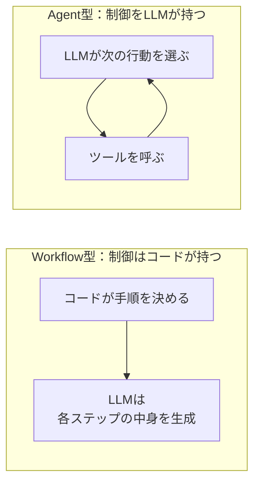
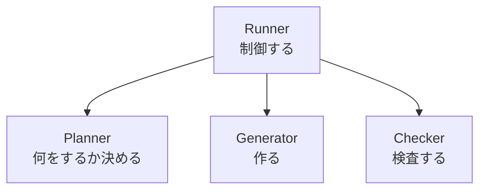

# AIエージェントをスクラッチで作る #1 〜Agent OSという考え方〜

## はじめに

Claude Code、Gemini CLI、Cursor、Codex。コーディングエージェントを使っていると、こう見えます。

> AIが賢いから動いている

実際は違います。AIが担当しているのは**推論の1ステップだけ**です。

- どのファイルを読むか決める
- 結果を検証する
- 失敗したらやり直す
- 途中で止まったら再開する

これらは全部、AIの外側にある[[Python]]や[[TypeScript]]のプログラムがやっています。この外側を、本連載では **Agent OS** と呼びます。

```
AIエージェント = LLM + Agent OS
```

この連載では、Agent OSをフレームワークなしで作ります。作るものは「Markdownの技術メモを読んで、四択問題と要約を自動生成し続けるエージェント」です。

**この連載のコードは全て実際に動きます。しかも[[API]]キーなしで動きます。** 各章のコードはリファレンス実装から切り出しています。

---

## 最初に決めること：WorkflowかAgentか

ここを曖昧にしたまま作り始めると、後で必ず迷子になります。

AIを使ったシステムは、**「次に何をするか」を誰が決めるか**で2種類に分かれます。



| | Workflow型 | Agent型 |
|---|---|---|
| 制御フロー | コードのif文・ループ | [[LLM]]のtool calling |
| 再現性 | 高い | 低い |
| デバッグ | スタックトレースで追える | ログを読み解く |
| コスト | 事前に見積もれる | 実行するまで不明 |
| 向いている仕事 | 手順が事前に書ける | 手順が事前に書けない |

**この連載はWorkflow型で作ります。** 理由は3つです。

1. 「Markdownを読んで問題を作る」は手順が事前に書ける。Agent型にする必要がない
2. Agent OSの部品（State、Queue、Retry、Watcher）はWorkflow型の方が輪郭がはっきりする
3. Agent型はWorkflow型の部品を全部使った上に成り立つ。順番として先にこちらが要る

LangGraph・CrewAI・OpenAI Agents SDKは両方を扱えますが、**制御権をどちらに置くかは常に設計者の判断**です。フレームワークが決めてくれるわけではありません。ここは最終章でもう一度戻ってきます。

---

## 登場人物

今回作るのは3人です。まだAIは呼びません。



### Runner

OSにあたる部分です。Windowsがメモ帳やChromeを起動するように、RunnerがPlannerやGeneratorを動かします。

Runner自身は、問題を作りません。検査もしません。**制御だけ**を持ちます。

### Planner

「何をすべきか」を決めます。「CMA-ES.mdが更新されたから、問題生成の仕事を作ろう」と判断する係です。

### Generator

実際に作ります。将来ここがLLMを呼びます。

### Checker

出来上がったものを検査します。[[JSON]]として壊れていないか、問題数は足りているか。

---

## なぜ最初にAIを呼ばないのか

初心者がAIエージェントを作るとき、最初に書きたくなるのはこれです。

```python
response = gemini.generate(prompt)
```

これをやると、動かなかったときに

- AIの出力が悪いのか
- こちらの制御が悪いのか

が切り分けられません。**先に骨格を作って、動くことを確認してから、AIを差し込みます。**

---

## 実装

プロジェクトルートを `knowledge-agent/` とします。

```
knowledge-agent/
├── agents/
│   ├── __init__.py
│   ├── planner.py
│   ├── checker.py
│   └── generators/
├── application/
│   ├── __init__.py
│   └── runner.py
├── models/
├── services/
├── clients/
├── docs/          ← 入力のMarkdown
├── outputs/       ← 生成物
├── state/         ← 進捗の記録
└── config.py
```

### `__init__.py` は最初から置く

空でいいので置いてください。無くてもPython 3では動きますが、後でテストや[[Docker]]を入れたときに、あるかないかで挙動が変わって消耗します。

### agents/planner.py

```python
class Planner:
    def plan(self):
        print("Planner: 何をするか決める")
        return ["quiz:CMA-ES.md"]
```

### agents/generators/base.py

```python
class Generator:
    def generate(self, job):
        print(f"Generator: {job} を作る")
        return f"{job} の成果物"
```

### agents/checker.py

```python
class Checker:
    def check(self, artifact):
        print(f"Checker: {artifact} を検査する")
        return True
```

### application/runner.py

```python
from agents.checker import Checker
from agents.generators.base import Generator
from agents.planner import Planner


class Runner:
    def __init__(self):
        self.planner = Planner()
        self.generator = Generator()
        self.checker = Checker()

    def run_once(self):
        for job in self.planner.plan():
            artifact = self.generator.generate(job)
            ok = self.checker.check(artifact)
            print(f"結果: {'OK' if ok else 'NG'}")


def main():
    Runner().run_once()
    return 0


if __name__ == "__main__":
    raise SystemExit(main())
```

---

## 実行する：起動方法だけ先に間違えないでください

```bash
python -m application.runner
```

**`python application/runner.py` では動きません。**

```
ModuleNotFoundError: No module named 'agents'
```

理由は `sys.path[0]` です。`python パス/ファイル.py` で起動すると、Pythonは**そのファイルがあるディレクトリ**を検索パスの先頭に置きます。つまり `application/` が起点になり、その隣にある `agents/` が見えません。

`-m` で起動すると、**カレントディレクトリ**が起点になります。だから `agents` も `models` も見えます。

この違いは後でDockerと[[GitHub]] ActionsとCronの3箇所で効いてきます。今のうちに `-m` を体に入れておいてください。

### 実行結果

```
Planner: 何をするか決める
Generator: quiz:CMA-ES.md を作る
Checker: quiz:CMA-ES.md の成果物 を検査する
結果: OK
```

これだけです。AIは影も形もありません。しかし、**Agent OSの骨格はもう出来ています。**

---

## 今回のポイント

- AIエージェントは「LLM」ではなく「LLM + Agent OS」
- 制御をコードが持つ（Workflow型）か、LLMが持つ（Agent型）かは設計判断。本連載は前者
- Runnerは制御だけを持つ。作らない、検査しない
- 起動は `python -m application.runner`。`python application/runner.py` は壊れる

---

## 設計者メモ

今回、Plannerは文字列 `"quiz:CMA-ES.md"` を返しています。これは**わざと悪い設計**にしてあります。

このままだと、「対象ファイル」「仕事の種類」「進捗」が全部1本の文字列に混ざり、パースが必要になります。次回、これを `Task` というデータ型に置き換えます。

Agent OSを作るとき、最初に効いてくるのは**[[データ構造]]の設計**です。制御フローではありません。

---

## 次回予告

**#2 Taskで仕事を実体化し、Agentを疎結合にする**

PlannerがGeneratorを直接呼ばないようにします。間に「Task」を挟むと何が嬉しいのか、そして「Taskを渡すだけ」がなぜ拡張性の正体なのかを見ます。
