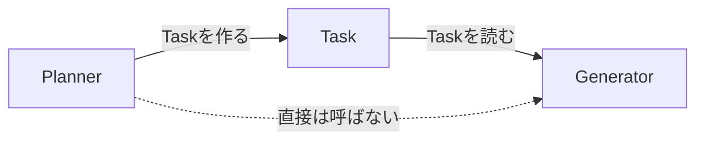
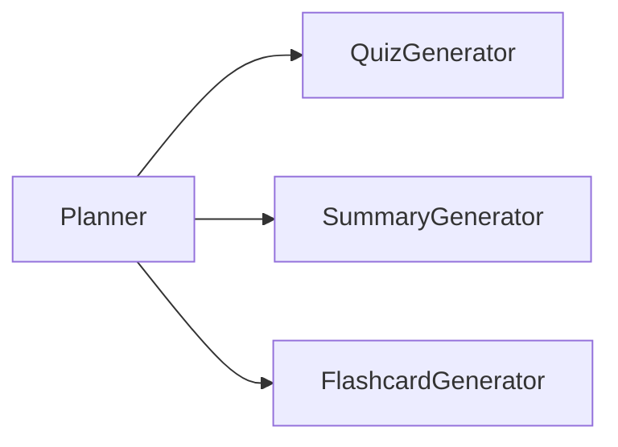
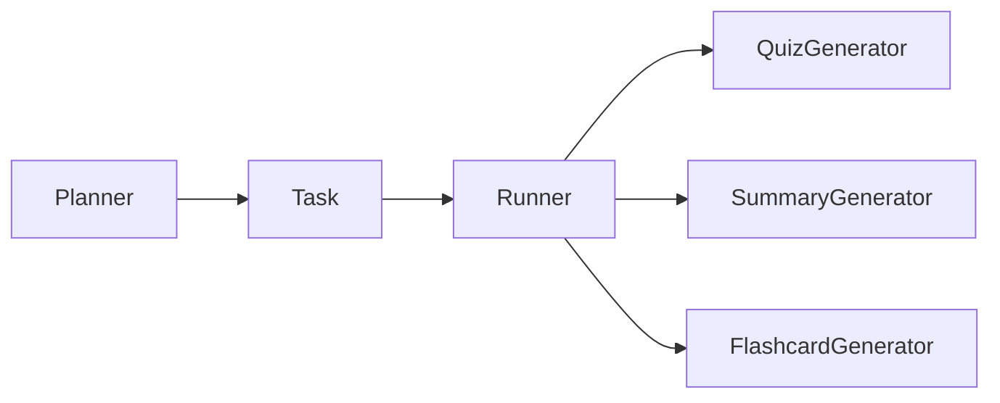

# AIエージェントをスクラッチで作る #2 〜Taskで仕事を実体化する〜

## はじめに

前回、Plannerはこんな文字列を返していました。

```python
return ["quiz:CMA-ES.md"]
```

動きます。でもこの先が続きません。

- 「対象ファイルは？」→ `split(":")` でパースする
- 「リトライ回数は？」→ 文字列に埋め込む？
- 「入力が変わったか判定したい」→ どこに書く？

全部が1本の文字列に押し込まれています。今回はこれを **Task** というデータ型にします。

---

## Taskとは何か

Taskは**やるべき仕事そのもの**です。ただのデータで、自分では何も実行しません。



会社で例えるなら、「鈴木さんに口頭でお願いする」のではなく**作業依頼書を発行する**ということです。依頼書があれば、誰がやってもいい。順番を変えてもいい。溜めておいてもいい。

### models/task.py

```python
from dataclasses import dataclass, field


@dataclass
class Task:
    task_type: str            # "quiz" / "summary"
    target: str               # 入力ファイル
    feedback: list[str] = field(default_factory=list)  # 前回失敗した理由
```

`feedback` は今回まだ使いません。第5章でここが主役になります。**先に器だけ作っておきます。**

> `field(default_factory=list)` は必須です。`feedback: list = []` と書くと、全Taskインスタンスが**同じリストを共有**します。dataclassの定番の罠です。

---

## Agentは互いを知らない

Plannerを書き換えます。

```python
from models.task import Task          # ← これを忘れると NameError


class Planner:
    def __init__(self, task_types: list[str]):
        self.task_types = task_types

    def plan(self, targets: list[str]) -> list[Task]:
        return [
            Task(task_type=t, target=target)
            for target in targets
            for t in self.task_types
        ]
```

Generatorは、Taskを受け取るだけです。

```python
from models.task import Task


class Generator:
    def generate(self, task: Task) -> str:
        return f"[{task.task_type}] {task.target} の成果物"
```

ここが重要です。

- **PlannerはGeneratorを知りません**
- **GeneratorはPlannerを知りません**
- 両者が知っているのは `Task` だけです

---

## Runnerだけが全体を知る

```python
from agents.checker import Checker
from agents.generators.base import Generator
from agents.planner import Planner


class Runner:
    def __init__(self):
        self.planner = Planner(task_types=["quiz", "summary"])
        self.generator = Generator()
        self.checker = Checker()

    def run_once(self):
        tasks = self.planner.plan(["CMA-ES.md", "PSO.md"])
        print(f"Taskを生成: {len(tasks)}件")

        for task in tasks:
            artifact = self.generator.generate(task)
            ok = self.checker.check(artifact)
            print(f"  {task.task_type:8} {task.target:12} -> {'OK' if ok else 'NG'}")
```

実行します。

```bash
python -m application.runner
```

```
Taskを生成: 4件
  quiz     CMA-ES.md    -> OK
  summary  CMA-ES.md    -> OK
  quiz     PSO.md       -> OK
  summary  PSO.md       -> OK
```

`task_types` に `"flashcard"` を足すだけで6件になります。**Generatorのコードは1行も変わりません。**

---

## 疎結合の正体

なぜこれが嬉しいのか、変更が起きたときで比べます。

### Taskが無い場合



Generatorを増やすたびに、Plannerを書き換えます。Plannerは全Generatorの名前を知っている必要があります。

### Taskがある場合



Plannerは `Task(task_type="flashcard", ...)` を作るだけ。**誰がそれを処理するかを知りません。**

この「間にデータを挟んで依存を切る」という手は、[[MVC]]の[[Model]]、DDDのEntity、イベント駆動のEventと同じ発想です。AIエージェント固有の話ではありません。

---

## よくある勘違い：TaskにLLMを呼ばせない

```python
# やってはいけない
@dataclass
class Task:
    def execute(self):          # ← Taskが実行方法を知ってしまう
        return gemini.generate(...)
```

こう書くと、Taskは「仕事の内容」と「実行方法」の両方を持つことになります。

- 実行方法を変えたい → Taskを書き換える
- Taskをファイルに保存したい → メソッドは保存できない
- テストしたい → [[LLM]]がくっついてくる

**Taskはデータ。実行はGenerator。制御はRunner。** この3分割を最後まで崩しません。

---

## 今回のポイント

- Taskは「やるべき仕事」を表すデータ。自分では実行しない
- PlannerとGeneratorは互いを知らない。知っているのはTaskだけ
- 全体の流れを知っているのはRunnerだけ
- `field(default_factory=list)` を使う。`= []` は共有されて壊れる

---

## 設計者メモ

今回の設計で、Generatorを追加したときに書き換わる場所を数えてみます。

| ファイル | 変更 |
|---|---|
| `models/task.py` | なし |
| `agents/planner.py` | なし |
| `application/runner.py` | `task_types` に1語足すだけ |
| 新しいGenerator | 新規作成 |

第10章では、この「1語足すだけ」も無くします。ファイルを置くだけで増える形にします。

ただし先に言っておくと、**最初からそこまでやるのは早すぎます。** 拡張点は「実際に2回目の変更が来てから」作るのが定石です。1回目で汎用化すると、たいてい間違った軸で抽象化します。

---

## 次回予告

**#3 StateとDiscoveryで「記憶」と「差分」を持たせる**

いまのエージェントは、起動するたびに全ファイルを最初から処理します。「前回どこまでやったか」を覚えていないからです。

次回、STATE.jsonを導入します。ただし単に `json.dump` するだけでは、**途中で電源が落ちるとファイルが壊れます。** そこの対処まで含めて作ります。
