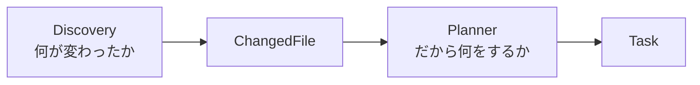

# AIエージェントをスクラッチで作る #3 〜StateとDiscoveryで記憶と差分を持つ〜

## はじめに

前回までのエージェントには、致命的な欠陥があります。

```bash
python -m application.runner   # 4件処理
python -m application.runner   # また同じ4件を処理
python -m application.runner   # またまた同じ4件
```

**何も覚えていません。** 起動するたびに全部やり直します。ファイルが100個あって1個だけ直した場合も、100個ぶんの[[LLM]]呼び出しが走ります。お金が溶けます。

チャットAIとAIエージェントの差はここです。

| | ChatGPT | AIエージェント |
|---|---|---|
| 「続きから」 | ブラウザを閉じたら終わり | 前回の続きから再開する |
| 差分 | 分からない | 変わったものだけ処理する |

今回導入するのは2つです。

- **State** — 自分がどこまでやったかの記憶
- **Discovery** — 何が変わったかを調べる係

---

## Stateの設計：1つのstatusでは足りない

素朴に書くとこうなります。

```python
@dataclass
class State:
    status: str          # "running" / "done"
    retry_count: int
```

これは並列実行を入れた瞬間に破綻します。Taskが4件同時に走っているとき、`status` は誰の状態でしょうか。

**Stateは「Task 1件ごと」に持ちます。**

### models/state.py

```python
from dataclasses import asdict, dataclass, field
from datetime import datetime, timezone

PENDING = "pending"
RUNNING = "running"
DONE = "done"
FAILED = "failed"


@dataclass
class TaskState:
    task_id: str
    task_type: str
    target: str
    status: str = PENDING
    retry_count: int = 0
    last_errors: list[str] = field(default_factory=list)
    updated_at: str = ""

    def touch(self) -> None:
        self.updated_at = datetime.now(timezone.utc).isoformat(timespec="seconds")


@dataclass
class State:
    tasks: dict[str, TaskState] = field(default_factory=dict)
    seen: dict[str, str] = field(default_factory=dict)   # path -> 内容ハッシュ

    def to_dict(self) -> dict:
        return {
            "tasks": {k: asdict(v) for k, v in self.tasks.items()},
            "seen": dict(self.seen),
        }

    @classmethod
    def from_dict(cls, raw: dict) -> "State":
        tasks = {k: TaskState(**v) for k, v in (raw.get("tasks") or {}).items()}
        return cls(tasks=tasks, seen=dict(raw.get("seen") or {}))

    def is_done(self, task_id: str) -> bool:
        ts = self.tasks.get(task_id)
        return ts is not None and ts.status == DONE
```

`seen` は「どのファイルをどの内容で見たか」の記録です。これがDiscoveryの燃料になります。

---

## Taskに識別子をつける

`state.tasks` の鍵が要ります。連番だと、再起動したときに同じ番号が別の仕事を指してしまいます。

**入力から決まるIDにします。**

```python
import hashlib
from dataclasses import dataclass, field


@dataclass
class Task:
    task_type: str
    target: str
    source_hash: str = ""                              # 入力ファイルの内容ハッシュ
    feedback: list[str] = field(default_factory=list)

    @property
    def id(self) -> str:
        raw = f"{self.task_type}:{self.target}:{self.source_hash}"
        return hashlib.sha1(raw.encode("utf-8")).hexdigest()[:12]

    def with_feedback(self, errors: list[str]) -> "Task":
        return Task(self.task_type, self.target, self.source_hash, list(errors))
```

同じファイル・同じ内容・同じ種類なら、**何回起動しても同じID**になります。これが冪等性です。第7章でWatcherが二重発火したときに効いてきます。

```python
def test_同じ入力なら同じID():
    assert Task("quiz", "a.md", "hash1").id == Task("quiz", "a.md", "hash1").id


def test_内容が変わればIDも変わる():
    assert Task("quiz", "a.md", "hash1").id != Task("quiz", "a.md", "hash2").id
```

---

## StateServiceを分ける

Stateはデータです。**保存方法を知るべきではありません。**

```python
state.save()      # ← これをやると、StateがJSONの都合を持ってしまう
```

今日は[[JSON]]でも、明日はSQLite、来月はPostgreSQLかもしれません。保存だけを別クラスに切り出します（単一責任の原則）。

### 素朴な実装が壊れる理由

```python
# 危ない実装
def save(self, state):
    with open(self.path, "w", encoding="utf-8") as f:
        json.dump(state.to_dict(), f)
```

`open(path, "w")` は**その瞬間にファイルを空にします。** ここで電源が落ちたりCtrl+Cが入ると、STATE.jsonは中身が空か途中までの壊れたJSONになります。次回起動すると `JSONDecodeError` で、進捗が全部消えます。

「記憶を守る仕組み」が「記憶を壊す原因」になっては本末転倒です。

### services/state_service.py

```python
import json
import os
import tempfile
import threading
from pathlib import Path

from models.state import State


class StateService:
    def __init__(self, path: Path):
        self.path = Path(path)
        self._lock = threading.Lock()

    def load(self) -> State:
        with self._lock:
            if not self.path.exists():
                return State()
            try:
                raw = json.loads(self.path.read_text(encoding="utf-8"))
            except json.JSONDecodeError:
                # 壊れていたら退避して作り直す。落ちるより再開できる方が大事。
                self.path.rename(self.path.with_suffix(".corrupt.json"))
                return State()
            return State.from_dict(raw)

    def save(self, state: State) -> None:
        with self._lock:
            self.path.parent.mkdir(parents=True, exist_ok=True)
            payload = json.dumps(state.to_dict(), ensure_ascii=False, indent=2)

            fd, tmp = tempfile.mkstemp(dir=self.path.parent, suffix=".tmp")
            try:
                with os.fdopen(fd, "w", encoding="utf-8") as f:
                    f.write(payload)
                    f.flush()
                    os.fsync(f.fileno())
                os.replace(tmp, self.path)     # ここでだけ本番が切り替わる
            except BaseException:
                Path(tmp).unlink(missing_ok=True)
                raise
```

要点は3つです。

1. **一時ファイルへ全部書いてから `os.replace`**。同一ボリューム内なら原子的に差し替わるので、STATE.jsonは常に「古い完全な状態」か「新しい完全な状態」のどちらかになります
2. **`os.fsync`** でOSのバッファを吐き出してから差し替えます
3. **壊れていたら諦めて退避**。証拠は `.corrupt.json` に残しつつ、動き続けます

3番目は好みが分かれますが、24時間動かすものは「1つの壊れたファイルで永久に起動しなくなる」方が困ります。

---

## Discovery：何が変わったかを調べる

Discoveryの仕事はひとつだけです。**変更を見つけること。** AIは使いません。

### mtimeではなく内容ハッシュを使う

更新日時（mtime）は当てになりません。

- `git checkout` や `git clone` でmtimeは全部更新される
- エディタによっては保存のたびに更新される（中身が同じでも）
- [[Docker]]のボリューム越しやCIでずれる

**内容が変わったか**を知りたいので、内容の[[ハッシュ]]を取ります。

### services/discovery.py

```python
import hashlib
from pathlib import Path

from models.changed_file import ChangedFile
from models.state import State


def file_hash(path: Path) -> str:
    return hashlib.sha256(path.read_bytes()).hexdigest()[:16]


class Discovery:
    IGNORE_SUFFIXES = (".md~", ".swp", ".tmp")

    def __init__(self, docs_dir: Path):
        self.docs_dir = Path(docs_dir)

    def _iter_markdown(self):
        if not self.docs_dir.exists():
            return
        for p in sorted(self.docs_dir.rglob("*.md")):
            if not p.is_file():
                continue
            if p.name.startswith(("~", ".")) or p.name.endswith(self.IGNORE_SUFFIXES):
                continue
            yield p

    def scan(self, state: State) -> list[ChangedFile]:
        changed: list[ChangedFile] = []
        current: dict[str, str] = {}

        for path in self._iter_markdown():
            rel = path.relative_to(self.docs_dir).as_posix()   # ← 重要
            h = file_hash(path)
            current[rel] = h

            previous = state.seen.get(rel)
            if previous is None:
                changed.append(ChangedFile(rel, "added", h))
            elif previous != h:
                changed.append(ChangedFile(rel, "modified", h))

        for rel in state.seen.keys() - current.keys():
            changed.append(ChangedFile(rel, "deleted", ""))

        return changed
```

### `as_posix()` を忘れないでください

`Path.rglob` が返すパスは、Windowsでは `docs\最適化\CMA-ES.md` です。[[Linux]]では `docs/最適化/CMA-ES.md` です。

このまま `state.seen` の鍵にすると、**同じファイルがOSによって別物になります。** WindowsでSTATE.jsonを作ってDockerで動かした瞬間に全ファイルが「新規」になります。

`as_posix()` で `/` に正規化します。Taskのidにも `target` が入っているので、ここがずれると全IDがずれます。

### 一時ファイルの除外

エディタは保存時に `CMA-ES.md~` や `.CMA-ES.md.swp` を作ります。これを拾うと、無関係のTaskが延々と生成されます。

---

## ChangedFileはTaskではない

Discoveryは `Task` を返しません。`ChangedFile` を返します。

```python
@dataclass
class ChangedFile:
    path: str
    action: str          # "added" / "modified" / "deleted"
    content_hash: str = ""
```

理由は責務です。



Discoveryは「PDFが増えました」と報告するだけ。それを見て「PDF要約Taskを作ろう」と決めるのはPlannerです。もしDiscoveryがTaskを返すと、Discoveryが仕事の種類を知ることになり、Generatorを増やすたびにDiscoveryを触る羽目になります。

---

## Plannerが冪等になる

```python
class Planner:
    def __init__(self, task_types: list[str]):
        self.task_types = task_types

    def plan(self, changes: list[ChangedFile], state: State) -> list[Task]:
        tasks = []
        for change in changes:
            if change.action == "deleted":
                continue
            for task_type in self.task_types:
                task = Task(task_type, change.path, change.content_hash)
                if state.is_done(task.id):     # 同じ内容で成功済みなら作らない
                    continue
                tasks.append(task)
        return tasks
```

---

## 動かす

```bash
python -m application.runner
```

```
変更を検知: 2件
Taskを生成: 4件 (種類: quiz, summary)
完了: 成功 4 / 失敗 0
```

もう一度、何も変えずに実行します。

```
変更を検知: 0件
Taskを生成: 0件 (種類: quiz, summary)
完了: 成功 0 / 失敗 0
```

**何もしません。** これが記憶を持つということです。

`docs/PSO.md` に1行足してから実行します。

```
変更を検知: 1件
Taskを生成: 2件 (種類: quiz, summary)
```

PSO.mdぶんの2件だけ。CMA-ES.mdは触りません。

---

## テスト

この章の内容はテストしやすいので、書いておきます。第10章で本格的にやりますが、StateとDiscoveryは今のうちに固めておく価値があります。

```python
def test_壊れたJSONでも落ちずに再開できる(tmp_path):
    path = tmp_path / "STATE.json"
    path.write_text("{壊れている", encoding="utf-8")
    state = StateService(path).load()
    assert state.tasks == {}
    assert (tmp_path / "STATE.corrupt.json").exists()


def test_追加_変更_削除を検出する(tmp_path):
    docs = tmp_path / "docs"
    (docs / "sub").mkdir(parents=True)
    (docs / "a.md").write_text("A", encoding="utf-8")
    (docs / "sub" / "b.md").write_text("B", encoding="utf-8")

    discovery = Discovery(docs)
    state = State()

    changes = discovery.scan(state)
    assert {(c.path, c.action) for c in changes} == {
        ("a.md", "added"), ("sub/b.md", "added")
    }

    for c in changes:
        state.seen[c.path] = c.content_hash
    assert discovery.scan(state) == []          # 2回目は何も出ない

    (docs / "a.md").write_text("A2", encoding="utf-8")
    assert [(c.path, c.action) for c in discovery.scan(state)] == [("a.md", "modified")]
```

`("sub/b.md", "added")` が `sub\b.md` ではなく `sub/b.md` であることに注目してください。`as_posix()` がここで効いています。

---

## 今回のポイント

- Stateは1つではなくTaskごとに持つ（`TaskState`）
- Taskのidは入力から決まる。何回起動しても同じ → 冪等性
- 保存は「一時ファイル + `os.replace`」。`open(path,"w")` は中断で記憶を壊す
- 差分判定はmtimeではなく内容ハッシュ
- パスは `as_posix()` で正規化。しないとOSをまたいだ瞬間に全部が新規扱いになる
- Discoveryは「何が変わったか」まで。「だから何をするか」はPlanner

---

## 設計者メモ

ここまでAIは一度も登場していません。にもかかわらず、すでに実用的な問題（中断からの再開、差分検知、冪等性）を解いています。

**AIエージェントの難しさの大半は、AIの外側にあります。**

LangGraphやCrewAIのようなフレームワークも、内部でやっていることの多くはこれです。「LLMを呼ぶ」部分は薄く、「状態を持つ」「失敗を扱う」「もう一度やる」部分が厚い。次章からAIを繋ぎますが、ここで作った土台の上に載るだけだと分かるはずです。

---

## 次回予告

**#4 Prompt・PromptBuilder・LLMClientでAIとの境界を引く**

いよいよAIを繋ぎます。ただし**まだ[[API]]キーは使いません。** ダミーのLLMを差し込んで、全体が動く状態を保ったまま境界だけを設計します。
