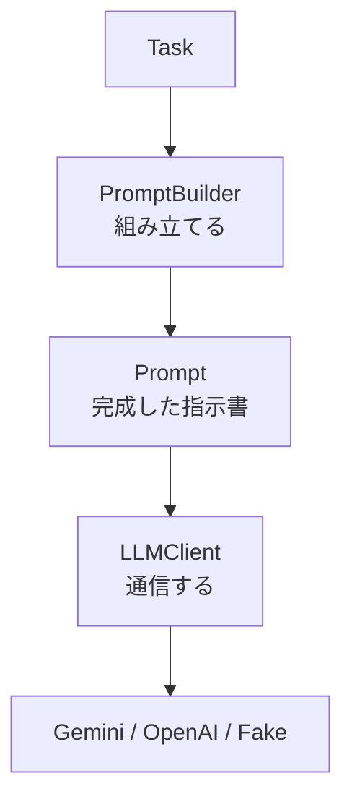
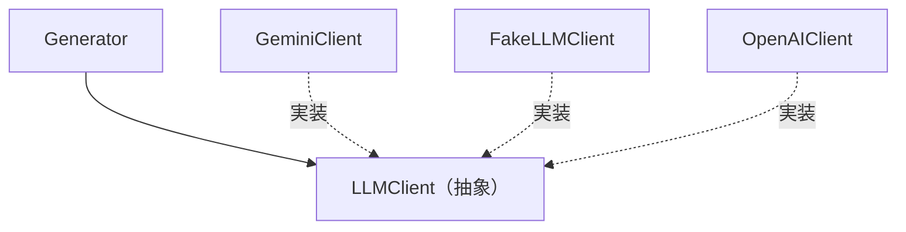

# AIエージェントをスクラッチで作る #4 〜AIとの境界を設計する〜

## はじめに

ここまででエージェントは、自分の状態を覚え、変更を検知できるようになりました。残るは「AIと話す仕組み」です。

ただし今回の目的は **「AIを呼ぶこと」ではなく「AIを差し替えられる形で呼ぶこと」** です。

```python
response = gemini.generate(prompt)     # これをGeneratorに直接書かない
```

これを書いた瞬間に、半年後のモデル移行、テスト、オフライン実行の全部が困難になります。

今回入れるのは3つです。

| 役割 | 担当 |
|---|---|
| Prompt | AIへ送る完成した指示書（データ） |
| PromptBuilder | TaskからPromptを組み立てる（変換） |
| LLMClient | Promptを送って結果を受け取る（通信） |



---

## PromptとPromptBuilderは別物

ここが一番混乱するところなので、先に片付けます。

- **Prompt** = 完成した料理
- **PromptBuilder** = 料理人

Promptは「AIに送る直前の、そのまま送れる状態」のデータです。PromptBuilderは、テンプレートと資料と失敗理由を混ぜてPromptを作る処理です。

### models/prompt.py

Promptを1本の文字列にせず、役割ごとに分けて持ちます。

```python
from dataclasses import dataclass


@dataclass
class Prompt:
    system: str          # 役割の指定
    instruction: str     # 何をしてほしいか
    context: str         # 材料（資料本文）
    feedback: str = ""   # 前回失敗した理由（第5章で使う）

    def to_text(self) -> str:
        blocks = [self.system, self.instruction]
        if self.feedback:
            blocks.append(self.feedback)
        blocks.append(self.context)
        return "\n\n".join(b.strip() for b in blocks if b.strip())
```

文字列1本にしない理由は、将来ここが分岐するからです。

- モデルによってはsystemを別フィールドで渡す
- 画像や会話履歴を足したくなる
- 「contextだけ長すぎるので削る」といった操作をしたくなる

`to_text()` で結合して返すので、呼ぶ側は今まで通り文字列として扱えます。

---

## テンプレートはコードの外に置く

プロンプトはコードではなく**設定**です。[[Python]]の文字列リテラルに埋め込むと、改行やエスケープで読みにくくなり、変更のたびにコードレビューが必要になります。

```
prompts/
├── system.md
├── quiz.md
└── summary.md
```

### prompts/system.md

```markdown
あなたは技術文書から学習教材を作る教育AIです。

出力は必ず JSON のみとし、前後に説明文・挨拶・```json などのコードフェンスを付けないでください。
```

### prompts/quiz.md

```markdown
# 指示

以下の資料から四択問題をちょうど5問作成してください。

次のJSONスキーマに厳密に従ってください。

{
  "questions": [
    {
      "question": "問題文（文字列）",
      "choices": ["選択肢1", "選択肢2", "選択肢3", "選択肢4"],
      "answer": 0,
      "explanation": "解説（文字列）"
    }
  ]
}

制約:

- questions はちょうど5要素
- choices は必ず4要素、重複禁止
- answer は 0〜3 の整数（choices のインデックス）
- 同じ問題文を2回出さないこと
```

**この制約は次章のCheckerが検査する項目とぴったり同じにします。** 片方だけ直すとズレてリトライが止まらなくなるので、ここは意識して揃えます。

---

## PromptBuilder

### services/prompt_builder.py

```python
from pathlib import Path

from models.prompt import Prompt
from models.task import Task


class PromptBuilder:
    def __init__(self, prompts_dir: Path, docs_dir: Path, max_source_chars: int = 8000):
        self.prompts_dir = Path(prompts_dir)
        self.docs_dir = Path(docs_dir)
        self.max_source_chars = max_source_chars

    def _read_template(self, name: str) -> str:
        path = self.prompts_dir / f"{name}.md"
        if not path.exists():
            raise FileNotFoundError(
                f"プロンプトテンプレートがありません: {path}\n"
                f"task_type='{name}' を追加したなら prompts/{name}.md も作る"
            )
        return path.read_text(encoding="utf-8")

    def _read_source(self, target: str) -> str:
        text = (self.docs_dir / target).read_text(encoding="utf-8")
        if len(text) <= self.max_source_chars:
            return text
        return (
            text[: self.max_source_chars]
            + f"\n\n...(以降 {len(text) - self.max_source_chars} 文字は長さ制限のため省略)"
        )

    def build(self, task: Task) -> Prompt:
        return Prompt(
            system=self._read_template("system"),
            instruction=self._read_template(task.task_type),
            context=f"# 対象資料: {task.target}\n\n{self._read_source(task.target)}",
        )
```

### テンプレートはtask_typeから引く

```python
self._read_template(task.task_type)      # quiz -> prompts/quiz.md
```

`if task.task_type == "quiz": ...` を書きません。**Generatorが増えてもPromptBuilderは変わりません。** `prompts/` にファイルを1枚足すだけです。

### 長い資料を切る

これは見落としがちですが必須です。資料をそのままPromptに載せると、大きいMarkdownでトークン上限を超えてエラーになります。しかも「たまたま大きいファイルのときだけ落ちる」ので原因が分かりにくい。

**黙って切らないこと**も大事です。切ったことをPrompt内に明記しておくと、AIが「途中で切れている」と認識できますし、ログを見た人間も気付けます。

---

## LLMClient：抽象に依存する

### clients/llm_client.py

```python
from abc import ABC, abstractmethod

from models.prompt import Prompt


class LLMClient(ABC):
    name: str = "abstract"

    @abstractmethod
    def generate(self, prompt: Prompt) -> str:
        """1回だけ生成する。リトライはしない（それはRunnerの責務）。"""
        raise NotImplementedError
```

**`generate` はリトライしません。** 「1回投げて、返ってきたものをそのまま返す」だけです。ここでこっそりリトライすると、Runner側のリトライと二重になり、リトライ回数もコストも読めなくなります。

### clients/gemini_client.py

```python
from clients.llm_client import LLMClient
from models.prompt import Prompt


class GeminiClient(LLMClient):
    name = "gemini"

    def __init__(self, api_key: str, model: str):
        if not api_key:
            raise RuntimeError(
                "GEMINI_API_KEY が未設定です。"
                "動作確認だけなら LLM_BACKEND=fake で起動してください。"
            )
        from google import genai          # 遅延インポート

        self._client = genai.Client(api_key=api_key)
        self._model = model
        self.name = model

    def generate(self, prompt: Prompt) -> str:
        response = self._client.models.generate_content(
            model=self._model,
            contents=prompt.to_text(),
            config={
                "response_mime_type": "application/json",
                "temperature": 0.2,
            },
        )
        return response.text or ""
```

#### `response_mime_type="application/json"` が効きます

「[[JSON]]で返してね」とプロンプトでお願いするのと、**JSON以外を出せなくする**のは別物です。前者は守られないことがあります。後者はモデル側の制約になります。

これを入れるだけで、次章のリトライ回数が体感で大きく減ります。**構造化出力は、検査とリトライの前に打つべき手です。**

#### 遅延インポート

`from google import genai` を関数の外に置くと、Geminiを使わない人も `pip install google-genai` を強制されます。使うときだけ読み込みます。

---

## APIキー無しで動かす：FakeLLMClient

ここが今回の肝です。**本物の[[LLM]]を繋ぐ前に、偽物を繋いで全体を動かします。**

### clients/fake_client.py

```python
import json

from clients.llm_client import LLMClient
from models.prompt import Prompt


class FakeLLMClient(LLMClient):
    name = "fake-llm"

    def generate(self, prompt: Prompt) -> str:
        payload = {
            "questions": [
                {
                    "question": f"サンプル問題{i + 1}",
                    "choices": [f"A{i}", f"B{i}", f"C{i}", f"D{i}"],
                    "answer": i % 4,
                    "explanation": "サンプル解説",
                }
                for i in range(5)
            ]
        }
        return json.dumps(payload, ensure_ascii=False, indent=2)
```

次章でこれを「わざと1回失敗する」ように改造します。そうすると**リトライループが正しく動いているかを、[[API]]を1回も叩かずに確認できます。**

### clients/factory.py

どのClientを使うかを決める場所を1箇所に集めます。

```python
import config
from clients.llm_client import LLMClient


def build_llm_client() -> LLMClient:
    backend = config.LLM_BACKEND.lower()

    if backend == "fake":
        from clients.fake_client import FakeLLMClient
        return FakeLLMClient()

    if backend == "gemini":
        from clients.gemini_client import GeminiClient
        return GeminiClient(config.GEMINI_API_KEY, config.GEMINI_MODEL)

    raise ValueError(f"未知の LLM_BACKEND: {config.LLM_BACKEND} (fake / gemini)")
```

`config.py` 側は環境変数から読みます。

```python
LLM_BACKEND = os.getenv("LLM_BACKEND", "fake")     # 既定はfake
GEMINI_API_KEY = os.getenv("GEMINI_API_KEY", "")
GEMINI_MODEL = os.getenv("GEMINI_MODEL", "gemini-2.5-flash")
```

**APIキーをコードに書かないでください。** 環境変数から読み、`.env` は `.gitignore` に入れます。[[GitHub]]に上げた瞬間に自動収集ボットに拾われます。

---

## Generatorはこう変わる

```python
from abc import ABC, abstractmethod

from clients.llm_client import LLMClient
from models.artifact import Artifact      # 次章で作る
from models.task import Task
from services.prompt_builder import PromptBuilder


class Generator(ABC):
    task_type: str = ""

    def __init__(self, builder: PromptBuilder, llm: LLMClient):
        self.builder = builder
        self.llm = llm

    @abstractmethod
    def generate(self, task: Task, attempt: int) -> Artifact:
        raise NotImplementedError

    def _call_llm(self, task: Task, attempt: int) -> Artifact:
        prompt = self.builder.build(task)
        content = self.llm.generate(prompt)
        return Artifact(
            task_id=task.id, task_type=task.task_type, target=task.target,
            content=content, model=self.llm.name, attempt=attempt,
        )
```

Generatorが知っているのは `PromptBuilder` と `LLMClient` だけです。`GeminiClient` も `google.genai` も知りません。

具体的なGeneratorは、これだけです。

```python
class QuizGenerator(Generator):
    def generate(self, task: Task, attempt: int) -> Artifact:
        return self._call_llm(task, attempt)
```

---

## 依存性逆転（DIP）

今回の構造を図にします。



矢印が `Generator → GeminiClient` ではなく、両方が**抽象を向いている**のがポイントです。

これで得られるものは、モデル移行だけではありません。

| やりたいこと | 差し替えるもの |
|---|---|
| Gemini → Claude | Clientを1つ足す |
| テストしたい | FakeLLMClient / MockLLM |
| APIキー無しで動作確認 | FakeLLMClient |
| ローカルLLMで試す | OllamaClient |
| コストを記録したい | 計測するデコレータClient |

最後の行が面白いところです。既存のClientを包むだけでロギングや計測を足せます。

> 厳密には、DIPは「抽象を上位モジュール側が所有する」ことまで含みます。教科書的には `LLMClient` は `clients/` ではなくGeneratorの近くに置く形になります。ここは実用上の読みやすさを優先して `clients/` に置いていますが、意図的な妥協です。

---

## 動かす

```bash
python -m application.runner
```

```
変更を検知: 2件
Taskを生成: 4件 (種類: quiz, summary)
```

まだCheckerが仮なので保存はされませんが、**PromptBuilderが組み立て、FakeLLMが返す**ところまで通っています。

本物を使うときはこうです。

```bash
export LLM_BACKEND=gemini
export GEMINI_API_KEY=xxxxx
python -m application.runner
```

**コードは1行も変えません。**

---

## 今回のポイント

- PromptはデータでPromptBuilderは処理。別物
- テンプレートは `prompts/*.md` に置き、`task_type` から引く。if文で分岐しない
- 資料は必ず長さで切る。切ったことを明記する
- `LLMClient` は抽象。Generatorは具体的なモデルを知らない
- `generate()` はリトライしない。リトライはRunnerの仕事
- `response_mime_type="application/json"` で「JSON以外を出せなく」する
- FakeLLMClientを先に作る。APIキー無しで全体が動く状態を保つ

---

## 設計者メモ

FakeLLMClientを作ることを「テスト用の飾り」だと思わないでください。**これは設計の検証装置です。**

もしFakeが作れないなら、それはGeneratorがLLMに癒着している証拠です。「差し替えられる」と口で言うのは簡単ですが、実際に差し替えたものが動いて初めて本当になります。

そして実務上の効果が大きい。この連載の残り8章、私は一度もAPIキーを使わずに全部の動作確認ができます。CIも無料で回せます。

---

## 次回予告

**#5 Artifact・Checker・フィードバック付きリトライ**

いよいよ本連載の主題です。

AIは指示を守りません。「5問作れ」と言っても2問しか作らないし、「JSONで」と言ってもコードフェンスを付けてきます。

そこで検査してやり直させるわけですが、**同じプロンプトをもう一度投げても同じ結果が返ってくるだけです。** 「なぜ落ちたか」を次の入力に戻して初めて、ループが意味を持ちます。
