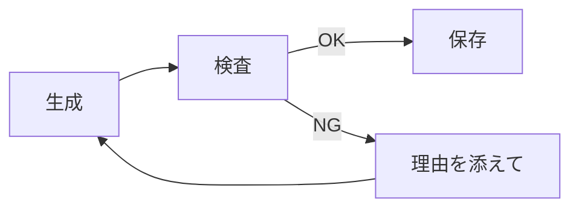
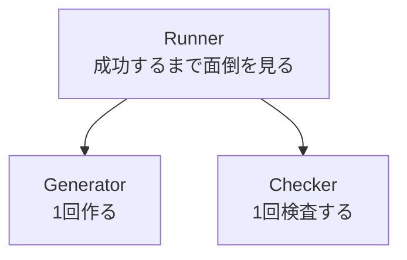

# AIエージェントをスクラッチで作る #5 〜Loop Engineering：失敗を入力に戻す〜

## はじめに

この章が本連載の中心です。

AIは指示を守りません。「5問作れ」と言えば3問返ってくるし、「[[JSON]]だけ」と言えば ```` ```json ```` で囲んできます。悪意はなく、[[確率]]的にそうなります。

普通のプログラムなら、ここで例外を投げて終わりです。AIエージェントは違います。



この輪を回すのが **Loop Engineering** です。

そして最初に、一番よくある間違いを潰しておきます。

```python
# 動かないリトライ
for attempt in range(3):
    artifact = generator.generate(task)     # ← 毎回まったく同じ引数
    if checker.check(artifact):
        break
```

これは**ほぼ意味がありません。** 同じPromptを投げているので、同じように失敗します。temperatureのぶれで偶然通ることはありますが、それはリトライではなくガチャです。

**失敗した理由を、次の入力に戻す。** これが本章のすべてです。

---

## その前に：リトライしなくて済むようにする

ループの話をする前に、順番として先に来るものがあります。**構造化出力**です。

| 手段 | 効果 |
|---|---|
| ① プロンプトで「JSONで返して」と頼む | 守られないことがある |
| ② `response_mime_type="application/json"` | JSON以外を出せなくなる |
| ③ 検査してリトライ | ①②をすり抜けたものを拾う |

③だけで戦うと、リトライ回数もコストも跳ね上がります。**①②を打ってから③**です。前章でGeminiClientに②を入れたのはこのためです。

それでも「JSONとしては妥当だが、問題が3問しかない」は防げません。だから③が要ります。

---

## Artifact：成果物を文字列で持たない

いままでGeneratorは文字列を返していました。これを構造体にします。

### models/artifact.py

```python
from dataclasses import dataclass
from datetime import datetime, timezone


@dataclass
class Artifact:
    task_id: str
    task_type: str
    target: str
    content: str
    model: str
    attempt: int                 # 何回目の生成か
    created_at: str = ""

    def __post_init__(self):
        if not self.created_at:
            self.created_at = datetime.now(timezone.utc).isoformat(timespec="seconds")
```

なぜ文字列ではいけないか。Checkerが検査するには、**中身だけでなく来歴**が要るからです。

- `task_type` が無いと、どのスキーマで検査すべきか分からない
- `attempt` が無いと、「3回目でやっと通った」がログにも保存物にも残らない
- `model` が無いと、後で「どのモデルの出力か」が追えない

`attempt` と `model` は、後で品質を比べるときに効きます。「gemini-2.5-flashは平均1.4回、proは1.05回」といった話ができるようになります。

---

## Checker：boolを返してはいけない

ここが設計の分かれ目です。

```python
def check(self, artifact) -> bool:      # ← これだと理由が消える
```

`False` だけ返ってきても、次のPromptに書くことがありません。**「なぜ落ちたか」を、そのままAIに読ませられる形で返します。**

### models/check_result.py

```python
from dataclasses import dataclass, field


@dataclass
class CheckResult:
    ok: bool
    errors: list[str] = field(default_factory=list)

    @classmethod
    def passed(cls) -> "CheckResult":
        return cls(ok=True)

    @classmethod
    def failed(cls, *errors: str) -> "CheckResult":
        return cls(ok=False, errors=list(errors))
```

### agents/checker.py

```python
import json
from typing import Any, Callable

import config
from models.artifact import Artifact
from models.check_result import CheckResult

Validator = Callable[[Any], list[str]]


def _validate_quiz(data: Any) -> list[str]:
    errors: list[str] = []
    if not isinstance(data, dict):
        return ["トップレベルはオブジェクトである必要があります"]

    questions = data.get("questions")
    if not isinstance(questions, list):
        return ["'questions' が配列としてありません"]

    if len(questions) != config.QUIZ_COUNT:
        errors.append(
            f"問題数がちょうど{config.QUIZ_COUNT}問である必要があります"
            f"（現在 {len(questions)}問）"
        )

    seen: set[str] = set()
    for i, q in enumerate(questions, start=1):
        where = f"questions[{i}]"
        if not isinstance(q, dict):
            errors.append(f"{where} がオブジェクトではありません")
            continue

        text = q.get("question")
        if not isinstance(text, str) or not text.strip():
            errors.append(f"{where}.question が空です")
        elif text in seen:
            errors.append(f"{where}.question が他の問題と重複しています: {text[:30]}")
        else:
            seen.add(text)

        choices = q.get("choices")
        if not isinstance(choices, list) or len(choices) != 4:
            errors.append(f"{where}.choices は4要素の配列である必要があります")
        elif len(set(map(str, choices))) != 4:
            errors.append(f"{where}.choices に重複があります")

        answer = q.get("answer")
        if not isinstance(answer, int) or isinstance(answer, bool) or not 0 <= answer <= 3:
            errors.append(f"{where}.answer は0〜3の整数である必要があります（現在 {answer!r}）")

        if not isinstance(q.get("explanation"), str) or not q["explanation"].strip():
            errors.append(f"{where}.explanation が空です")

    return errors


class Checker:
    VALIDATORS: dict[str, Validator] = {
        "quiz": _validate_quiz,
        "summary": _validate_summary,
    }

    def check(self, artifact: Artifact) -> CheckResult:
        raw = artifact.content.strip()
        if not raw:
            return CheckResult.failed("出力が空です")

        try:
            data = json.loads(raw)
        except json.JSONDecodeError as e:
            hint = ""
            if raw.startswith("```") or "```" in raw[:20]:
                hint = "（コードフェンス ``` が付いています。JSON本体だけを出力してください）"
            elif not raw.startswith(("{", "[")):
                hint = "（前置きの文章が付いています。JSON本体だけを出力してください）"
            return CheckResult.failed(f"JSONとして解釈できません: {e.msg}{hint}")

        validator = self.VALIDATORS.get(artifact.task_type)
        if validator is None:
            return CheckResult.failed(f"検査方法が未定義の task_type: {artifact.task_type}")

        errors = validator(data)
        return CheckResult.passed() if not errors else CheckResult(ok=False, errors=errors)
```

### エラーメッセージは「AI向けの指示」として書く

ここが地味に一番大事です。エラー文はログのためではなく、**次のPromptに載る文章**です。

| 悪い | 良い |
|---|---|
| `ValidationError` | `問題数がちょうど5問である必要があります（現在 3問）` |
| `invalid answer` | `questions[2].answer は0〜3の整数である必要があります（現在 9）` |
| `parse error` | `JSONとして解釈できません（コードフェンス ``` が付いています。JSON本体だけを出力してください）` |

「どこが」「何が期待値で」「実際は何だったか」の3点を書きます。人間へのレビューコメントと同じです。

`isinstance(answer, bool)` を除外しているのは、[[Python]]では `isinstance(True, int)` が `True` だからです。`answer: true` というJSONを通してしまいます。

### 検査を `task_type` の辞書で引く

`if artifact.task_type == "quiz":` を書きません。Generatorを増やしたときにCheckerのif文が伸びていくのを避けます。

---

## 失敗をPromptへ戻す

Taskに `feedback` を用意してありました。ようやく使います。

```python
def with_feedback(self, errors: list[str]) -> "Task":
    return Task(self.task_type, self.target, self.source_hash, list(errors))
```

**Taskを書き換えず、新しいTaskを作ります。** 元のTaskを残しておくと、「1回目に何を投げたか」がログや調査で追えます。

そして `feedback` は `id` の計算に入れていません。リトライしても**同じTask**であり続けます。

PromptBuilderに節を足します。

```python
def _build_feedback(self, task: Task) -> str:
    if not task.feedback:
        return ""
    lines = "\n".join(f"- {e}" for e in task.feedback)
    return (
        "# 前回の出力は下記の理由で不合格でした\n"
        f"{lines}\n"
        "上記をすべて修正した上で、あらためて全体を出力してください。"
    )


def build(self, task: Task) -> Prompt:
    return Prompt(
        system=self._read_template("system"),
        instruction=self._read_template(task.task_type),
        context=f"# 対象資料: {task.target}\n\n{self._read_source(task.target)}",
        feedback=self._build_feedback(task),
    )
```

「全体を出力してください」を明記するのは、差分だけ返してくるのを防ぐためです。

---

## ループ本体

```python
def _process(self, task: Task) -> Outcome:
    errors: list[str] = []
    current = task

    for attempt in range(1, config.MAX_RETRY + 1):
        generator = self.generators.create(current.task_type)
        try:
            artifact = generator.generate(current, attempt)
        except Exception as e:
            # LLM呼び出しの失敗はここで握る。1件の失敗で全体を落とさない。
            errors = [f"{type(e).__name__}: {e}"]
            log.warning("[%s] 生成に失敗 (%d回目): %s", current.id, attempt, e)
            continue

        result = self.checker.check(artifact)
        if result.ok:
            path = self.store.save(artifact)
            log.info("[%s] %s 合格 (%d回目) -> %s",
                     current.id, current.task_type, attempt, path.name)
            return Outcome(current, True, attempt, [], str(path))

        errors = result.errors
        log.info("[%s] %d回目 不合格: %s", current.id, attempt, "; ".join(errors))

        # ここがLoop Engineeringの本体
        current = current.with_feedback(errors)

    return Outcome(current, False, config.MAX_RETRY, errors)
```

行数は多くありません。効いているのは最後から2行目の1行だけです。

### 保存はCheckerを通ってから

```python
if result.ok:
    path = self.store.save(artifact)
```

**不合格のものをファイルに書きません。** 壊れたJSONが `outputs/` に残ると、後段の処理が全部それを踏みます。

### 例外はここで握る

[[LLM]] [[API]]はタイムアウト・レート制限・一時的な500で普通に落ちます。ここで握らないと、1件のネットワークエラーで全Taskが道連れになります。

---

## リトライは誰の責務か

初心者はGeneratorの中に書きたくなります。書きません。



| 部品 | 責務 |
|---|---|
| Generator | 1回作る |
| Checker | 1回検査する |
| Runner | 何回やるか、いつ諦めるか決める |

Generatorがリトライを持つと、こうなります。

- 上限を変えたい → 全Generatorを直す
- リトライ回数を記録したい → 全Generatorに記録処理を書く
- テストしたい → リトライごとLLMがくっついてくる

**制御は1箇所に集めます。** これが「制御と実行を分ける」の実利です。

---

## 動かして目で確認する

FakeLLMClientを「わざと1回目に失敗する」ようにします。

```python
FEEDBACK_MARK = "前回の出力は下記の理由で不合格"


class FakeLLMClient(LLMClient):
    name = "fake-llm"

    def generate(self, prompt: Prompt) -> str:
        text = prompt.to_text()
        retrying = FEEDBACK_MARK in text            # 叱られたら直す

        count = 5 if retrying else 2                # 1回目はわざと足りない
        payload = {"questions": [...省略...]}
        body = json.dumps(payload, ensure_ascii=False, indent=2)

        if retrying:
            return body
        return f"承知しました。\n```json\n{body}\n```"   # 1回目は余計な飾り付き
```

実行します。

```bash
python -m application.runner
```

```
変更を検知: 2件
Taskを生成: 4件 (種類: quiz, summary)
[2dd0673bf20b] 1回目 不合格: JSONとして解釈できません: Expecting value（コードフェンス ``` が付いています。JSON本体だけを出力してください）
[177459817f49] 1回目 不合格: JSONとして解釈できません: Expecting value（コードフェンス ``` が付いています。JSON本体だけを出力してください）
[adb9944c8df8] 1回目 不合格: 'bullets' は3〜5要素である必要があります（現在 1要素）; 'summary' は100文字以上必要です（現在 36文字）
[adb9944c8df8] summary 合格 (2回目) -> CMA-ES.json
[2dd0673bf20b] quiz 合格 (2回目) -> CMA-ES.json
[177459817f49] quiz 合格 (2回目) -> PSO.json
[ffcbfba8a1dd] summary 合格 (2回目) -> PSO.json
完了: 成功 4 / 失敗 0
```

**1回目に落ちて、理由を読んで、2回目に直っています。** APIキーは1回も使っていません。

---

## テストで確かめる

ログを目で見るだけでなく、「理由が本当に次のPromptへ入っているか」を機械的に確認します。

```python
class ScriptedLLM(LLMClient):
    """あらかじめ決めた順に返すLLM。何を渡されたかも記録する。"""
    name = "scripted"

    def __init__(self, responses: list[str]):
        self.responses = list(responses)
        self.seen_prompts: list[str] = []

    def generate(self, prompt: Prompt) -> str:
        self.seen_prompts.append(prompt.to_text())
        return self.responses.pop(0) if self.responses else "{}"


def test_失敗理由が次のPromptへ差し込まれる():
    llm = ScriptedLLM(["```json\n{}\n```", valid_quiz()])
    outcome = build_runner(llm)._process(make_task())

    assert outcome.ok
    assert outcome.attempts == 2

    first, second = llm.seen_prompts
    assert "前回の出力は下記の理由で不合格" not in first
    assert "前回の出力は下記の理由で不合格" in second      # 理由が戻っている
    assert "コードフェンス" in second                      # しかも具体的に


def test_上限まで失敗したら諦めて理由を残す():
    llm = ScriptedLLM(["だめ"] * config.MAX_RETRY)
    outcome = build_runner(llm)._process(make_task())

    assert not outcome.ok
    assert outcome.attempts == config.MAX_RETRY
    assert outcome.errors


def test_LLMが例外を投げても全体を落とさない():
    class BrokenLLM(LLMClient):
        name = "broken"
        def generate(self, prompt):
            raise TimeoutError("API timeout")

    outcome = build_runner(BrokenLLM())._process(make_task())
    assert not outcome.ok
    assert any("TimeoutError" in e for e in outcome.errors)
```

```bash
python -m pytest -q
```

```
.........................                                                [100%]
25 passed in 1.22s
```

**「リトライが効いている」を主張ではなく事実にする**のは、この4行のテストです。

---

## 諦めたあとの扱い

上限まで失敗したTaskをどうするか。ここを決めておかないと、静かにデータが欠けます。

本連載では**「seenに記録しない」**という方針にします。

```python
failed_targets = {o.task.target for o in outcomes if not o.ok}
for change in changes:
    if change.path not in failed_targets:
        state.seen[change.path] = change.content_hash
```

失敗したファイルは `seen` に入らないので、**次回の起動でもう一度拾われます。** 一時的なAPI障害なら次回で回復します。

同時に、失敗の記録は `TaskState` に残ります。

```json
{
  "status": "failed",
  "retry_count": 3,
  "last_errors": ["問題数がちょうど5問である必要があります（現在 3問）"]
}
```

「毎回同じファイルが失敗し続ける」ならプロンプトかスキーマの問題です。`last_errors` を見れば分かります。

---

## 今回のポイント

- 引数が同じリトライはリトライではない。失敗理由を次の入力に戻す
- 順番は「構造化出力 → 検査 → リトライ」。③だけで戦わない
- Checkerは `bool` ではなく `CheckResult(ok, errors)` を返す
- エラーメッセージはAIへの指示として書く。どこが・期待値・実際の3点
- Generatorは1回作るだけ。リトライはRunnerの責務
- 合格したものだけ保存する
- 失敗したファイルは `seen` に入れない。次回もう一度拾わせる

---

## 設計者メモ

Loop Engineeringは「AIに何度もやらせること」ではありません。**状態が前に進むまでシステムを回すこと**です。

同じPromptを3回投げるのは、状態が進んでいません。回数を消費しているだけです。

```
生成 → 検査 → 失敗理由 → Taskが更新される → 生成
                            ↑ ここで状態が進む
```

この「Taskが更新される」があるかどうかが、ループとガチャの境目です。第12章でLangGraphを読むとき、これがそのまま `Conditional Edge` と `State` の関係として出てきます。名前が変わるだけです。

---

## 次回予告

**#6 Queueと並列実行**

Markdownが100個あると、いまのRunnerは1件ずつ順番に処理します。LLM呼び出しは待ち時間がほとんどなので、並列化すると劇的に速くなります。

ただし、並列にした瞬間に **STATE.jsonが壊れます。** 実際に壊してから直します。
