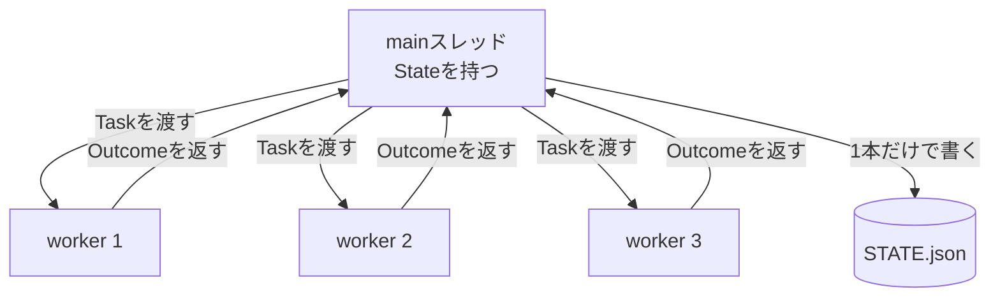

# AIエージェントをスクラッチで作る #6 〜Queueと並列実行、そして壊れるState〜

## はじめに

いまのRunnerは1件ずつ順番に処理します。

```
quiz:CMA-ES   30秒
summary:CMA-ES 20秒
quiz:PSO      30秒
summary:PSO   20秒
------------------
合計          100秒
```

[[LLM]]呼び出しの中身は、ほぼ**通信の待ち時間**です。CPUは遊んでいます。同時に投げれば30秒で終わります。

今回やることは2つです。

1. Queueで仕事を並べる
2. ThreadPoolExecutorで並列に流す

そして**並列にした瞬間にSTATE.jsonが壊れます。** それを実演してから直します。

---

## Queueの動機を間違えない

まずよくある説明を否定しておきます。

> Taskが1000件あると全部メモリに載ってしまう。だからQueueにする。

**これは誤りです。** `collections.deque` を使っても全件メモリに載ります。リストと変わりません。

Queueにする本当の理由は3つです。

| 理由 | 中身 |
|---|---|
| 中断・再開 | 処理途中で落ちても、残りをファイルに書き出せる |
| 投入と消費の分離 | Watcherが投げ、Workerが取る、を別[[スレッド]]にできる |
| 制御の余地 | 優先度、間引き、レート制限を挟める |

「メモリに載らないようにする」を本当にやるなら、Redisや SQLite に落とす必要があります。今回はそこまでやりませんが、**ファイルに書き出して再開できる**ところまでは作ります。

### services/task_queue.py

```python
import json
from collections import deque
from dataclasses import asdict
from pathlib import Path
from threading import Lock

from models.task import Task


class TaskQueue:
    def __init__(self) -> None:
        self._q: deque[Task] = deque()
        self._lock = Lock()

    def push(self, task: Task) -> None:
        with self._lock:
            self._q.append(task)

    def pop(self) -> Task | None:
        """空なら例外ではなくNone。呼ぶ側のwhileが素直に書ける。"""
        with self._lock:
            return self._q.popleft() if self._q else None

    def __len__(self) -> int:
        with self._lock:
            return len(self._q)

    def empty(self) -> bool:
        return len(self) == 0

    def dump(self, path: Path) -> None:
        with self._lock:
            items = [asdict(t) for t in self._q]
        Path(path).write_text(
            json.dumps(items, ensure_ascii=False, indent=2), encoding="utf-8"
        )

    @classmethod
    def restore(cls, path: Path) -> "TaskQueue":
        q = cls()
        if Path(path).exists():
            for raw in json.loads(Path(path).read_text(encoding="utf-8")):
                q.push(Task(**raw))
        return q
```

### `pop()` がNoneを返す理由

`deque.popleft()` は空だと `IndexError` を投げます。

```python
if not queue.empty():
    task = queue.pop()          # ← ここが競合する
```

単一スレッドなら `empty()` チェックで足りますが、並列にすると `empty()` と `pop()` の**間に**他のスレッドが取っていきます。いわゆるTOCTOU（確認と使用の間の隙間）です。

`pop()` の中でロックを取り、空ならNoneを返せば隙間が消えます。

```python
while (task := queue.pop()) is not None:
    ...
```

---

## 並列実行

LLM呼び出しはI/O待ちなので、**スレッドで十分**です。

[[Python]]にはGIL（Global Interpreter Lock）があり、CPUを使う処理はスレッドで速くなりません。しかしネットワーク待ちの間はGILが解放されるので、スレッドが効きます。ここでプロセスを使うと、オブジェクトのやり取りに余計な苦労が増えるだけです。

```python
from concurrent.futures import ThreadPoolExecutor, as_completed

with ThreadPoolExecutor(max_workers=config.MAX_WORKERS) as pool:
    futures = {pool.submit(self._process, task): task for task in tasks}
    for future in as_completed(futures):
        outcome = future.result()
```

### `max_workers` は必ず指定する

```python
ThreadPoolExecutor()      # 引数なし
```

これは `min(32, CPU数 + 4)` 本になります。手元のマシンで確認すると **20本** でした。

無料枠の[[API]]に20本同時に投げると即座に429（レート制限）です。しかもリトライが走るので、さらに投げます。**必ず明示してください。**

```python
MAX_WORKERS = 3
```

### `future.result()` は例外を投げ直す

ここが罠です。

```python
for future in futures:
    artifact = future.result()      # 1件でも失敗すると、ここで例外
    checker.check(artifact)
```

ワーカー内で発生した例外は、`result()` を呼んだ瞬間に呼び出し側で再送出されます。**2件目で落ちると3件目以降の結果は捨てられます。**

実測してみます。

```python
def maker_run(task):
    if task == 2:
        raise ValueError("LLM API error")
    return f"artifact{task}"

with ThreadPoolExecutor(max_workers=3) as ex:
    futures = [ex.submit(maker_run, t) for t in [1, 2, 3]]

for f in futures:
    print(f.result())
```

```
artifact1
ValueError: LLM API error      ← 3件目の結果は失われた
```

前章で `_process` の中で例外を握っているので通常は届きませんが、**握り漏らしがあり得る**ので二重に守ります。

```python
for future in as_completed(futures):
    task = futures[future]
    try:
        outcome = future.result()
    except Exception as e:
        log.exception("[%s] 想定外の例外", task.id)
        outcome = Outcome(task, False, 0, [f"{type(e).__name__}: {e}"])
```

---

## そしてStateが壊れる

ここからが本題です。

各ワーカーがそれぞれStateを更新する、素直な実装を書いてみます。

```python
def worker(task):
    st = state_service.load()     # 読む
    st.seen[task.target] = "..."  # 変える
    state_service.save(st)        # 書く
```

これを8スレッド×200回で回します。

```python
with ThreadPoolExecutor(max_workers=8) as ex:
    list(ex.map(worker, range(200)))
```

結果です。

```
json.decoder.JSONDecodeError: Expecting value: line 1 column 1 (char 0)
```

3回試して3回とも落ちました。

「更新が1回ぶん消える」程度の話ではありません。**あるスレッドが書いている最中のファイルを、別のスレッドが読んでいます。** `open(path, "w")` はファイルを空にするので、その瞬間に読むと空文字列が返ります。

State——記憶を守るための仕組み——が、記憶を壊す原因になっています。

### 対策1：保存を直列化する

第3章のStateServiceにはロックが入っています。

```python
def save(self, state):
    with self._lock:
        ...
        os.replace(tmp, self.path)
```

`os.replace` は原子的なので、読み手は「古い完全なファイル」か「新しい完全なファイル」のどちらかしか見ません。これで**壊れる**問題は消えます。

テストで固定します。

```python
def test_並列に保存してもJSONが壊れない(tmp_path):
    svc = StateService(tmp_path / "STATE.json")
    svc.save(State())

    def worker(i: int) -> None:
        st = svc.load()
        st.seen[f"f{i}.md"] = str(i)
        svc.save(st)

    with ThreadPoolExecutor(max_workers=8) as pool:
        list(pool.map(worker, range(100)))

    json.loads((tmp_path / "STATE.json").read_text(encoding="utf-8"))  # 壊れていない
```

### 対策2：そもそもワーカーにStateを触らせない

ただし、ロックだけでは**更新のロスト**が残ります。

```
スレッドA: load() → {a:1}
スレッドB: load() → {a:1}
スレッドA: save({a:1, b:2})
スレッドB: save({a:1, c:3})     ← b:2 が消えた
```

読んでから書くまでの間に、他人の書き込みが挟まっているからです。ロックの粒度をload〜saveの全体に広げれば防げますが、そうすると並列にした意味が薄れます。

**設計で解きます。ワーカーはStateを触りません。**



ワーカーは「何が起きたか」を返すだけ。Stateへ書くのはmainスレッド1本だけ。**共有可変状態が無ければ、競合も起きません。**

```python
@dataclass
class Outcome:
    task: Task
    ok: bool
    attempts: int
    errors: list[str]
    output_path: str = ""
```

### Runnerの最終形

```python
def _drain(self, queue: TaskQueue, state: State) -> list[Outcome]:
    outcomes: list[Outcome] = []

    with ThreadPoolExecutor(max_workers=config.MAX_WORKERS) as pool:
        futures: dict[Future, Task] = {}
        while (task := queue.pop()) is not None:
            ts = state.tasks.setdefault(
                task.id, TaskState(task.id, task.task_type, task.target)
            )
            ts.status = RUNNING
            ts.touch()
            futures[pool.submit(self._process, task)] = task

        for future in as_completed(futures):
            task = futures[future]
            try:
                outcome = future.result()
            except Exception as e:
                log.exception("[%s] 想定外の例外", task.id)
                outcome = Outcome(task, False, 0, [f"{type(e).__name__}: {e}"])

            ts = state.tasks[task.id]                # ← mainスレッドだけが書く
            ts.status = DONE if outcome.ok else FAILED
            ts.retry_count = outcome.attempts
            ts.last_errors = outcome.errors
            ts.touch()
            outcomes.append(outcome)

    return outcomes
```

---

## Generatorは並列に対応する必要があるか

しません。**Generatorはステートレス**です。

```python
class QuizGenerator(Generator):
    def generate(self, task, attempt):
        return self._call_llm(task, attempt)
```

インスタンス変数に書き込む処理がないので、何スレッドから呼ばれても壊れません。

逆に言うと、**Generatorに `self.retry_count` のようなものを持たせた瞬間に並列で壊れます。** 前章で「リトライはRunnerの責務」としたのは、責務の美しさだけでなく、こういう実利があります。

---

## 動かす

```bash
python -m application.runner
```

```
変更を検知: 2件
Taskを生成: 4件 (種類: quiz, summary)
[2dd0673bf20b] 1回目 不合格: JSONとして解釈できません（コードフェンス ``` が付いています…）
[177459817f49] 1回目 不合格: JSONとして解釈できません（コードフェンス ``` が付いています…）
[adb9944c8df8] 1回目 不合格: 'bullets' は3〜5要素である必要があります（現在 1要素）…
[adb9944c8df8] summary 合格 (2回目) -> CMA-ES.json
[2dd0673bf20b] quiz 合格 (2回目) -> CMA-ES.json
[177459817f49] quiz 合格 (2回目) -> PSO.json
[ffcbfba8a1dd] summary 合格 (2回目) -> PSO.json
完了: 成功 4 / 失敗 0
```

ログの並びが実行のたびに変わります。並列に動いている証拠です。ログのフォーマットに `%(threadName)s` を入れておくと、どのワーカーの発言か分かります。

```
2026-08-09 17:46:53 INFO [ThreadPoolExecutor-0_2] [177459817f49] quiz 合格 (2回目)
```

---

## レート制限との付き合い方

`max_workers=3` は入り口です。実運用では、これも要ります。

- **バックオフ**：429が返ったら待ってから再試行する。指数的に待ち時間を伸ばす
- **同時実行の上限をAPI側の制限に合わせる**：RPM（分あたり回数）から逆算する
- **失敗を分類する**：429やタイムアウトは「待てば直る」、400や認証エラーは「待っても直らない」

いまの `_process` は全部の例外を同じに扱っています。本気で運用するなら、**リトライすべき失敗とすべきでない失敗を区別**します。認証エラーで3回リトライしても、3回とも落ちるだけです。

---

## 今回のポイント

- Queueの動機は「メモリ」ではない。中断・再開、投入と消費の分離、制御の余地
- `pop()` は空でNoneを返す。`empty()` してから `pop()` は並列で競合する
- LLM呼び出しはI/O待ちなのでスレッドで足りる
- `ThreadPoolExecutor()` の既定は最大32本。必ず `max_workers` を指定する
- `future.result()` は例外を投げ直す。1件の失敗で残りを捨てないよう `as_completed` + try
- 並列 + 素朴な[[JSON]]保存はファイルを壊す。実際に `JSONDecodeError` になる
- ロックで壊れるのは防げる。ロストを防ぐのは設計（Stateはmainスレッドだけが触る）

---

## 設計者メモ

並列化は「速くする技術」に見えて、実際には**状態管理の技術**です。

速くするだけなら3行で書けます。難しいのは、速くしたあとも状態が壊れないことです。今回それを、ロック（防御）と設計（そもそも共有しない）の2段で解きました。

そして後者の方が強い。ロックは「かけ忘れ」があり得ますが、共有可変状態が無ければかけ忘れようがありません。並列処理で困ったら、**まず共有をやめられないかを考える**のが定石です。

---

## 次回予告

**#7 Watcherとイベント駆動**

いまのエージェントは、人間が `python -m application.runner` を打たないと動きません。人間が起動ボタンになっています。

次回、ファイルを保存した瞬間に動くようにします。ただし `watchdog` を素直に使うと、**1回の保存で4回起動したり、自分の出力で自分が起動し続けたり**します。そこまで含めて作ります。
