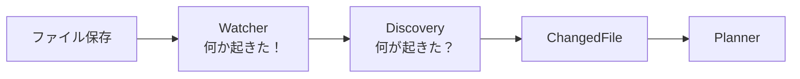

# AIエージェントをスクラッチで作る #7 〜Watcherとイベント駆動〜

## はじめに

いまのエージェントはこうです。

```
Markdownを保存
  ↓
人間が python -m application.runner を打つ
  ↓
動く
```

**人間が起動ボタンです。** これでは自律しているとは言えません。

今回、ファイルを保存した瞬間に動くようにします。ただし `watchdog` を素直に使うと、次の4つに必ずぶつかります。

1. 1回保存しただけでイベントが何回も飛ぶ
2. エディタの一時ファイル（`.md~`）で起動する
3. ディレクトリのイベントでも起動する
4. **自分の出力を検知して、自分で自分を起動し続ける**

4番目は無限ループです。順に潰します。

---

## WatcherとDiscoveryは別物

まず責務を分けます。ここが混ざると、後で必ずこじれます。



| | 役割 | 知っていること |
|---|---|---|
| Watcher | 「**何か**起きた」と伝える | OSのファイルイベント |
| Discovery | 「**何が**変わったか」を調べる | 前回の[[ハッシュ]]（State） |

Watcherは、どのファイルがどう変わったかを判断しません。**旗を立てるだけ**です。

なぜ分けるのか。Watcherが「変更内容」まで持つと、こうなります。

- Cronで起動したときはイベントが無いので、Discoveryが別途必要になる
- OSのイベントは取りこぼす（大量コピー時など）ので、結局ハッシュ比較が要る
- Watcherのテストが、OSのファイルシステムに依存して書きづらくなる

**Discoveryが唯一の真実**にしておけば、起動のきっかけが何であれ、同じ結論になります。

---

## ポーリングとイベントの違い

いままでのDiscoveryは、起動のたびに `docs/` を全走査していました。これが**ポーリング**です。

```
Runner起動 → 全ファイルのハッシュ計算 → 変わったものを探す
```

ファイルが1万個あると、毎回1万回ハッシュを計算します。

イベント駆動なら、変わったときだけ起きます。

```
ファイル保存 → OSが通知 → 起きる → Discoveryが差分を出す
```

ただし**ポーリングを捨てません。** イベントは取りこぼすことがあります（Watcherが起動していない間の変更、ネットワークドライブ、大量ファイルの一括コピー）。

- **Watcher**：普段はこれで即座に反応
- **Cron**：1日1回、取りこぼしを拾う

この二段構えが実務では定番です。両方が同じDiscoveryを呼ぶので、二重に処理されることもありません（Taskのidが同じなので `state.is_done` で弾かれます）。

---

## watchdogを使う

```bash
pip install watchdog
```

最小の形はこうです。

```python
from watchdog.events import FileSystemEventHandler
from watchdog.observers import Observer


class Handler(FileSystemEventHandler):
    def on_modified(self, event):
        print(event.src_path)
```

**これだけでは何も起きません。** ハンドラを定義しただけで、監視は始まっていません。Observerが要ります。

```python
observer = Observer()
observer.schedule(handler, str(path), recursive=True)
observer.start()
```

そして `observer.start()` は別[[スレッド]]で動くので、mainスレッドが終わるとプロセスごと終わります。何かで待ち続ける必要があります。

---

## 4つの罠を潰す

### 罠1：1回の保存で複数回飛ぶ

エディタは「一時ファイルに書く → リネーム」のような手順で保存します。VSCodeで1回保存すると、`created`, `modified`, `modified`, `moved` のように複数のイベントが飛びます。

素直に書くと、1回の保存でRunnerが4回起動します。

**デバウンス**します。イベントが来たら旗を立て、**静かになるまで待ってから**まとめて1回だけ処理します。

```python
wake = threading.Event()

# イベント側
def on_any_event(self, event):
    self.wake.set()          # 旗を立てるだけ。処理はしない

# 処理側
while wake.is_set():
    wake.clear()
    time.sleep(DEBOUNCE_SECONDS)   # この間に再度立ったらもう一周
# ここへ来たときは2秒間イベントが無かった
runner.run_once()
```

「保存が続いている間は待ち、止まったら動く」という挙動になります。

### 罠2：一時ファイル

エディタは `CMA-ES.md~`、`.CMA-ES.md.swp`、`4913`（Vimの権限テスト用ファイル）などを作ります。

```python
def _relevant(self, event) -> bool:
    name = Path(event.src_path).name
    if name.startswith((".", "~")) or not name.endswith(".md"):
        return False
    return True
```

Discovery側にも同じ除外を入れてあります。**両方に入れます。** Watcherは起動判断、Discoveryは処理対象の判断で、目的が違うからです。

### 罠3：ディレクトリのイベント

```python
if event.is_directory:
    return
```

ディレクトリの更新時刻が変わるだけでもイベントが飛びます。

### 罠4：自己ループ

これが一番厄介です。

```
Runnerが outputs/quiz/CMA-ES.json を書く
  ↓
Watcherが検知
  ↓
Runnerが起動
  ↓
また outputs/ に書く
  ↓
（無限）
```

[[API]]キーを設定したまま一晩放置すると、請求が大変なことになります。

対策はシンプルで、**監視対象を入力ディレクトリだけに限定します。**

```python
observer.schedule(handler, str(config.DOCS_DIR), recursive=True)
#                            ^^^^^^^^^^^^^^^^ outputs/ も state/ も監視しない
```

`docs/` の下に `outputs/` を置かない、というディレクトリ設計もセットです。今回 `docs/` を読み取り専用として扱い、生成物を完全に別の場所へ出しているのはこのためです。

---

## watchers/markdown_watcher.py

```python
import logging
import threading
import time
from pathlib import Path

from watchdog.events import FileSystemEventHandler
from watchdog.observers import Observer

import config
from application.logging_setup import setup_logging
from application.runner import Runner, shutdown

log = logging.getLogger(__name__)

DEBOUNCE_SECONDS = 2.0


class MarkdownHandler(FileSystemEventHandler):
    """「何か起きた」だけを伝える。何が変わったかは Discovery が調べる。"""

    def __init__(self, wake: threading.Event):
        self.wake = wake

    def _relevant(self, event) -> bool:
        if event.is_directory:                       # 罠3
            return False
        name = Path(event.src_path).name
        if name.startswith((".", "~")) or not name.endswith(".md"):   # 罠2
            return False
        return True

    def on_any_event(self, event) -> None:
        if self._relevant(event):
            log.debug("イベント: %s %s", event.event_type, event.src_path)
            self.wake.set()


def main() -> int:
    setup_logging()
    config.ensure_dirs()

    wake = threading.Event()
    observer = Observer()
    # 罠4: 監視対象は入力ディレクトリだけ
    observer.schedule(MarkdownHandler(wake), str(config.DOCS_DIR), recursive=True)
    observer.start()
    log.info("監視を開始しました: %s  (Ctrl+C で停止)", config.DOCS_DIR)

    runner = Runner()
    try:
        while not shutdown.is_set():
            if not wake.wait(timeout=1.0):
                continue

            # 罠1: 静かになるまで待ってから、まとめて1回だけ
            while wake.is_set():
                wake.clear()
                time.sleep(DEBOUNCE_SECONDS)

            log.info("変更を検知したので実行します")
            try:
                runner.run_once()
            except Exception:
                log.exception("実行中に例外。監視は継続します")
    except KeyboardInterrupt:
        pass
    finally:
        observer.stop()
        observer.join()
        log.info("監視を終了しました")
    return 0


if __name__ == "__main__":
    raise SystemExit(main())
```

### `wake.wait(timeout=1.0)` にしている理由

```python
wake.wait()          # 無限に待つ
```

これだとCtrl+Cで止まらないことがあります。1秒でタイムアウトさせ、ループの先頭で `shutdown` を確認することで、**停止要求に反応できる**ようにしています。

### 例外で監視を止めない

```python
try:
    runner.run_once()
except Exception:
    log.exception("実行中に例外。監視は継続します")
```

常駐プロセスの鉄則です。1回の実行が失敗しても、監視自体は生かします。ここで例外を素通しすると、深夜にAPIが5分だけ不調だっただけで、朝まで死んだままになります。

---

## 動かす

```bash
python -m watchers.markdown_watcher
```

```
2026-08-09 18:20:01 INFO [MainThread] 監視を開始しました: .../knowledge-agent/docs  (Ctrl+C で停止)
```

別の端末で `docs/CMA-ES.md` を編集して保存します。

```
2026-08-09 18:20:34 INFO [MainThread] 変更を検知したので実行します
2026-08-09 18:20:34 INFO [MainThread] 変更を検知: 1件
2026-08-09 18:20:34 INFO [MainThread] Taskを生成: 2件 (種類: quiz, summary)
2026-08-09 18:20:34 INFO [ThreadPoolExecutor-1_0] [9bd64523fa41] 1回目 不合格: ...
2026-08-09 18:20:34 INFO [ThreadPoolExecutor-1_0] [9bd64523fa41] quiz 合格 (2回目) -> CMA-ES.json
```

保存しただけで動きました。もう `python -m application.runner` を打つ必要はありません。

同じファイルを保存し直すと、内容が変わっていないので何も起きません。ハッシュで判定しているからです。

```
変更を検知: 0件
```

---

## 冪等性がここで効く

Watcherは取りこぼしと二重発火の両方があります。デバウンスをすり抜けて2回起動しても、こうなります。

```python
task = Task("quiz", "CMA-ES.md", "abc123")
task.id                       # -> 2dd0673bf20b（毎回同じ）

if state.is_done(task.id):    # 1回目で成功していればスキップ
    continue
```

第3章でTaskのidを**入力から決まる値**にしておいたのが、ここで効きます。「起動のきっかけが増えても壊れない」のは、その設計のおかげです。

イベント駆動を入れるとき、**先に冪等性を用意しておく**のは順番として正しいです。逆にすると、二重実行のバグを追いかける羽目になります。

---

## 今回のポイント

- Watcherは「何か起きた」、Discoveryは「何が変わった」。責務が違う
- イベント駆動でもポーリング（Cron）を捨てない。イベントは取りこぼす
- watchdogは `Observer` を `start()` しないと動かない
- 1回の保存で複数イベントが飛ぶ。デバウンス必須
- 一時ファイル・ディレクトリを除外する
- **監視対象は入力ディレクトリだけ**。outputs/を監視すると自己ループする
- 常駐プロセスは、1回の失敗で監視を止めない
- 二重発火はTaskのidで吸収する

---

## 設計者メモ

Watcherを入れて、Runnerのコードは1行も変わっていません。

```python
runner.run_once()      # Watcherから呼んでも、CLIから呼んでも同じ
```

これは偶然ではなく、`run_once()` が「1回まわす」という単位で切ってあるからです。この単位を守ると、起動のきっかけを自由に増やせます。

| きっかけ | 呼び出し方 |
|---|---|
| 人間 | `python -m application.runner` |
| ファイル保存 | Watcher |
| 時刻 | Cron / [[GitHub]] Actions |
| [[HTTP]]リクエスト | Webフレームワークから |
| Slackのメンション | Botから |

**Agent OSの本体は「1回まわす」関数で、その外側は全部トリガーに過ぎません。** 次章でCronと[[Docker]]を入れますが、そこでもRunnerは変わりません。

---

## 次回予告

**#8 完成版Agent OSとLoop Engineeringの整理**

ここまでで部品が揃いました。一度立ち止まって、全体を1枚に整理します。

そして「Loop Engineering」「Harness」という言葉が何を指しているのか、既存フレームワークとの共通言語として定義しておきます。
