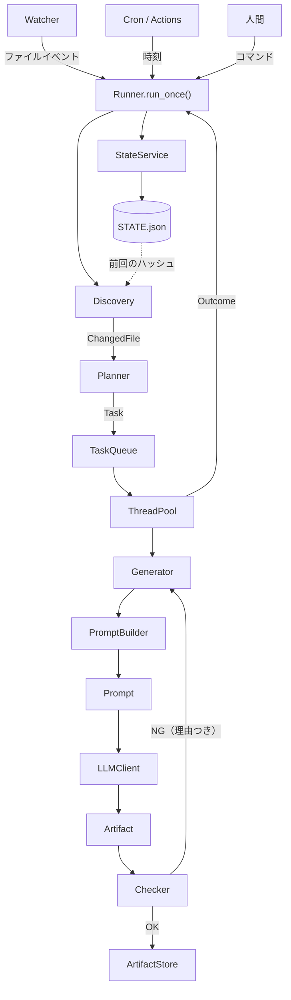
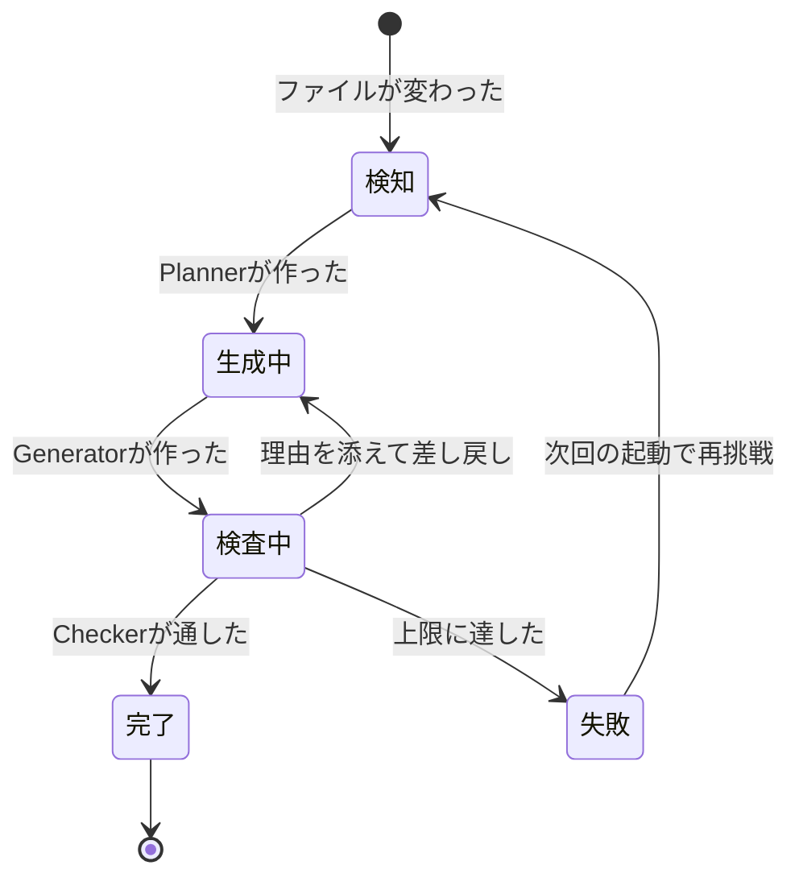
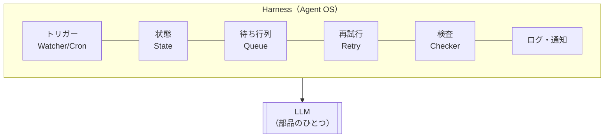

# AIエージェントをスクラッチで作る #8 〜完成版Agent OSとLoop Engineering〜

## はじめに

ここまでで部品が揃いました。一度立ち止まって、全体を1枚に整理します。

そして「Loop Engineering」「Harness」という言葉を、**あとでフレームワークを読むときの共通語**として定義しておきます。

> 断っておくと、「Loop Engineering」「Harness Engineering」は業界で確立した用語ではありません。本連載での整理です。ただし指している中身は実在するので、名前が違うだけで同じものを他所でも見かけるはずです。

---

## 完成版アーキテクチャ



太い線が1本あります。**Checker から Generator へ戻る矢印**です。ここに「理由つき」と書いてあるのが本連載の主題でした。

---

## 層で整理する

| 層 | 部品 | 責務 | 依存してよい相手 |
|---|---|---|---|
| application | Runner, logging_setup | 制御。いつ・何回・並列度 | 全部 |
| agents | Planner, Generator, Checker | 判断・生成・検査 | services, clients, models |
| services | Discovery, PromptBuilder, StateService, TaskQueue, ArtifactStore, Notifier | 道具 | models |
| clients | LLMClient, GeminiClient, FakeLLMClient | 外部との通信 | models |
| models | Task, State, Prompt, Artifact, CheckResult, ChangedFile | データ | なし |
| watchers | MarkdownWatcher | 起動のきっかけ | application |

**依存は上から下へ一方向**です。`models` は何にも依存しません。だからテストが速く、直列化も簡単です。

逆向きの矢印が生えたら黄信号です。たとえば `models/task.py` が `clients` を import し始めたら、それはTaskが実行方法を知り始めた合図です。

### フォルダ構成

```
knowledge-agent/
├── agents/
│   ├── planner.py
│   ├── checker.py
│   └── generators/
│       ├── base.py           # Generator + GeneratorRegistry
│       ├── quiz.py
│       └── summary.py
├── application/
│   ├── runner.py
│   └── logging_setup.py
├── clients/
│   ├── llm_client.py         # 抽象
│   ├── gemini_client.py
│   ├── fake_client.py
│   └── factory.py
├── models/
│   ├── task.py
│   ├── state.py
│   ├── prompt.py
│   ├── artifact.py
│   ├── check_result.py
│   └── changed_file.py
├── services/
│   ├── discovery.py
│   ├── prompt_builder.py
│   ├── state_service.py
│   ├── task_queue.py
│   ├── artifact_store.py
│   └── notifier.py
├── watchers/
│   └── markdown_watcher.py
├── prompts/          # テンプレート（コードではなく設定）
├── docs/             # 入力（読み取り専用）
├── outputs/          # 生成物
├── state/            # STATE.json
├── logs/
├── tests/
└── config.py
```

---

## Taskの一生



注目してほしいのは**閉じた輪が1つだけ**あることです。「検査中 → 生成中」の戻り。ここを回るたびにTaskの `feedback` が更新されるので、**同じ場所を回っているのに状態は進んでいます。**

---

## Loop Engineeringとは何か

定義します。

> **状態が前に進むまで、システム全体を回し続けること。**

「AIに何度もやらせること」ではありません。区別する基準は1つです。

| | 回すたびに入力が変わるか |
|---|---|
| ガチャ | 変わらない。運が良ければ通る |
| Loop Engineering | 変わる。前回の失敗が次の入力になる |

第5章のコードで言えば、この1行があるかどうかです。

```python
current = current.with_feedback(errors)
```

そして、ループが成立するには3つが要ります。

| 必要なもの | 本連載での担当 |
|---|---|
| 終了条件 | Checkerが `ok` を返す |
| 進捗 | 失敗理由がTaskへ積まれる |
| 打ち切り | `MAX_RETRY` |

**打ち切りは必須です。** 終了条件と進捗があっても、AIが直せない要求（矛盾したスキーマなど）を出していれば永久に回ります。上限は「バグの保険」ではなく「設計の一部」です。

---

## Harnessとは何か

Harness（ハーネス）は、**[[LLM]]の周りを固めている装置一式**です。



この図で言いたいことは1つです。**LLMは中央ではなく、部品の1つです。**

実際、本連載で書いたコードのうち、LLMを呼んでいるのは `gemini_client.py` の10行程度です。残りは全部Harnessです。

そして重要なのは、**Harnessの部品はLLMに依存しない**ということです。State、Queue、Retry、Watcher——どれもLLM登場前から存在する、ごく普通のソフトウェア工学の道具です。だからこそ枯れていて、信頼できます。

---

## いま作ったものの実力

現時点でこれだけできます。

- [x] ファイル保存を検知して自動起動する
- [x] 変わったファイルだけ処理する（内容[[ハッシュ]]）
- [x] 複数種類の成果物を並列に生成する
- [x] 出力を検査し、理由を添えてやり直させる
- [x] 途中で電源が落ちても状態が壊れない（アトミック書き込み）
- [x] 二重起動しても重複処理しない（冪等なTask id）
- [x] [[API]]キー無しで全機能をテストできる

依存は標準ライブラリ + `watchdog` + LLMのSDKだけです。

### まだできないこと

正直に並べます。次章以降で埋めるものと、この連載の範囲外のものがあります。

| できないこと | 対応 |
|---|---|
| 24時間動く運用（[[Docker]], Cron, 通知） | 第9章 |
| Generatorをファイル追加だけで増やす | 第10章 |
| 他のMarkdownを参照した生成（RAG） | 第11章 |
| 外部システムの操作（[[GitHub]], Slack） | 第11章（MCP） |
| LLM自身が次の行動を決める | 第12章で扱う（設計判断の話として） |
| 生成物の「品質」の評価 | 本連載の範囲外 |
| 分散実行 | 本連載の範囲外 |

最後から2番目は補足が要ります。いまのCheckerが見ているのは**形式**です。「[[JSON]]として正しいか」「5問あるか」。**「良い問題か」は見ていません。** そこはLLM-as-a-Judgeや人間のレビューの領域で、形式検査とは別の設計が要ります。混ぜないでください。

---

## 今回のポイント

- 依存は application → agents → services/clients → models の一方向
- Taskの一生に閉じた輪は1つ。「検査 → 生成」の差し戻し
- Loop Engineering = 状態が進むまで回すこと。入力が変わらない繰り返しはガチャ
- ループには終了条件・進捗・打ち切りの3つが要る
- Harness = LLMの周りの装置一式。LLMは部品の1つ
- Checkerが見ているのは形式であって品質ではない

---

## 設計者メモ

この連載で書いたコードを数えると、LLMに関係する行は全体の1割もありません。

これは偶然ではなく、**AIエージェント開発の実態**だと思っています。難しいのは「AIに何を言うか」ではなく、

- いつAIを呼ぶのか
- 失敗したらどうするのか
- 途中で止まったらどう再開するのか
- 同じ仕事を二度やらないためにどう識別するのか

という、AIが出てくる前からある問題です。[[プロンプトエンジニアリング]]の本を読んでも解決しません。ソフトウェア設計の話だからです。

逆に言えば、**普通のバックエンドが書ける人はAIエージェントも書けます。** 足りないのは「LLMは失敗する部品である」という前提の置き方だけです。

---

## 次回予告

**#9 24時間動かす：Docker・Cron・GitHub Actions・ログ・通知**

ここからは「作る」ではなく「動かし続ける」の話です。

そして最初に、多くの人がハマる落とし穴を1つ潰します。**Dockerで起動した瞬間に `ModuleNotFoundError` が出ます。** 第1章で `python -m` の話をしたのは、この日のためでした。
