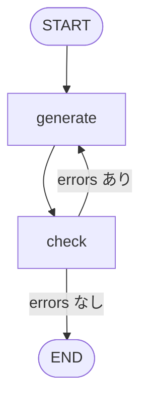
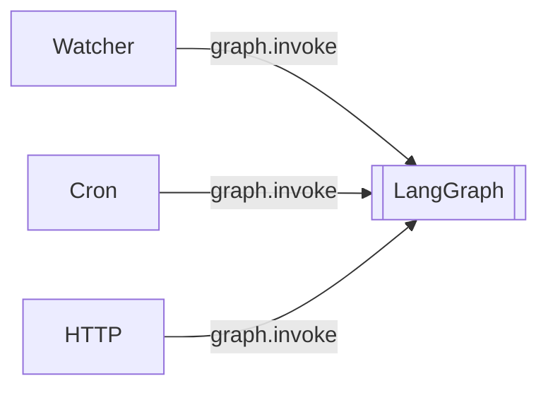
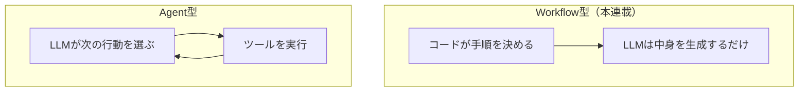

# AIエージェントをスクラッチで作る #12 〜LangGraphを読み、フレームワークを翻訳する〜

## はじめに

最終章です。

LangGraphの入門記事はたくさんあります。この章は入門ではなく **読解** です。

LangGraphで挫折する人の多くは、

```python
graph.add_node(...)
graph.add_edge(...)
graph.compile()
```

という[[API]]を暗記して、**内部で何を抽象化しているのかが分からないまま**進んでしまいます。

あなたはもう、Runner・Task・State・Retry・Queueを自分で書きました。だから「このNodeは自分のGeneratorだ」「このConditional Edgeは自分のif文だ」と読めます。

---

## LangGraphとは何か

一言でいえば、**Agent Workflow Engine** です。私たちが手で書いた

```
Planner → Queue → Generator → Checker → Retry
```

の制御部分を、宣言的に書けるようにしたものです。

対応はこうなります。

| 私たちの実装 | LangGraph |
|---|---|
| `Runner.run_once()` | [[コンパイル]]済みGraph |
| Planner / Generator / Checker | Node |
| 実行順を書いたコード | Edge |
| `if result.ok:` の分岐 | Conditional Edge |
| `Task` + `Artifact` + 途中経過 | Graph State |
| **`StateService`（永続化）** | **checkpointer** |
| `MAX_RETRY` | `recursion_limit` |
| 並列のfan-out | `Send` |
| Watcher | **Graphの外** |

**太字の2行が一番重要です。** ここを取り違えると、本番で状態が消えます。

---

## Stateの定義

LangGraphのStateは、`TypedDict`（または dataclass / Pydantic BaseModel）で定義します。

```python
import operator
from typing import Annotated, TypedDict


class AgentState(TypedDict):
    target: str
    artifact: str
    errors: list[str]
    attempts: int
```

### reducerを理解する

各Nodeは、**Stateの差分を辞書で返します。**

```python
def generate_node(state: AgentState) -> dict:
    content = llm.generate(build_prompt(state))
    return {"artifact": content, "attempts": state["attempts"] + 1}
```

既定の挙動は**上書き**です。返した鍵だけが置き換わります。

蓄積したい場合は `Annotated` でreducerを指定します。

```python
class AgentState(TypedDict):
    errors: Annotated[list[str], operator.add]     # 追記される
```

これを付けると、Nodeが `{"errors": ["問題数が足りません"]}` を返すたびに**リストが連結**されます。

ここは意図して選んでください。

| やりたいこと | 書き方 |
|---|---|
| 今回の失敗理由だけ欲しい | reducerなし（上書き） |
| 何回目に何が起きたか全部残したい | `Annotated[list, operator.add]` |

私たちの実装では、`Task.feedback` は**上書き**（直近の失敗だけ）、`TaskState.last_errors` も上書きにしました。並列Nodeから同じ鍵に書き込む場合はreducerが必須になるので、そこも判断材料です。

---

## Nodeは「関数」

```python
builder.add_node("generate", generate_node)
```

第2引数は**stateを受け取る呼び出し可能オブジェクト**です。内部で `RunnableLambda` に変換されます。

つまり、こう書くと動きません。

```python
generator = QuizGenerator(builder, llm)
graph.add_node("generate", generator)      # generate()メソッドがあるだけ
```

`QuizGenerator` は callable ではないからです。既存のクラスを載せるなら、包みます。

```python
builder.add_node("generate", lambda state: {"artifact": generator.generate(...).content})
```

**ここは既存コードを移植するとき最初につまずく箇所**です。私たちの `Generator` は `generate(task, attempt)` というシグネチャなので、Node用のアダプタが要ります。

---

## Edgeとif文

私たちのRunnerはこう書いていました。

```python
for attempt in range(1, MAX_RETRY + 1):
    artifact = generator.generate(current, attempt)
    result = checker.check(artifact)
    if result.ok:
        break
    current = current.with_feedback(result.errors)
```

LangGraphでは、この `if` が **Conditional Edge** になります。

```python
from langgraph.graph import END, START, StateGraph


def route(state: AgentState) -> str:
    if not state["errors"]:
        return END
    if state["attempts"] >= 3:
        return END
    return "generate"


builder = StateGraph(AgentState)
builder.add_node("generate", generate_node)
builder.add_node("check", check_node)

builder.add_edge(START, "generate")
builder.add_edge("generate", "check")
builder.add_conditional_edges("check", route, {"generate": "generate", END: END})

graph = builder.compile()
```



**`check` から `generate` へ戻る辺**。これが第5章のリトライループです。図の上で閉じた輪として見えるのが、LangGraphの分かりやすさです。

### `state.ok` ではなく `state["ok"]`

StateをTypedDictで定義した場合、実行時の中身は**ただのdict**です。

```python
def route(state):
    if state.ok:          # AttributeError
```

属性アクセスにしたいなら、Stateをdataclassかpydanticの `BaseModel` で定義します。どちらを使うか決めて統一してください。

---

## recursion_limitは自動的な打ち切り

上の `route` で `attempts >= 3` を見ていますが、これを忘れるとどうなるか。

LangGraphには **`recursion_limit`（既定25）** があります。超えると例外が飛びます。

```
GraphRecursionError: Recursion limit of 25 reached without hitting a stop condition
```

私たちの `MAX_RETRY` に相当します。ただし性質が違います。

| | MAX_RETRY | recursion_limit |
|---|---|---|
| 単位 | 1つのTaskの生成回数 | Graph全体のステップ数 |
| 意味 | 業務ルール | 暴走の保険 |
| 超えたら | `failed` として記録 | 例外 |

**recursion_limitを業務上の上限として使わないでください。** 「25回まで直させる」という意図なら、routeの中で明示的に数えます。recursion_limitは「無限ループになっていたら止める」ための安全装置です。

```python
graph.invoke(input, config={"recursion_limit": 50})
```

---

## checkpointer：ここが本命

**LangGraphのGraph Stateは、既定では実行が終われば消えます。**

「StateService が Graph State に置き換わる」と説明されることがありますが、正確ではありません。永続化に対応するのは **checkpointer** です。

```python
from langgraph.checkpoint.sqlite import SqliteSaver

graph = builder.compile(checkpointer=SqliteSaver.from_conn_string("state.sqlite"))

graph.invoke(
    {"target": "CMA-ES.md", "errors": [], "attempts": 0},
    config={"configurable": {"thread_id": "quiz:CMA-ES.md"}},
)
```

`thread_id` ごとに状態が保存され、途中で落ちても続きから再開できます。

対応を整理します。

| 私たちの実装 | LangGraph |
|---|---|
| `State` / `TaskState`（データ） | Graph State（TypedDict + reducer） |
| `StateService.save/load`（保存） | checkpointer |
| `STATE.json` | SQLite / Postgres |
| `Task.id`（何の仕事か） | `thread_id` |

第3章でTaskのidを入力から決まる値にしたのは、まさに `thread_id` に相当します。**同じ仕事に同じIDを振る**という発想は共通です。

checkpointerを付け忘れると、「ローカルでは動いたのに本番で中断から復帰できない」という形で表面化します。しかも普段は動くので気付きにくい。**第3章でアトミック保存を自分で書いた経験があると、ここを飛ばさなくなります。**

---

## 並列はSend

私たちは `ThreadPoolExecutor` で4つのTaskを同時に流しました。LangGraphでは `Send` を使います。

```python
from langgraph.types import Send


def fan_out(state):
    return [
        Send("generate", {"target": t, "errors": [], "attempts": 0})
        for t in state["targets"]
    ]


builder.add_conditional_edges("planner", fan_out, ["generate"])
```

1つのNodeから、動的な数の並列実行を撒けます。

このとき、各分岐の結果を集めるには**reducerが必須**です。reducerが無いと最後に書いた分岐の値で上書きされ、他が消えます。第6章で「並列にすると状態が壊れる」と言ったのと同じ問題が、別の形で出ています。

「TaskQueueは内部のQueueに置き換わる」といった説明を見かけますが、正確ではありません。LangGraphの実行モデルはBSP（superstep）で、キューを直接触るAPIはありません。**fan-outは `Send`** と覚えるのが正しいです。

---

## Watcherはグラフの外

これは対応表というより、**設計上の重要な事実**です。



Watcher、Cron、[[Docker]]、ログ、通知、Graceful Shutdown——**第9章でやったことは、LangGraphに移行しても全部そのまま必要です。** フレームワークが面倒を見てくれるのは「1回の実行の中身」だけです。

これが、第9章に丸ごと1章を使った理由です。フレームワークを使っても消えません。

---

## スクラッチとLangGraph、どちらを使うか

| | スクラッチ | LangGraph |
|---|---|---|
| 学習 | ◎ 中で何が起きているか全部見える | △ APIの向こうが見えない |
| 立ち上がり | △ 全部書く | ◎ すぐ動く |
| 保守 | △ 自分たちで面倒を見る | ◎ 永続化・可視化・監視が揃っている |
| 制御の自由度 | ◎ | ○ 枠から出ると急に難しい |
| 依存 | ほぼ標準ライブラリ | フレームワークのバージョンに追従が要る |

実務では素直にフレームワークを使えばよいと思います。**この連載の価値は「LangGraphを使わないこと」ではなく、「LangGraphが何を代行しているか分かること」**です。

---

## フレームワーク翻訳表

主要フレームワークを、同じ設計語彙に翻訳します。

### CrewAI

「人間の組織」を模したフレームワークです。

| 私たち | CrewAI |
|---|---|
| Runner（制御） | `Crew` + `Process`（sequential / hierarchical） |
| Planner / Generator / Checker | `Agent`（role, goal, backstory） |
| Task | `Task`（description, expected_output） |
| PromptBuilder | Agentのrole/goal + Taskのdescription |
| State | `Memory`（short-term / long-term / entity） |

`Process.hierarchical` を選ぶと、**マネージャー役の[[LLM]]がどのAgentに振るかを決めます。** ここが後述する「制御をLLMに渡す」パターンです。

### OpenAI Agents SDK

Agent中心のシンプルな構成です。

| 私たち | OpenAI Agents SDK |
|---|---|
| Runner | `Runner.run()` |
| PromptBuilder | `instructions` |
| LLMClient | `model` |
| Checker | **`guardrails`** |
| Planner の振り分け | **`handoffs`** |
| Artifact | `output_type` / `final_output` |

**guardrails ↔ Checker** の対応は覚えておく価値があります。入力・出力の検証を挟む仕組みで、私たちのCheckerとまったく同じ位置に立っています。

`handoffs` はAgent間で制御を渡す仕組みで、**誰に渡すかをLLMが決めます。**

### Microsoft Agent Framework（旧 AutoGen / Semantic Kernel）

ここは2026年時点で状況が動いた領域です。

AutoGenとSemantic Kernelは統合され、**Microsoft Agent Framework** になりました。2025年10月にプレビュー、2026年4月に1.0が出荷され、**AutoGenとSemantic Kernelはメンテナンスモード**（バグ修正のみ、新機能なし）になっています。

新規に始めるならAgent Framework側を見てください。設計の系譜としては、AutoGenの「会話ベースのマルチエージェント」とSemantic Kernelの「本番運用向けの基盤」が合流したものです。

| 私たち | AutoGen系の考え方 |
|---|---|
| Planner / Generator / Checker | 会話に参加するAgent |
| TaskQueue | Conversation（会話履歴） |
| State | Chat History |
| Runner | GroupChat / Orchestration |

AutoGen系の特徴は、**Taskの受け渡しではなく会話でやり取りする**ことです。私たちのTaskキュー中心の設計とは発想が違います。

### Mastra

[[TypeScript]]製です。**[[Python]]ではありません**（本連載の構成をそのまま持っていくことはできません）。

| 私たち | Mastra |
|---|---|
| Runner | Workflow |
| State | Memory |
| Retriever | Knowledge / RAG |
| MCPClient | Tool |
| Checker | Evals |
| ログ・通知 | Observability |

特徴は「最初から全部入り」であることです。私たちが第9章で自作したログ・通知・可観測性が、最初から用意されています。

---

## 何を選ぶか

「初心者はLangGraph」とよく言われますが、私はそう思いません。**LangGraphは学習コストが一番高い部類**です。

| 状況 | 候補 |
|---|---|
| まず動かしたい / OpenAI中心 | OpenAI Agents SDK |
| 役割分担のあるチーム型 | CrewAI |
| 制御フローを細かく設計したい / 中断再開が要る | LangGraph |
| .NET / [[Azure]]中心 | Microsoft Agent Framework |
| TypeScriptで全部入りが欲しい | Mastra |
| 要件が単純 | **フレームワークを使わない** |

最後の行は本気です。この連載で作ったものは1000行程度で、依存はほぼ標準ライブラリだけです。「Markdownを読んで問題を作る」程度の要件に、グラフ実行エンジンは要りません。

**フレームワークは、要件が設計を追い越したときに入れるものです。**

---

## 第1章の問いに戻る：制御は誰が持つか

最後に、保留にしていた話を回収します。

第1章で、AIを使ったシステムは**「次に何をするか」を誰が決めるか**で2つに分かれると書きました。



各フレームワークの「LLMに制御を渡す」機能はこれです。

| フレームワーク | 制御をLLMに渡す仕組み |
|---|---|
| OpenAI Agents SDK | `handoffs` |
| CrewAI | `Process.hierarchical` |
| LangGraph | tool callingを使うNode（ReActパターン） |
| AutoGen系 | 会話による自律的な発話順の決定 |

**「全部同じで、書き方が違うだけ」ではありません。** 制御権をどこに置くかは、それぞれのフレームワークの思想であり、あなたの設計判断です。

### 本連載がWorkflow型を選んだ理由

もう一度、はっきり書きます。

- 「Markdownから問題を作る」は手順が事前に書ける。LLMに判断させる必要がない
- 再現性が高く、デバッグがスタックトレースでできる
- 実行前にコストが見積もれる
- テストがLLMなしで書ける（第10章）

### Agent型が要るとき

手順が事前に書けないときです。

- 「このバグを直して」（どのファイルを見るべきか事前に分からない）
- 「このデータを分析して」（何を調べるべきかがデータ次第）
- 「調べて報告して」（探索の道筋が決まらない）

このとき、コードでif文を書き切ることは不可能です。**判断をLLMに委ねる代わりに、再現性とコスト予測性を手放します。** これは等価交換であって、進化ではありません。

そしてAgent型を作るときも、**HarnessはWorkflow型と同じものが要ります。** 状態、リトライ、上限、ログ、権限管理。むしろAgent型の方が、暴走しうるぶん厳しく要ります。

**この連載でやったことは、Agent型を作るときの前提でもあります。**

---

## このシリーズで学んだこと

| 章 | 学んだこと |
|---|---|
| 1 | Agent OSという考え方。Workflow型とAgent型の違い |
| 2 | Taskで仕事を実体化し、Agentを疎結合にする |
| 3 | State（記憶）とDiscovery（差分）。アトミック保存、冪等なID |
| 4 | Prompt / PromptBuilder / LLMClient。抽象への依存 |
| 5 | **Loop Engineering。失敗理由を入力に戻す** |
| 6 | Queueと並列実行。共有状態をどう扱うか |
| 7 | Watcherとイベント駆動。デバウンスと自己ループ |
| 8 | 完成版[[アーキテクチャ]]。Harnessの定義 |
| 9 | 24時間動かす。Docker / Cron / Actions / ログ / 通知 |
| 10 | プラグイン化とテスト。DIの見返り |
| 11 | KnowledgeとTool。RAGとMCP |
| 12 | フレームワーク読解。そして制御権の話 |

---

## 最後に

AIエージェント開発というと、「Claude Codeを使う」「LangGraphを書く」という話になりがちです。

しかし本連載で書いたコードのうち、LLMに触っている部分は1割もありませんでした。残りは全部、

- 責務をどう分けるか
- 状態をどう持つか
- 失敗をどう扱うか
- 同じ仕事を二度やらないためにどう識別するか

という、**LLM以前からあるソフトウェア設計**です。

だからこの連載で一番価値があるのは、LangGraphのAPIを覚えることではありません。

> **フレームワークが隠している設計を、自分の言葉で説明できるようになること**

そこまで来れば、新しいフレームワークが出ても「これはRunnerに相当する」「これはcheckpointerが無いから中断復帰できないな」と、本質から読めます。使う側ではなく、**選ぶ側・設計する側**の視点です。

---

## この先に進むなら

- **評価**：LLM-as-a-Judge、Evalsの設計。第8章で「Checkerは形式しか見ていない」と書いた続き
- **可観測性**：OpenTelemetry、Langfuse。第9章のログの続き
- **メモリ設計**：短期記憶と長期記憶の分離
- **エージェントのセキュリティ**：権限管理、サンドボックス、インジェクション対策
- **Agent型の実装**：tool callingループ、ReAct、self-reflection

どれも、今回作ったHarnessの上に載ります。**土台はもうできています。**

---

### 参考

- [LangGraph Graph API — LangChain Docs](https://docs.langchain.com/oss/python/langgraph/graph-api)
- [Migrate your Semantic Kernel and AutoGen projects to Microsoft Agent Framework](https://devblogs.microsoft.com/agent-framework/migrate-your-semantic-kernel-and-autogen-projects-to-microsoft-agent-framework-release-candidate/)
- [Semantic Kernel + AutoGen = Microsoft Agent Framework — Visual Studio Magazine](https://visualstudiomagazine.com/articles/2025/10/01/semantic-kernel-autogen--open-source-microsoft-agent-framework.aspx)
